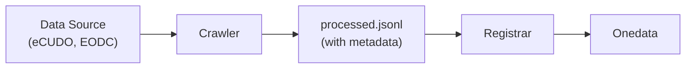

# Public Data Crawlers

Tools for automatic discovery and registration of public scientific datasets in
[Onedata](https://onedata.org/).

## Overview

This project provides:
- **Crawlers** - Fetch and process datasets from public repositories
- **Registrar** - Register processed datasets in Onedata



## Installation

```bash
pip install -r requirements.txt
```

## Crawlers

The `crawlers` framework fetches datasets from various sources and produces
JSONL files ready for registration.

### Available Plugins

| Plugin | Source | Description |
|--------|--------|-------------|
| `ecudo` | [eCUDO.pl](http://central.ecudo.pl) | Polish university scientific datasets |
| `eodc` | [EODC STAC](https://stac.eodc.eu) | Earth Observation Data Centre |

### Basic Usage

```bash
# List available plugins
python -m crawlers --list-plugins

# Show plugin help
python -m crawlers ecudo --help

# Show command help
python -m crawlers ecudo crawl --help
```

### eCUDO Crawler

Crawls datasets from Polish scientific institutions via eCUDO.pl.

```bash
# List available organizations
python -m crawlers ecudo list-orgs

# Crawl all datasets from an organization
python -m crawlers ecudo crawl iopan

# Crawl with limit
python -m crawlers ecudo crawl iopan -n 100

# Specify output directory
python -m crawlers ecudo crawl iopan -o ./output

# Disable URL validation (faster, but may include broken links)
python -m crawlers ecudo crawl iopan --no-url-validation

# Disable diversity filter (include all similar datasets)
python -m crawlers ecudo crawl iopan --no-diversity-filter
```

### EODC Crawler

Crawls STAC items from EODC Earth Observation Data Centre.

```bash
# List available collections
python -m crawlers eodc list-collections

# Crawl items from a collection
python -m crawlers eodc crawl SENTINEL1_GRD

# Crawl with temporal filter
python -m crawlers eodc crawl SENTINEL1_GRD --datetime 2025-01-01/2025-01-31

# Crawl with limit
python -m crawlers eodc crawl SENTINEL1_GRD -n 50
```

### Configuration

Crawlers support configuration from multiple sources (in priority order):
1. CLI arguments
2. YAML config file
3. Environment variables
4. Default values

**Using a config file:**

```bash
python -m crawlers ecudo -c config.yaml crawl iopan
```

**Example `config.yaml`:**

```yaml
global:
  timeout: 30
  output_dir: ./data

plugins:
  ecudo:
    base_url: "http://central.ecudo.pl"
    
    processors:
      url_validator:
        enabled: true
        invalid_url_log: "invalid_urls.jsonl"
      diversity_filter:
        enabled: true
        max_similar: 10
        similarity_threshold: 0.85
    
    commands:
      crawl:
        page_size: 200
        concurrency: 128
```

**Environment variables:**

All config options can be set via `CRAWLER_<OPTION>` environment variables:

```bash
CRAWLER_TIMEOUT=60 python -m crawlers ecudo crawl iopan
```

### Output

Crawlers produce two JSONL files:

| File | Content |
|------|---------|
| `{org}_raw.jsonl` | Source data in original format |
| `{org}_processed.jsonl` | Onedata-ready format with metadata XML |

**Example processed record:**

```json
{
  "name": "Dataset Title",
  "location": "dataset-title",
  "pid": "unique-identifier",
  "metadata_xml": "<?xml version=\"1.0\"?>...",
  "files": [
    {"name": "data.csv", "path": "data.csv", "url": "https://..."}
  ]
}
```

The `metadata_xml` contains standardized metadata (OpenAIRE or DataCite format)
for Onedata registration.

## Registrar

The registrar takes processed JSONL files and registers datasets in Onedata.

### Setup

Configure access to Onedata services:

```bash
export REGISTRAR_ADMIN_TOKEN="your-onepanel-admin-token"
export REGISTRAR_SPACE_OWNER_TOKEN="your-onezone-user-token"
export REGISTRAR_ONEZONE_DOMAIN="demo.onedata.org"
export REGISTRAR_ONEPROVIDER_DOMAIN="provider.demo.onedata.org"

# Optional: for DOI handle registration
export REGISTRAR_HANDLE_SERVICE_ID="your-handle-service-id"
```

Or use a config file (`registrar_config.yaml`).

### Usage

```bash
# Register datasets from JSONL
python -m registrar register data/iopan_processed.jsonl

# Register with limit (for testing)
python -m registrar register data/iopan_processed.jsonl --limit 10

# Dry run (validate without registering)
python -m registrar register data/iopan_processed.jsonl --dry-run

# List available spaces
python -m registrar list-spaces

# List available storages
python -m registrar list-storages

# Show configuration
python -m registrar show-config
```

## Complete Workflow

```bash
# 1. Crawl datasets
python -m crawlers ecudo crawl iopan -o ./data

# 2. Review output
head data/iopan_processed.jsonl

# 3. Register in Onedata (dry run first)
python -m registrar register data/iopan_processed.jsonl --dry-run

# 4. Register for real
python -m registrar register data/iopan_processed.jsonl
```

## Development

### Adding a New Plugin

See the [Plugin Development Guide](crawlers/docs/PLUGIN_GUIDE.md) for
step-by-step instructions.

### Architecture Documentation

See the [Framework Architecture](crawlers/docs/arch/ARCHITECTURE.md) for detailed
framework documentation/reference.

### Running Tests

```bash
make test
```

## License

MIT - See [LICENSE.txt](LICENSE.txt)
