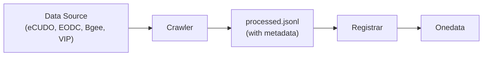

# Repository Crawlers

Tools for automatic discovery and registration of public scientific datasets in
[Onedata](https://onedata.org/).

## Overview

This project provides:
- **Crawlers** — framework for fetching and processing datasets from public repositories
- **Registrar** — tool for registering processed datasets in Onedata



## Installation

Requires [uv](https://docs.astral.sh/uv/):

```bash
make sync
```

This installs all workspace packages, development tools, and optional plugin
dependencies.

## Crawlers

The `crawlers` framework fetches datasets from various sources and produces
JSONL files ready for registration.

### Available Plugins

| Plugin | Source | Description |
|--------|--------|-------------|
| `ecudo` | [eCUDO.pl](http://central.ecudo.pl) | Polish university scientific datasets |
| `eodc` | [EODC STAC](https://stac.eodc.eu) | Earth Observation Data Centre |
| `bgee` | [Bgee](https://bgee.org) | Gene expression database (schema.org JSON-LD) |
| `vip` | [VIP Girder](https://vip.creatis.insa-lyon.fr) | Virtual Imaging Platform datasets |

### Usage

```bash
# List available plugins
uv run crawlers --list-plugins

# Show plugin help
uv run crawlers ecudo --help

# Show command help
uv run crawlers ecudo crawl --help
```

Every plugin provides a `crawl` command and usually a `list-*` command to
inspect available data sources.

### Examples

**eCUDO** — crawls datasets from Polish scientific institutions:

```bash
uv run crawlers ecudo list-orgs
uv run crawlers ecudo crawl iopan
uv run crawlers ecudo crawl iopan -n 100 -o ./data
```

**EODC** — crawls STAC items from Earth Observation Data Centre:

```bash
uv run crawlers eodc list-collections
uv run crawlers eodc crawl SENTINEL1_GRD -n 50
```

**Bgee** — crawls gene expression datasets from the SIB Bgee database:

```bash
uv run crawlers bgee crawl
uv run crawlers bgee crawl --base-url https://bgee.org/search/species -n 200
```

**VIP** — crawls datasets from the Virtual Imaging Platform Girder API:

```bash
uv run crawlers vip list-collections
uv run crawlers vip crawl COLLECTION_NAME
```

### Configuration

Crawlers support configuration from multiple sources (in priority order):
1. CLI arguments
2. YAML config file (`-c config.yaml`)
3. Default values

```bash
uv run crawlers ecudo -c config.yaml crawl iopan
```

All common options (`--timeout`, `--max-retries`, `-o`, `--concurrency`,
`--queue-size`, `-n`, `--no-url-validation`) are shared across plugins via
the base config classes. Run `uv run crawlers <plugin> crawl --help` for
the full list.

### Output

Each crawl creates a timestamped run directory under
`<output_dir>/runs/<timestamp>_<plugin>_<context>/`:

```
data/runs/2026-03-29T21-06-52_ecudo_iopan/
├── config.json       # resolved configuration snapshot
├── processed.jsonl   # Onedata-ready records with metadata XML
├── rejected.jsonl    # records that failed validation
└── state.json        # run summary (counts, duration, errors)
```

The `metadata_xml` field in processed records contains standardized metadata
(OpenAIRE or DataCite format) for Onedata registration.

## Registrar

The registrar takes processed JSONL files and registers datasets in Onedata.

### Setup

Configure access to Onedata services:

```bash
export REGISTRAR_ADMIN_TOKEN="your-onepanel-admin-token"
export REGISTRAR_SPACE_OWNER_TOKEN="your-onezone-user-token"
export REGISTRAR_ONEZONE_DOMAIN="demo.onedata.org"
export REGISTRAR_ONEPROVIDER_DOMAIN="provider.demo.onedata.org"

# Optional: for DOI handle registration
export REGISTRAR_HANDLE_SERVICE_ID="your-handle-service-id"
```

Or use a config file (`registrar_config.yaml`).

### Usage

```bash
# Register datasets from a crawl run
uv run registrar register data/runs/<run_dir>/processed.jsonl

# Register with limit (for testing)
uv run registrar register data/runs/<run_dir>/processed.jsonl --limit 10

# Dry run (validate without registering)
uv run registrar register data/runs/<run_dir>/processed.jsonl --dry-run

# List available spaces / storages
uv run registrar list-spaces
uv run registrar list-storages

# Show configuration
uv run registrar show-config
```

## Complete Workflow

```bash
# 1. Crawl datasets
uv run crawlers ecudo crawl iopan -o ./data

# 2. Review the run output
ls data/runs/                                       # find the latest run directory
head data/runs/<run_dir>/processed.jsonl

# 3. Register in Onedata (dry run first)
uv run registrar register data/runs/<run_dir>/processed.jsonl --dry-run

# 4. Register for real
uv run registrar register data/runs/<run_dir>/processed.jsonl
```

## Development

### Writing a New Plugin

See the [Writing Plugins](docs/crawlers/guides/writing-plugins.md) guide for
step-by-step instructions.

### Architecture

See the [Architecture Overview](docs/crawlers/arch/_overview.md) for the
framework design, data flow, and key decisions.

### Linting and Tests

```bash
make sync     # install workspace packages and development dependencies
make format   # auto-format with black + isort
make lint     # black check + pylint + mypy
make test     # run pytest
```

## License

MIT — See [LICENSE.txt](LICENSE.txt)
