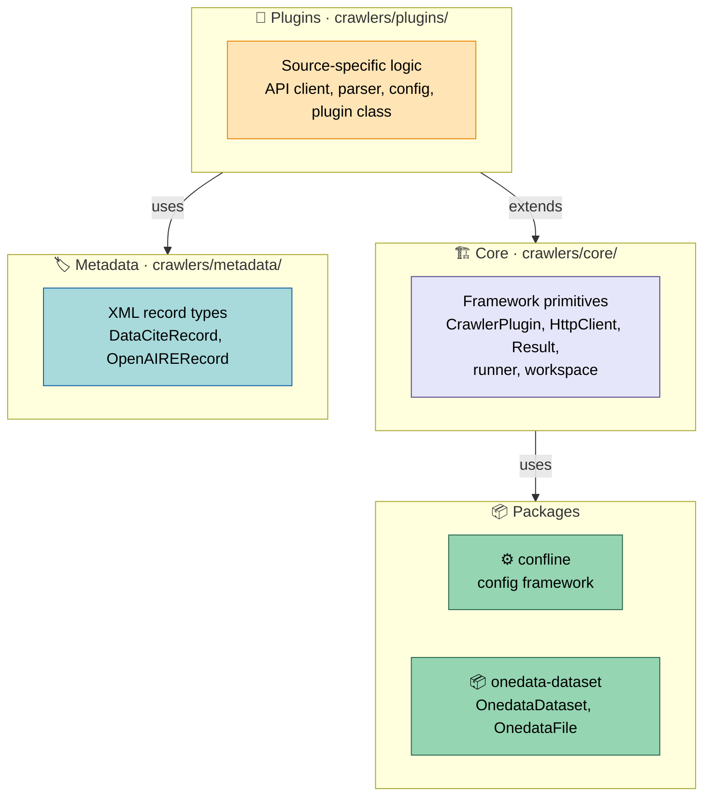
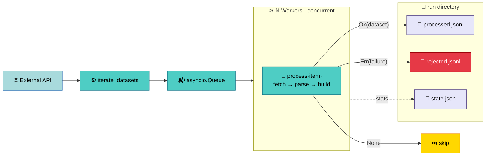

# Crawlers Architecture Overview

The `crawlers` package is a framework for harvesting scientific
dataset metadata from external APIs and producing Onedata-compatible
registration records — structured entries that Onedata uses to make
datasets discoverable and accessible within spaces. Adding support
for a new data source requires only the source-specific parts — API
client, parser, config — while the framework handles parallel
execution, workspace management, CLI generation, and metadata
serialization.

## Why This Architecture

The design separates concerns by rate of change:

- **Core** (`apps/crawlers/src/crawlers/core/`) defines the stable
  vocabulary — the [plugin base class](plugin-system.md#crawlerplugin),
  HTTP client, Result type, and workspace runtime. 
  These contracts rarely change.

- **Metadata** (`apps/crawlers/src/crawlers/metadata/`) provides
  [DataCiteRecord and OpenAIRERecord](metadata.md) — structured
  records that produce standards-compliant XML via `to_xml()`.
  These evolve independently of plugins when metadata standards
  change.

- **Plugins** (`apps/crawlers/src/crawlers/plugins/`) contain only the
  source-specific logic: an API client facade, a parser, a config,
  and a plugin class that wires them together.

This means adding a new crawler (like Bgee or VIP) doesn't touch
the runner, the config system, or the metadata builders — you
implement `iterate_datasets()` and `process()` and the framework
does the rest. See the [Glossary](glossary.md) for concise
definitions.

## Data Flow

A crawl execution follows a fixed pattern regardless of the
plugin. The plugin's `iterate_datasets()` yields raw items from
the external API, N concurrent workers call `process()` on each
item, and results are routed to JSONL sinks in the
[run directory](plugin-system.md#workspace-and-run-management).
See [Parallel Execution](plugin-system.md#parallel-execution) for
the full mechanics.

## Key Design Decisions

**Explicit error handling with Result** — the framework uses
`Ok[T] | Err[E]` instead of exceptions for expected failures.
This makes success/failure boundaries visible in type signatures
and lets the runner route rejected items to a dedicated sink for
post-mortem analysis.

**Direct plugin contract** — plugins implement `iterate_datasets()`
and `process()` directly on the plugin class, with no intermediate
abstractions like pipeline stages or spec objects. Two methods,
full control over per-item logic.

## What's Next

| Goal | Start with |
|------|------------|
| Understand plugin structure and crawl lifecycle | [Plugin System](plugin-system.md) |
| Understand how XML metadata is produced | [Metadata](metadata.md) |
| Build a new crawler plugin | [Writing Plugins](../guides/writing-plugins.md) |
| Look up a term | [Glossary](glossary.md) |
