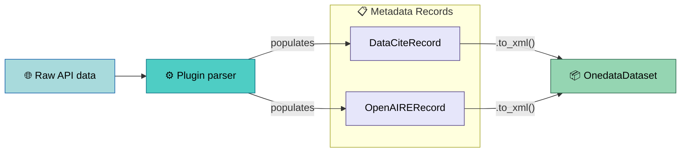
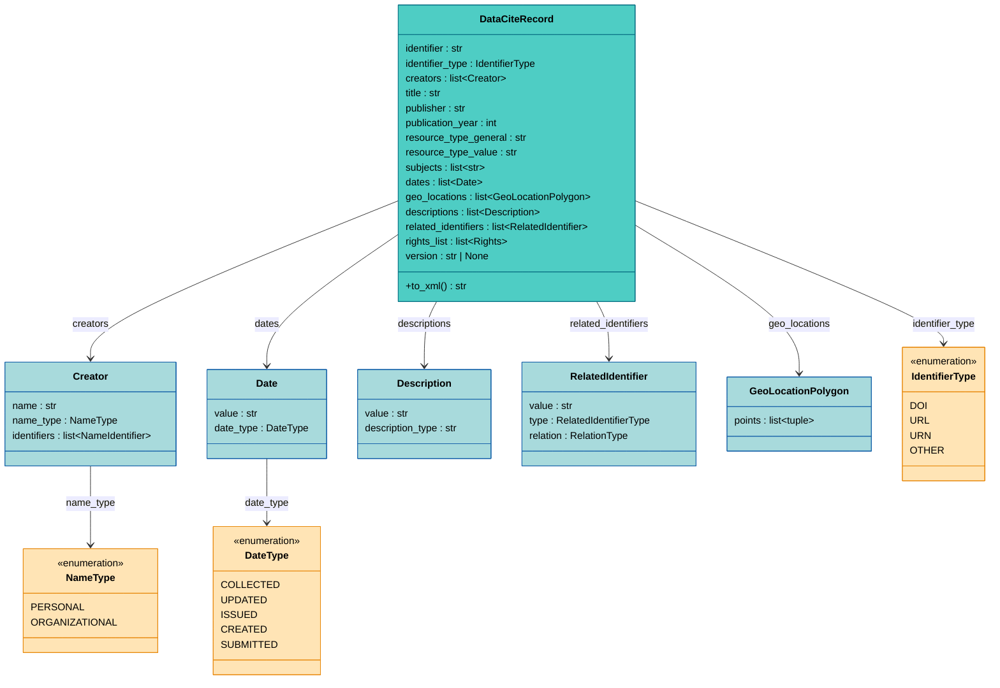
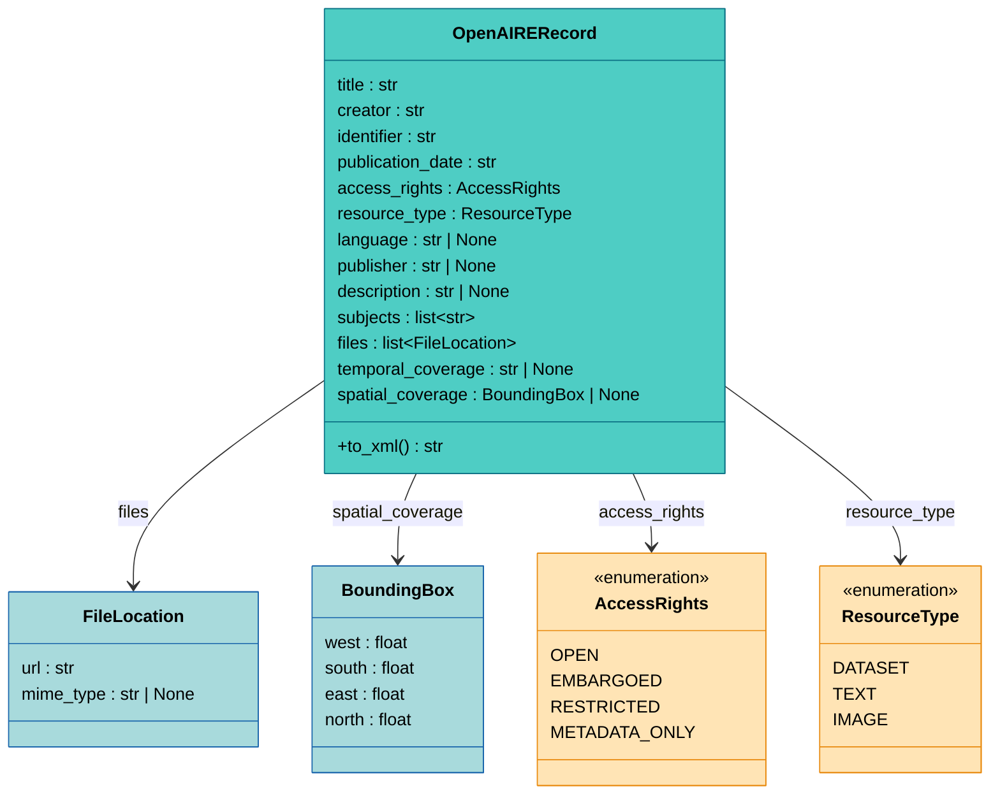

# Metadata Generation

Crawled datasets need standards-compliant XML metadata embedded in
their output records — Onedata uses this for discovery and
interoperability. The framework provides two structured record
types — [**DataCiteRecord**](#dataciterecord) and
[**OpenAIRERecord**](#openairerecord) — that plugins populate with
parsed fields and that produce XML via `to_xml()`. The record
carries the data *and* knows how to serialize itself — no separate
builder abstraction needed.



Each parser calls `record.to_xml()` once and stores the resulting
string in `OnedataDataset.metadata_xml`, so the dataset carries no
references back to parser state and can be serialized straight to
JSONL.


## DataCiteRecord

<sub>📄 `apps/crawlers/src/crawlers/metadata/datacite.py:151-178`</sub>

Generates XML compliant with
[DataCite Metadata Schema 4.5](https://schema.datacite.org/meta/kernel-4.5/).
Uses `xml.etree.ElementTree` for structured XML construction.



Mandatory fields (M in DataCite Kernel 4.5) have no default — the
dataclass constructor enforces their presence. Optional fields
default to `None` or empty collections; XML sections for absent
fields are not emitted.

### Sections

<sub>📄 `apps/crawlers/src/crawlers/metadata/datacite.py:219-339`</sub>

DataCite Kernel 4.5 defines mandatory (M) and recommended (R)
properties. The record supports:

| Section | Status | Populated from |
|---------|--------|----------------|
| Identifier | M | `identifier`, `identifier_type` |
| Creators | M | `creators` (with `NameIdentifier` support) |
| Titles | M | `title` |
| Publisher | M | `publisher` |
| PublicationYear | M | `publication_year` |
| ResourceType | M | `resource_type_general`, `resource_type_value` |
| Subjects | R | `subjects` |
| Dates | R | `dates` (with `DateType`) |
| GeoLocations | R | `geo_locations` (polygon points) |
| Descriptions | R | `descriptions` (with `description_type`) |
| RelatedIdentifiers | R | `related_identifiers` (with type + relation) |
| Rights | R | `rights_list` (with optional URI) |
| Version | R | `version` |

### Usage Pattern

<sub>📄 `apps/crawlers/src/crawlers/plugins/eodc/parser.py:118-143`</sub>

Plugins construct a `DataCiteRecord` directly in their parser,
populating fields from the raw API data. EODC's parser shows the
typical pattern — constants for source-specific defaults (creator,
publisher, subjects), with per-item fields (identifier, title,
dates, geometry) extracted from the STAC item:

```python
metadata = DataCiteRecord(
    identifier=item_id,
    identifier_type=IdentifierType.OTHER,
    creators=[Creator(name="European Space Agency", name_type=NameType.ORGANIZATIONAL)],
    title=title,
    publisher="EODC",
    publication_year=year_from_iso(dt),
    resource_type_general="Dataset",
    resource_type_value="Earth observation data",
    subjects=["Sentinel-1", "SAR", "GRD", "Copernicus"],
    dates=[Date(value=dt, date_type=DateType.COLLECTED)] if dt else [],
    geo_locations=polygons_from_geojson(geometry),
)
```


## OpenAIRERecord

<sub>📄 `apps/crawlers/src/crawlers/metadata/openaire.py:120-148`</sub>

Generates XML compliant with
[OpenAIRE Guidelines v4.0](https://openaire-guidelines-for-literature-repository-managers.readthedocs.io/en/v4.0.0/).
Uses `xml.etree.ElementTree` with proper namespace handling.



Like DataCite, mandatory fields have no default. `AccessRights`
values carry
[COAR vocabulary](https://vocabularies.coar-repositories.org/access_rights/)
URIs and labels. `ResourceType` values carry COAR Resource Type
URIs.

### Sections

<sub>📄 `apps/crawlers/src/crawlers/metadata/openaire.py:196-312`</sub>

| Section | Status | Populated from |
|---------|--------|----------------|
| Title | M | `title` (with `language` for `xml:lang`) |
| Creator | M | `creator` (organizational name) |
| Language | MA | `language` (ISO 639 code) |
| Publisher | MA | `publisher` |
| Publication Date | M | `publication_date` |
| Resource Type | M | `resource_type` (COAR URI + label) |
| Description | MA | `description` |
| Identifier | M | `identifier` (URN type) |
| Access Rights | M | `access_rights` (COAR URI + label) |
| Subjects | MA | `subjects` (capped at 20) |
| Temporal Coverage | R | `temporal_coverage` |
| Geo Location | O | `spatial_coverage` (bounding box) |
| Files | MA | `files` (URL + optional MIME type) |

(M = Mandatory, MA = Mandatory if Applicable, R = Recommended,
O = Optional)

### Usage Pattern

<sub>📄 `apps/crawlers/src/crawlers/plugins/ecudo/parser.py:117-133`</sub>

Ecudo's parser constructs an `OpenAIRERecord` from JSON-LD fields,
mapping eCUDO-specific conventions (access levels, spatial strings)
to OpenAIRE-compatible values:

```python
metadata = OpenAIRERecord(
    title=title,
    creator=publisher,
    identifier=identifier,
    publication_date=str(raw.get("issued", "")),
    access_rights=AccessRights.OPEN,
    language=normalize_language_code(raw.get("language", "en")),
    publisher=publisher,
    description=raw.get("description"),
    subjects=list(raw.get("keywords", [])),
    files=[FileLocation(url=f.url, mime_type=infer_mime_type(f.url)) for f in files],
    spatial_coverage=parse_bounding_box(raw.get("spatial")),
)
```
