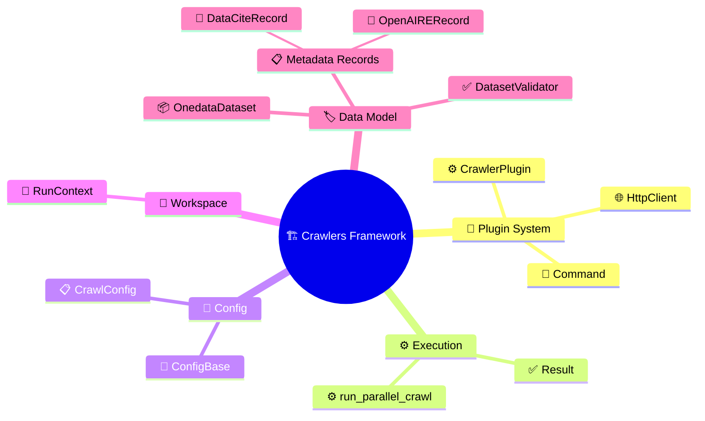

# Glossary

---

## Command

A named CLI entry point registered on a plugin via `@command`,
bound to a `ConfigBase` subclass that defines its arguments.
Learn more: [Plugin System](plugin-system.md#command-registration).

## ConfigBase

Base class for declarative configuration (from the `confline`
package, re-exported via `crawlers.core`). Subclasses are
dataclasses whose fields use `opt()` for metadata and
`Annotated[...]` for source-specific naming.
Learn more: [Writing Plugins — Configuration](../guides/writing-plugins.md#step-1-configuration).

## CrawlConfig

Framework-level config base for crawl commands — extends
`HttpConfig`, `OutputConfig`, and `ProcessingConfig` to provide
fields like `max_records` and `no_url_validation`. Plugin crawl
configs inherit from this.
Learn more:
[Writing Plugins — Configuration](../guides/writing-plugins.md#step-1-configuration).

## CrawlerPlugin

The single abstract base for all plugins — extends
`confline.CommandApp` to combine command registration, argparse
generation, multi-source config loading, and the complete crawl
lifecycle (`setup` → `iterate_datasets` → `process`, parallel
workers, JSONL sinks).
Learn more: [Plugin System](plugin-system.md#crawlerplugin).

## DataCiteRecord

Structured record that generates XML compliant with DataCite
Metadata Schema 4.5 via `to_xml()`.
Learn more: [Metadata](metadata.md#dataciterecord).

## DatasetValidator

Framework-owned validator (in `crawlers.core.dataset`) that
enforces non-empty files, unique paths, and (optionally) URL
reachability on every parsed `OnedataDataset`. Constructed by
`CrawlerPlugin.run_crawl()` via `_open_validator(config, stack)`
and passed to the runner before workers start.
Learn more:
[Plugin System](plugin-system.md#onedatadataset-assembly-and-validation).

## HttpClient

Concrete async HTTP client with retries, exponential backoff, and
`Result`-based error handling. Plugins create one during `setup()`
via `HttpClient.from_config(config)`.
Learn more: [Plugin System](plugin-system.md#httpclient).

## OnedataDataset

Frozen dataclass (from the `onedata-dataset` package, re-exported
via `crawlers.core.dataset`) representing a dataset ready for
Onedata registration — `name`, `target_dir`, `files`, `pid`,
`metadata_xml`. Plugins build it directly in their parser; the
framework's `DatasetValidator` enforces invariants before
persistence.
Learn more:
[Plugin System](plugin-system.md#onedatadataset-assembly-and-validation).

## OpenAIRERecord

Structured record that generates XML compliant with OpenAIRE
Guidelines v4.0 via `to_xml()`.
Learn more: [Metadata](metadata.md#openairerecord).

## Result

Explicit error-handling type: `type Result[T, E] = Ok[T] | Err[E]`.
Makes success/failure paths visible in signatures — `process()`
returns `Result[OnedataDataset, Any]`, `HttpClient` methods return
`Result[T, HttpFailure]` (where `HttpFailure` is
`ResponseFailure | TimeoutFailure`).
Learn more:
[Plugin System](plugin-system.md#iteration-and-processing).

## run_parallel_crawl

The producer–consumer engine that drives a crawl — feeds items
from `iterate_datasets()` into a bounded queue and processes them
with N concurrent workers. Tracks stats and routes results to
JSONL sinks.
Learn more:
[Plugin System](plugin-system.md#parallel-execution).

## RunContext

Manages a crawl run's directory, config snapshot, state
persistence, and JSONL sink lifecycle. Creates `processed.jsonl`
and `rejected.jsonl` via append-mode JSONL sinks.
Learn more:
[Plugin System](plugin-system.md#workspace-and-run-management).

---
