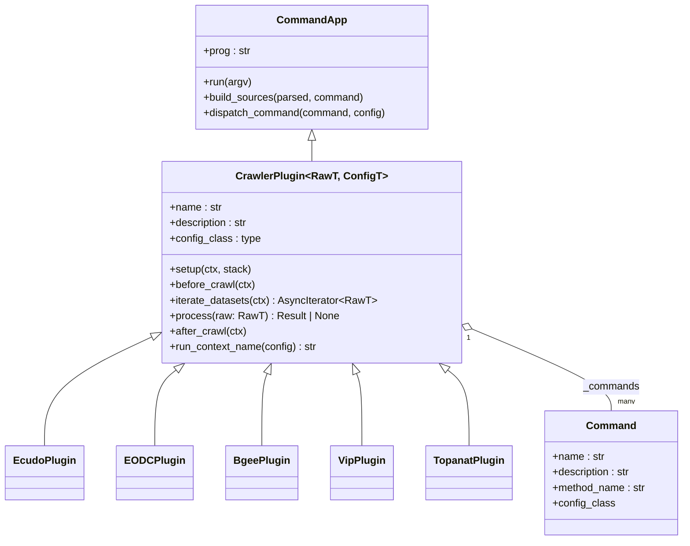
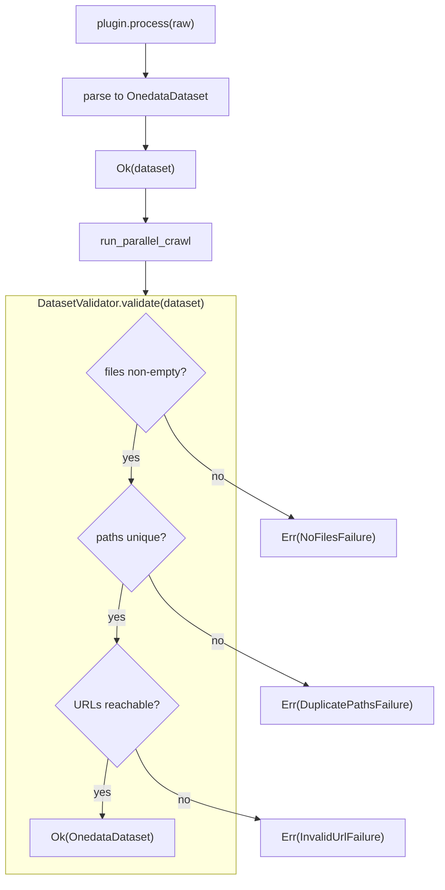
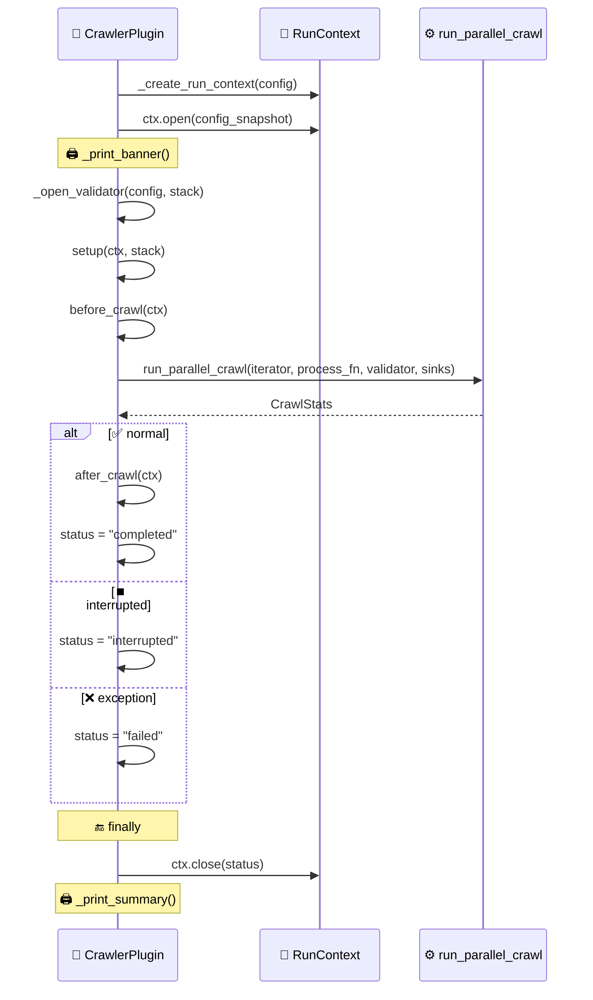
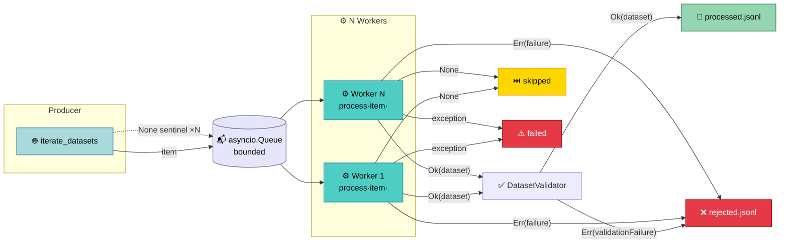

# Plugin System

<sub>source: `apps/crawlers/src/crawlers/core/plugin.py#CrawlerPlugin`</sub>

A plugin is a self-contained crawler for one external data source.
[**CrawlerPlugin**](#crawlerplugin) is the single base class that
all plugins extend — it extends `confline.CommandApp` to handle
command registration, argparse generation, multi-source config
loading, the crawl lifecycle, and parallel execution. You provide
the source-specific logic:
[`iterate_datasets()`](#iteration-and-processing) to list items
from the upstream API, and
[`process()`](#iteration-and-processing) to turn each item into an
[OnedataDataset](#onedatadataset-assembly-and-validation).



The plugin contract is intentionally minimal — only
`iterate_datasets` and `process` are abstract. The remaining
lifecycle methods (`setup`, `before_crawl`, `after_crawl`,
`run_context_name`) are optional hooks with sensible defaults.
The framework handles parallel execution, JSONL persistence,
progress display, run directories, and state management. See
[Writing Plugins](../guides/writing-plugins.md) for a step-by-step
guide.


## CrawlerPlugin

<sub>source: `apps/crawlers/src/crawlers/core/plugin.py#CrawlerPlugin`</sub>

`CrawlerPlugin[RawT, ConfigT]` is the abstract base for all
plugins. It extends `confline.CommandApp` (which owns the config
resolution and CLI dispatch machinery) and adds the crawl
lifecycle. The two type parameters define the plugin's data flow:

- **`RawT`** — the type yielded by `iterate_datasets()`. Ecudo
  yields `str` (dataset IDs requiring a detail fetch in
  `process()`), EODC yields `dict` (full STAC items), Bgee yields
  a custom `BgeeRawRecord`.
- **`ConfigT`** — the plugin's config class, which must extend
  [CrawlConfig](../guides/writing-plugins.md#step-1-configuration).

A concrete subclass sets three class attributes (`name`,
`description`, `config_class`) and implements two abstract methods
(`iterate_datasets`, `process`). The `crawl` command is
auto-registered when `name` is a string — no decorator needed.

### Command Registration

<sub>source: `packages/confline/src/confline/commands.py#command` · `apps/crawlers/src/crawlers/core/plugin.py#__init_subclass__`</sub>

Commands are declared with the `@command` decorator on async
methods:

```python
@command(name="list-orgs")
async def list_organizations(self, config: EcudoApiConfig, stack: AsyncExitStack) -> None:
    """List all available organizations from Ecudo."""
    ...
```

The decorator infers the config class from the first
`ConfigBase`-typed parameter and the help text from the docstring.
The command name defaults to the method name with underscores
replaced by dashes; override with `@command(name="ls", help="...")`.

When a subclass is created, `__init_subclass__` scans all methods
for `_command_def` attributes and collects them into the class-level
`_commands` dict. Commands are inherited — a method decorated in a
parent class is available in all subclasses unless overridden.

### CLI Generation and Dispatch

<sub>source: `packages/confline/src/confline/commands.py#CommandApp` · `packages/confline/src/confline/ui/argparse_builder.py#build_command_app_parser`</sub>

From the collected commands, `CommandApp._build_cli_parser()` (via
`build_command_app_parser()`) builds the full argparse structure — a
global `-c / --config` option, a subparser per command, and argument
groups derived from each command's config class hierarchy. At
runtime, `run(cli_args)` resolves the selected command, builds the
config object from all sources (see
[Writing Plugins — Resolution Priority](../guides/writing-plugins.md#resolution-priority)),
and invokes the decorated method via `dispatch_command()`.

For example, the generated `--help` for Ecudo shows how config
inheritance maps to argument groups:

```
$ crawlers ecudo crawl -h
usage: crawlers ecudo crawl [-h] [--page-size PAGE_SIZE] [--base-url BASE_URL] [-n MAX_RECORDS] [--no-url-validation | --no-no-url-validation] [--timeout TIMEOUT] [--max-retries MAX_RETRIES] [-o OUTPUT_DIR]
                            [--concurrency CONCURRENCY] [--queue-size QUEUE_SIZE]
                            organization

Crawl datasets

options:
  -h, --help            show this help message and exit

EcudoCrawlConfig:
  Ecudo crawl configuration.

  organization          Organization ID (e.g. iopan)
                        default: <required> · environment: CRAWLER_ORGANIZATION · yaml: organization
  --page-size PAGE_SIZE
                        Items per API page
                        default: 200 · environment: CRAWLER_PAGE_SIZE · yaml: page_size

EcudoApiConfig:
  Configuration for Ecudo API connections.

  --base-url BASE_URL   Ecudo API base URL
                        default: 'http://central.ecudo.pl' · environment: CRAWLER_BASE_URL · yaml: base_url

...
```

Each config class in the MRO becomes a separate argument group —
plugin-specific fields at the top, shared framework fields below.


## HttpClient

<sub>source: `apps/crawlers/src/crawlers/core/http.py#HttpClient`</sub>

Both `iterate_datasets()` and `process()` typically need to make
HTTP calls — for API pagination, detail fetches, or URL validation.
[**HttpClient**](glossary.md#httpclient) is the async HTTP client
all plugins use for this. It provides retries with exponential
backoff, `Result`-based error handling, and session management via
async context manager.

```python
async with HttpClient(base_url="https://api.example.com", timeout=15) as http:
    result = await http.get_json("/items")
    match result:
        case Ok(data):  ...
        case Err(failure):  ...
```

Plugins typically create an `HttpClient` in
[`setup()`](#crawl-lifecycle) using `HttpClient.from_config(config)`
and register it on the `AsyncExitStack` for automatic cleanup:

```python
async def setup(self, ctx, stack):
    self._http = await stack.enter_async_context(
        HttpClient.from_config(ctx.config)
    )
```

### Request Methods

The client offers typed convenience methods — all returning
`Result[T, HttpFailure]`:

| Method | Returns | Use |
|--------|---------|-----|
| `get_json(url)` | `Result[JsonValue, ...]` | JSON API calls |
| `post_json(url, body)` | `Result[JsonValue, ...]` | POST with JSON body |
| `get_json_object(url)` | `Result[JsonObject, ...]` | JSON guaranteed to be a dict |
| `get_text(url)` | `Result[str, ...]` | Text responses |
| `get_bytes(url)` | `Result[bytes, ...]` | Binary responses |
| `head(url)` | `Result[None, ...]` | URL reachability checks |

### Error Types

<sub>source: `apps/crawlers/src/crawlers/core/http.py#ResponseFailure` · `apps/crawlers/src/crawlers/core/http.py#TimeoutFailure`</sub>

Non-200 responses produce `ResponseFailure` (with status code,
method, URL, and truncated body). Network/timeout errors after
exhausting retries produce `TimeoutFailure`. Both carry `to_json()`
for structured serialization into rejection records.

### URL Resolution

When `base_url` is set, relative URLs are resolved against it.
Absolute URLs pass through unchanged — useful for server-provided
pagination links that may point to a different host.


## Iteration and Processing

<sub>source: `apps/crawlers/src/crawlers/core/plugin.py#iterate_datasets` · `apps/crawlers/src/crawlers/core/plugin.py#process`</sub>

Once the CLI dispatches a crawl command and config is loaded, the
framework calls the plugin's two core methods — the only abstract
methods on `CrawlerPlugin`:

```python
@abstractmethod
async def iterate_datasets(self, ctx: RunContext[ConfigT]) -> AsyncIterator[RawT]:
    """Async-iterate raw items from the upstream API."""

@abstractmethod
async def process(self, raw: RawT, /) -> Result[OnedataDataset, Any] | None:
    """Convert a raw item into an OnedataDataset."""
```

- **`iterate_datasets(ctx)`** — yields raw items from the upstream
  API. This is the producer side of the
  [parallel execution](#parallel-execution) model — the framework
  feeds these items into a bounded `asyncio.Queue`.

- **`process(raw)`** — converts a single raw item into an
  `OnedataDataset`. Runs inside one of N concurrent workers. May
  do I/O (additional API calls via the
  [HttpClient](#httpclient) stored on `self`).
  Return:
  - `Ok(dataset)` — validated by the framework, then persisted to
    `processed.jsonl`
  - `Err(failure)` — persisted to `rejected.jsonl` with failure
    details
  - `None` — silently skipped (not counted as rejection)

The split between iteration and processing is the core design
choice: `iterate_datasets` handles pagination and listing,
`process` handles the per-item work (fetching details, parsing,
building metadata, assembling the
[OnedataDataset](#onedatadataset-assembly-and-validation)). Because `process`
runs in parallel workers, it must be safe for concurrent
execution — store shared resources (like `HttpClient`) on `self`
during [`setup()`](#crawl-lifecycle), but avoid shared mutable
state.


## OnedataDataset Assembly and Validation

<sub>source: `packages/onedata-dataset/src/onedata_dataset/dataset.py#OnedataDataset` · `apps/crawlers/src/crawlers/core/dataset.py#DatasetValidator`</sub>

`OnedataDataset` itself is a frozen dataclass living in the
`onedata-dataset` package (re-exported via `crawlers.core.dataset`)
— `name`, `files`, `target_dir`, `pid`, `metadata_xml`. It is the
contract serialized to `processed.jsonl` and consumed by the
registrar.

Crawler-side concerns — empty-file checks, duplicate-path checks,
URL reachability — live in `DatasetValidator`
(`crawlers.core.dataset`). Plugins build the dataset directly
(typically inside their `parser.py`) and return it as `Ok(dataset)`.
The runner invokes the framework-managed validator before
persistence:



The validator performs three checks before passing the dataset
through:

1. **Non-empty files** — datasets with no downloadable files are
   rejected with `NoFilesFailure`.
2. **Unique paths** — duplicate `OnedataFile.path` values are
   rejected with `DuplicatePathsFailure`. Plugins handle path
   deduplication in their parsers (e.g.
   `resolve_path_collisions()`).
3. **URL reachability** (optional) — when the validator is
   constructed with an `HttpClient`, all file URLs are probed in
   parallel via HEAD requests. Any unreachable URL rejects the
   dataset with `InvalidUrlFailure`. Controlled by the
   `--no-url-validation` flag.

The validator is owned by the framework: `CrawlerPlugin.run_crawl()`
calls `_open_validator(config, stack)` before `setup()` and passes
the result to `run_parallel_crawl()`. Plugins never construct,
access, or close the validation `HttpClient` themselves.

### Typical process() Pattern

Every plugin's `process()` method follows the same shape: parse raw
data into an `OnedataDataset`, then return it as a successful result:

```python
async def process(self, raw: dict, /) -> Result[OnedataDataset, Any] | None:
    dataset = parse_item(raw)
    if dataset is None:
        return None

    return Ok(dataset)
```


## Crawl Lifecycle

<sub>source: `apps/crawlers/src/crawlers/core/plugin.py#run_crawl`</sub>

The sections above describe what a plugin provides — now here's the
full sequence of how the framework orchestrates a crawl from start
to finish. `run_crawl(config)` drives this in a fixed order:



1. **`_create_run_context(config)`** — creates a
   [RunContext](#workspace-and-run-management) with a timestamped
   run directory.
2. **`ctx.open()`** — creates the directory, writes `config.json`,
   opens JSONL sinks.
3. **`_open_validator(config, stack)`** — constructs the
   `DatasetValidator`, optionally with an HTTP client for URL probing.
4. **`setup(ctx, stack)`** — plugin hook for opening resources
   (HTTP clients, API facades). Register async context managers on
   `stack` so they close automatically on exit.
5. **`before_crawl(ctx)`** — plugin hook for pre-crawl validation
   (e.g. checking that a requested organization exists).
6. **`run_parallel_crawl(...)`** — the parallel execution step
   detailed [below](#parallel-execution).
7. **`after_crawl(ctx)`** — plugin hook for post-run actions
   (e.g. printing a conformity check).
8. **`ctx.close(status)`** — closes sinks, writes final
   `state.json`.

On `KeyboardInterrupt` or `CancelledError`, status is set to
`"interrupted"`. On other exceptions, status is `"failed"` and the
exception re-raises after cleanup. The `AsyncExitStack` ensures all
resources opened during `setup()` are cleaned up regardless of
outcome.

### Lifecycle Hooks

| Hook | When | Example |
|------|------|---------|
| `setup(ctx, stack)` | Before crawl starts | Open HTTP clients |
| `before_crawl(ctx)` | After setup, before workers | Validate preconditions |
| `after_crawl(ctx)` | After workers finish | Post-run reporting |
| `run_context_name(config)` | Run directory creation | Customize suffix |


## Parallel Execution

<sub>source: `apps/crawlers/src/crawlers/core/runner.py#run_parallel_crawl`</sub>

Step 6 of the lifecycle above — `run_parallel_crawl()` — is where
the actual dataset processing happens. It drives the crawl with a
producer–consumer pattern:



1. A **producer** task pulls from `iterate_datasets()` and enqueues
   items into a bounded `asyncio.Queue`.
2. **N worker** tasks (configurable via `concurrency`, default 128)
   dequeue items and call `process(item)`.
3. Workers route results: `Ok(dataset)` → validator → processed or
   rejection sink, `Err(failure)` → rejection sink, `None` → skip
   counter, exceptions → failure counter with warning.
4. Every `state_save_interval` items (default 100), stats are
   persisted to `state.json`.
5. The producer sends `None` sentinels (one per worker) to signal
   completion.
6. A Rich progress bar shows live throughput.

The bounded queue creates natural backpressure — the producer
blocks when the queue is full (`queue_size`, default 1000),
preventing unbounded memory growth against a fast API.

### CrawlStats

<sub>source: `apps/crawlers/src/crawlers/core/runner.py#CrawlStats`</sub>

The runner tracks five counters: `queued`, `processed`, `rejected`,
`skipped`, and `failed`. These feed both the periodic state
persistence and the post-crawl summary display.


## Workspace and Run Management

<sub>source: `apps/crawlers/src/crawlers/core/workspace.py#RunContext`</sub>

All the output from parallel execution — processed datasets,
rejected items, crawl statistics — lands in a **run directory**
with a fixed structure, managed by
[**RunContext**](glossary.md#runcontext):

```
<workspace>/runs/<timestamp>_<plugin>_<context>/
  config.json       # Config snapshot at run start
  state.json        # Status, timestamps, running stats
  processed.jsonl   # Successfully built OnedataDatasets
  rejected.jsonl    # Rejected items with failure details
```

`RunContext` manages the directory lifecycle:

1. **`open(config_snapshot)`** — creates the directory, writes
   `config.json`, initializes `state.json` with status `"running"`,
   opens both JSONL sink instances.
2. **`save_stats(stats)`** — periodically updates `state.json`
   (called by the runner every 100 items).
3. **`close(status)`** — closes sinks, writes final `state.json`
   with status `"completed"`, `"interrupted"`, or `"failed"`.


## Plugin Registry

<sub>source: `apps/crawlers/src/crawlers/plugins/__init__.py#REGISTERED_PLUGINS` · `apps/crawlers/src/crawlers/cli.py#main`</sub>

The [CLI generation](#cli-generation-and-dispatch) section above
showed how a single plugin's commands become argparse subcommands —
but how does the CLI discover plugins in the first place? Plugins
are registered as a hardcoded list in
`apps/crawlers/src/crawlers/plugins/__init__.py`. The CLI entry
point (`cli.py`) splits `argv` at the first non-flag argument (the
plugin name), looks it up in the registry, and calls
`plugin.run(plugin_argv)`. Each plugin is a `CommandApp` and owns
its own argparse tree — the top-level CLI is intentionally thin.

There is no dynamic plugin discovery — the registry is
intentionally simple because adding a plugin to the list is
trivial. See
[Writing Plugins — Step 5](../guides/writing-plugins.md#step-5-register-the-plugin)
for how to register a new plugin.
