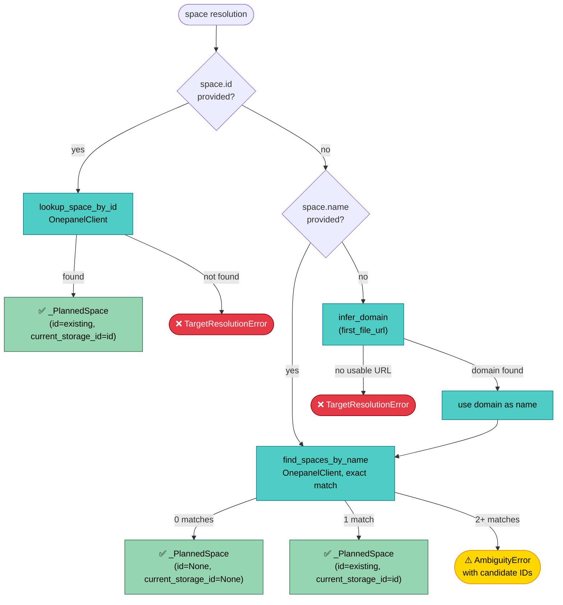
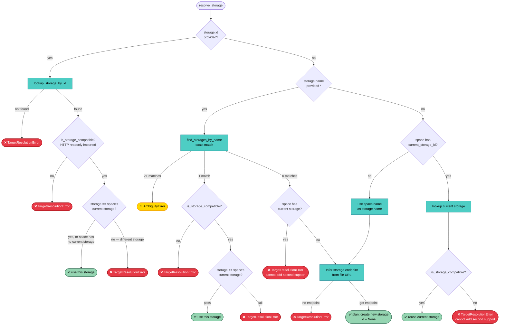
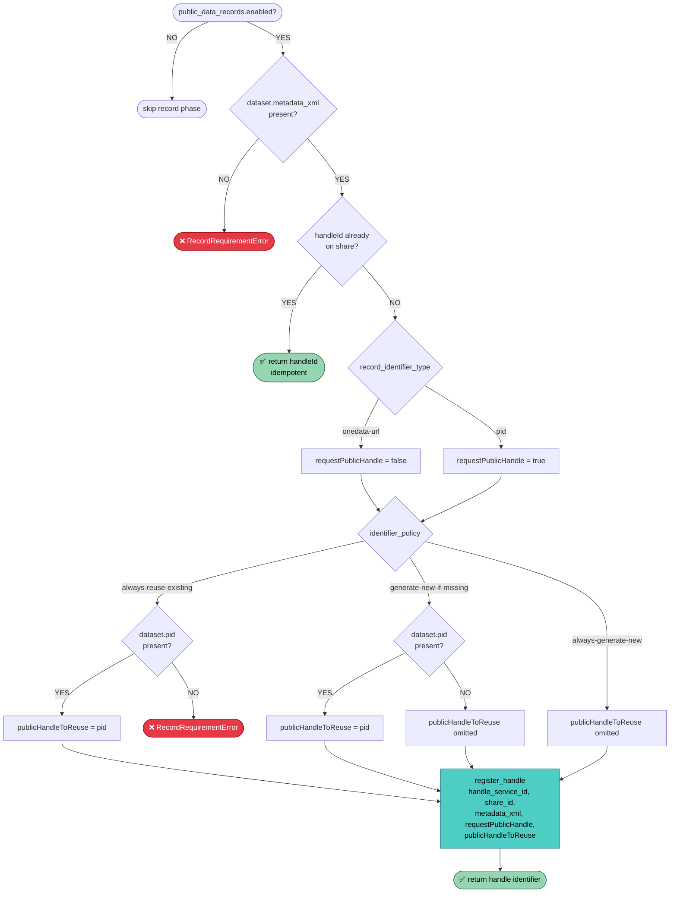

# Registrar Design Overview

source: `apps/registrar/src/registrar/register/command.py#run`

The registrar takes a file of crawled dataset metadata and turns it into
registered Onedata resources — files, shares, and optionally public data
records. You point it at a JSON or JSONL file produced by a crawler, it
figures out which Onedata space and storage to use (or creates them), asks
you to confirm, and then registers every dataset in a single batch run.

The `register` command is the only command with significant logic; the
companion `list-spaces` and `list-storages` commands are simple query
wrappers for operator convenience. The entry point is
`apps/registrar/src/registrar/register/command.py#run` — a linear
sequencer that reads top-to-bottom.

## Design Principles

source: `apps/registrar/src/registrar/register/command.py#_apply_target_plan` · `apps/registrar/src/registrar/register/registration.py#_process_one`

The `register` command splits its work into three distinct phases — plan,
apply, register — so the operator always sees what will happen before
anything changes. The planner resolves the target space and storage without
creating resources, the confirmation gate lets the operator inspect and
abort, and only then does the applier materialize missing infrastructure.
This design means you can run `registrar register datasets.jsonl` against
a production cluster and review the resolved plan before a single API call
mutates state.

Three more properties shape the design:

- **Per-dataset error isolation.** If one dataset fails to register (bad
  file URL, share conflict, missing metadata), the loop records the failure
  and moves on. The operator gets a full summary at the end rather than a
  partial run that stopped at the first error.

- **Idempotent re-runs.** Every step checks before creating: files are
  looked up by path before registration, shares are matched by name +
  description, handles are checked for existing `handleId`. A run
  interrupted halfway can be re-run with the same input — already-completed
  work is skipped automatically.

- **No rollback, by design.** If the space is created but support fails,
  the operator re-runs the command — the planner will find the existing
  space by name and pick up where it left off. This is simpler and more
  reliable than partial undo logic.

## Space Resolution

source: `apps/registrar/src/registrar/register/planner.py#_resolve_space` · `apps/registrar/src/registrar/register/lookups.py#find_spaces_by_name`

The planner resolves *which space* should hold the datasets. It follows
a cascade: explicit ID → name lookup → inference from file URLs, and
either produces a single unambiguous result or fails with a clear error.
It never silently picks one candidate over another.

The config layer enforces mutual exclusion between `space.id` and
`space.name`, so only one path can be active. When a name is inferred
from file URLs, the plan records `space_inferred=True` so the confirmation
display can highlight the guess before the operator commits.

## Storage Resolution

source: `apps/registrar/src/registrar/register/planner.py#_resolve_storage`

Storage resolution is more complex than space resolution because it must
satisfy two additional constraints:

- **Compatibility** — a storage must be HTTP readonly imported (the only
  type that supports file registration from external URLs). Incompatible
  types (POSIX, HTTP non-readonly) are rejected with a clear error.

- **Single-support invariant** — a space on a given provider can be
  supported by only one storage. The planner refuses to plan a switch
  rather than risk data split across storages or an API error at apply
  time.

When neither ID nor name is provided and the space already has a compatible
storage, the planner reuses it. When the space is new, the planner uses
the space name as the storage name — keeping them aligned by convention.

## Public Data Records

source: `apps/registrar/src/registrar/register/registration.py#_ensure_public_record` · `apps/registrar/src/registrar/api/onezone.py#OnezoneClient.register_handle`

After files and shares are in place, the registrar can optionally mint a
public identifier for each dataset's share. Both identifier types go
through `register_handle`; the behavior branches on two config values:
`record_identifier_type` (controls `requestPublicHandle`) and
`identifier_policy` (controls `publicHandleToReuse`).

- **`onedata-url`** (default) — registers the handle with
  `requestPublicHandle=false`. No public handle is minted by the service.
- **`pid`** — registers the handle with `requestPublicHandle=true`,
  asking the handle service (e.g. DOI or ePIC) to mint a public handle.

Both types require `metadata_xml` on the dataset and `handle_service_id`
in config.

### Identifier Policy

source: `apps/registrar/src/registrar/register/registration.py#_resolve_pid_to_reuse`

The `identifier_policy` controls `publicHandleToReuse` identically for
both `onedata-url` and `pid` types:

| Policy | `pid` present | `pid` absent |
|--------|---------------|--------------|
| `always-reuse-existing` | `publicHandleToReuse = pid` | Fail with `RecordRequirementError` |
| `generate-new-if-missing` | `publicHandleToReuse = pid` | Omit `publicHandleToReuse` |
| `always-generate-new` | Ignore the PID | Omit `publicHandleToReuse` |

The default is `generate-new-if-missing` — the safest option for batch
runs where some datasets carry PIDs from previous systems and others
are new.
