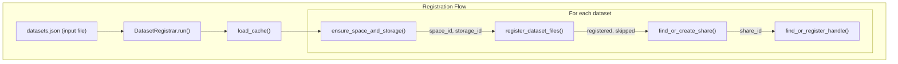

# Dataset Registrar Architecture

This document describes the modular architecture of the Dataset Registrar.

## Overview

The Dataset Registrar automates registration of datasets from external open science
services into Onedata. It creates HTTP storages and spaces as needed, registers files,
creates public shares, and optionally registers DOI handles.

## Module Structure

```
registrar/
├── __init__.py           # Package exports and version
├── __main__.py           # CLI entry point (python -m registrar)
├── cli.py                # Command-line interface (click)
├── config.py             # Configuration management
├── output.py             # Logging utilities
│
├── docs/
│   └── ARCHITECTURE.md   # This file
│
├── api/                  # Onedata API clients
│   ├── __init__.py       # Client exports
│   ├── onepanel.py       # OnepanelClient - admin operations (storages, space support)
│   ├── onezone.py        # OnezoneClient - space creation, tokens, handles
│   └── oneprovider.py    # OneproviderClient - file registration, shares
│
├── models.py             # Data structures (InputDataset, RegistrationResult)
├── cache.py              # ResourceCache - spaces/storages cache
├── operations.py         # Business logic functions
└── registrar.py          # DatasetRegistrar - high-level orchestration
```

## Data Flow



## Key Components

### API Clients (`api/`)

Classes that encapsulate Onedata REST API calls. Each client holds configuration
(domain, token) and a requests session.

**OnepanelClient** (`api/onepanel.py`)
- Admin operations on Oneprovider
- Storage management: `list_storages()`, `add_storage()`, `get_storage_details()`
- Space support: `list_spaces()`, `support_space()`, `get_space_details()`

**OnezoneClient** (`api/onezone.py`)
- User operations on Onezone
- Space creation: `create_space()`, `create_support_token()`
- Handle registration: `register_handle()`

**OneproviderClient** (`api/oneprovider.py`)
- Data operations on Oneprovider
- File registration: `register_file()`, `lookup_file_id()`, `get_file_attrs()`
- Shares: `create_share()`, `get_share_details()`

### ResourceCache (`cache.py`)

Caches spaces and storages to minimize API calls. Only tracks HTTP readonly
storages with matching space names (convention used for dataset registration).

### Operations (`operations.py`)

Pure functions implementing business logic. Dependencies passed explicitly.

| Function | Description |
|----------|-------------|
| `load_cache()` | Pre-load spaces/storages into cache |
| `ensure_space_and_storage()` | Create space+storage if not cached |
| `register_dataset_files()` | Register all files for a dataset |
| `find_or_create_share()` | Find existing or create new share |
| `find_or_register_handle()` | Find existing or register new DOI handle |

### DatasetRegistrar (`registrar.py`)

High-level orchestrator that ties everything together. Coordinates API clients,
cache, and operations to register datasets from external sources into Onedata.

## Configuration

Configuration uses a three-layer hierarchy (higher overrides lower):
1. Environment variables (`REGISTRAR_*` prefix)
2. Config file (`registrar.yaml`)
3. CLI arguments

### Config Sections

| Section | Description |
|---------|-------------|
| `onedata` | Onezone/Oneprovider domains, ports |
| `tokens` | Authentication tokens (admin, space owner, handle service) |
| `storage` | Default storage size |
| `output` | Output directory, log file |
| `logging` | Log level |

See `config.example.yaml` for all available options.

## CLI Commands

```bash
# Register datasets from JSON file
python -m registrar register datasets.json

# Register with options
python -m registrar register datasets.json --limit 10 --dry-run

# List HTTP readonly spaces
python -m registrar list-spaces

# List HTTP readonly storages
python -m registrar list-storages

# Show current configuration
python -m registrar show-config
```

## Design Decisions

### Error Handling

- API clients raise exceptions on HTTP errors
- Operations catch and log errors, continue processing other datasets
- Summary reports successful/failed counts
