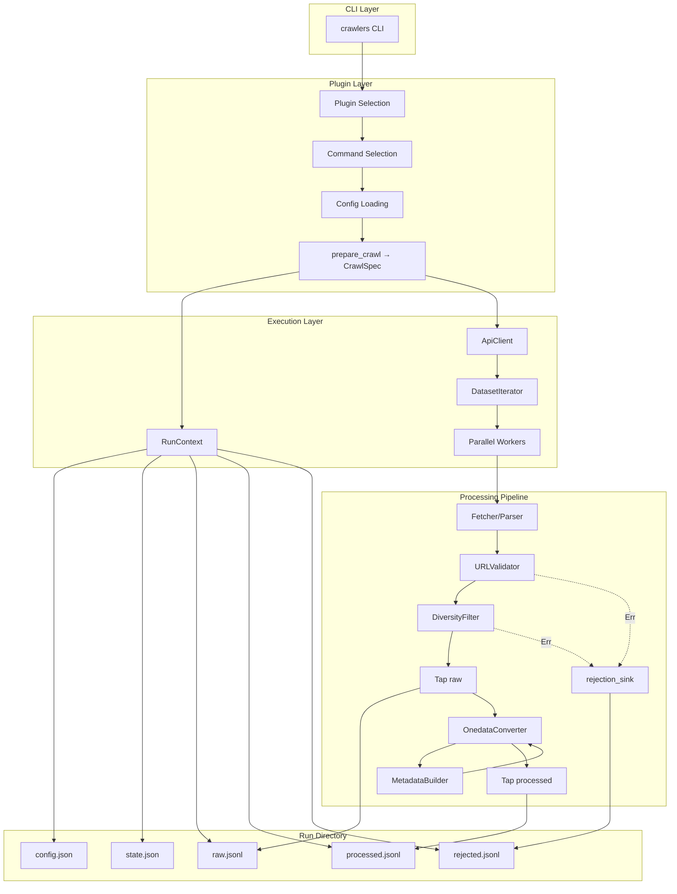

# Crawlers Framework Architecture

## Overview

The **crawlers** framework is a plugin-based system for crawling and processing
public scientific datasets. It provides:

- **Declarative configuration** with automatic CLI generation
- **Plugin architecture** for adding new data sources
- **Processing pipelines** for data transformation
- **Metadata generation** for standardized formats (DataCite, OpenAIRE)
- **Parallel execution** with progress tracking
- **Run persistence** with structured output directories and state files

The framework separates concerns: core provides reusable infrastructure, plugins
implement source-specific logic.

## Module Structure

```
crawlers/
├── __init__.py              # Package info
├── __main__.py              # Entry point: python -m crawlers
├── cli.py                   # Main CLI dispatcher
│
├── core/                    # Framework infrastructure
│   ├── abc/                 # Abstract base classes
│   │   ├── api.py           # ApiClient, DatasetIterator
│   │   ├── config.py        # ConfigBase, opt(), schema building
│   │   ├── metadata.py      # MetadataBuilder base
│   │   ├── plugin.py        # CrawlerPlugin, @command decorator
│   │   ├── processor.py     # Processor base, ProcessorStats
│   │   └── workspace.py     # RunContext ABC, make_run_dir()
│   │
│   ├── default/             # Ready-to-use implementations
│   │   ├── config.py        # ApiConfig, DefaultCrawlConfig, etc.
│   │   ├── plugin.py        # DefaultCrawlerPlugin, CrawlSpec
│   │   └── workspace.py     # DefaultRunContext
│   │
│   ├── metadata/            # Built-in metadata builders
│   │   ├── datacite.py      # DataCite Kernel 4.5
│   │   └── openaire.py      # OpenAIRE v4.0
│   │
│   ├── orchestration/       # Execution infrastructure
│   │   └── parallel.py      # run_parallel_pipeline, CrawlStats
│   │
│   ├── processors/          # Built-in processors
│   │   ├── pipeline.py      # ProcessorPipeline
│   │   ├── fetchers.py      # DatasetFetcher
│   │   ├── parsers.py       # ParserProcessor, Parser protocol
│   │   ├── validators.py    # URLValidator
│   │   ├── filters.py       # DiversityFilter
│   │   ├── converters.py    # OnedataConverter
│   │   └── tap.py           # Tap
│   │
│   ├── errors.py            # Structured error types (HttpError, TimeoutError)
│   ├── onedata.py           # Output data models (OnedataDataset)
│   ├── result.py            # Result[T, E] with Ok/Err variants
│   ├── sinks.py             # Sink ABC, JSONLSink, NullSink
│   │
│   └── ui/                  # Console output
│       ├── console.py       # Rich console wrapper
│       └── theme.py         # Color theme
│
├── plugins/                 # Data source implementations
│   ├── __init__.py          # Plugin registry (REGISTERED_PLUGINS)
│   ├── ecudo/               # eCUDO.pl plugin
│   │   ├── api.py           # EcudoClient, EcudoIteratorOpts
│   │   ├── config.py        # EcudoApiConfig, EcudoCrawlConfig
│   │   ├── models.py        # EcudoDataset, EcudoFile
│   │   ├── parser.py        # EcudoParser
│   │   └── plugin.py        # EcudoPlugin
│   └── eodc/                # EODC STAC plugin
│       ├── api.py           # EODCClient, EODCSearchOpts
│       ├── config.py        # EODCCrawlConfig
│       ├── metadata.py      # EODCDataCiteBuilder
│       ├── models.py        # EODCDataset, EODCFile
│       ├── parser.py        # EODCParser
│       └── plugin.py        # EODCPlugin
│
└── docs/                    # Documentation
    ├── arch/
    │   ├── ARCHITECTURE.md  # This file
    │   ├── configuration.md # Configuration system
    │   ├── plugins.md       # Plugin system
    │   ├── processors.md    # Processing pipeline
    │   ├── metadata.md      # Metadata generation
    │   └── crawling.md      # API clients, crawling, run context
    └── PLUGIN_GUIDE.md      # Step-by-step plugin guide
```

## Data Flow



## Key Components

### Configuration System

Declarative configuration using dataclasses with automatic CLI/YAML/ENV support.

| Component | Location | Purpose |
|-----------|----------|---------|
| `ConfigBase` | `core.abc.config` | Base class, auto-applies `@dataclass`, builds schema |
| `opt()` | `core.abc.config` | Field wrapper with CLI/ENV/YAML metadata |
| `ApiConfig` | `core.default.config` | Base API fields (base_url, timeout, max_retries) |
| `DefaultCrawlConfig` | `core.default.config` | Standard crawl config (+ output_dir, concurrency, max_records) |

**See:** [configuration.md](configuration.md)

### Plugin System

Plugin architecture with automatic CLI generation from decorated commands.

| Component | Location | Purpose |
|-----------|----------|---------|
| `CrawlerPlugin` | `core.abc.plugin` | Base class for all plugins |
| `DefaultCrawlerPlugin` | `core.default.plugin` | Batteries-included base for typical crawlers |
| `@command` | `core.abc.plugin` | Decorator registering methods as CLI commands |
| `CrawlSpec` | `core.default.plugin` | Describes what to crawl (client, opts, parser, builder) |

**See:** [plugins.md](plugins.md)

### Processing Pipeline

Modular processors chained for data transformation.

| Component | Location | Purpose |
|-----------|----------|---------|
| `Processor` | `core.abc.processor` | Base class with typed I/O and statistics |
| `ProcessorPipeline` | `core.processors.pipeline` | Chains processors, routes `Err` to rejection sink |
| `Tap` | `core.processors.tap` | Pass-through, copies items to a Sink |
| `Sink` / `JSONLSink` | `core.sinks` | External data destinations |

**See:** [processors.md](processors.md)

### Metadata Generation

Builders for standardized metadata formats.

| Component | Location | Purpose |
|-----------|----------|---------|
| `MetadataBuilder` | `core.abc.metadata` | Base class for metadata generators |
| `DataCiteBuilder` | `core.metadata.datacite` | DataCite Kernel 4.5 XML |
| `OpenAIREBuilder` | `core.metadata.openaire` | OpenAIRE v4.0 XML |

**See:** [metadata.md](metadata.md)

### Crawling System

API clients, run context, and parallel execution.

| Component | Location | Purpose |
|-----------|----------|---------|
| `ApiClient` | `core.abc.api` | HTTP client with retries and session management |
| `DefaultCrawlerPlugin` | `core.default.plugin` | Crawl lifecycle orchestration |
| `RunContext` | `core.abc.workspace` | Run directory, state, and sink lifecycle |
| `run_parallel_pipeline` | `core.orchestration.parallel` | Concurrent execution with progress |

**See:** [crawling.md](crawling.md)
