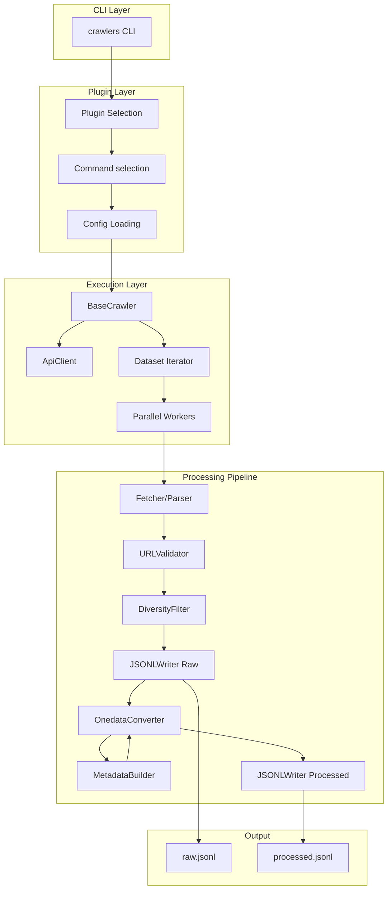

# Crawlers Framework Architecture

## Overview

The **crawlers** framework is a plugin-based system for crawling and processing 
public scientific datasets. It provides:

- **Declarative configuration** with automatic CLI generation
- **Plugin architecture** for adding new data sources
- **Processing pipelines** for data transformation
- **Metadata generation** for standardized formats (DataCite, OpenAIRE)
- **Parallel execution** with progress tracking

The framework separates concerns: core provides reusable infrastructure, plugins 
implement source-specific logic.

## Module Structure

```
crawlers/
├── __init__.py              # Package info
├── __main__.py              # Entry point: python -m crawlers
├── cli.py                   # Main CLI dispatcher
│
├── core/                    # Framework infrastructure
│   ├── abc/                 # Abstract base classes
│   │   ├── api.py           # ApiClient base
│   │   ├── config.py        # ConfigBase, opt(), schema building
│   │   ├── metadata.py      # MetadataBuilder base
│   │   └── processor.py     # Processor base, ProcessorStats
│   │
│   ├── config.py            # Reusable config classes (ApiConfig, etc.)
│   ├── crawler.py           # BaseCrawler orchestration
│   ├── plugin.py            # CrawlerPlugin, @command decorator
│   ├── onedata.py           # Output data models
│   │
│   ├── metadata/            # Built-in metadata builders
│   │   ├── datacite.py      # DataCite Kernel 4.5
│   │   └── openaire.py      # OpenAIRE v4.0
│   │
│   ├── orchestration/       # Execution infrastructure
│   │   └── parallel.py      # Concurrent pipeline execution
│   │
│   ├── processors/          # Built-in processors
│   │   ├── pipeline.py      # ProcessorPipeline
│   │   ├── fetchers.py      # DatasetFetcher
│   │   ├── parsers.py       # ParserProcessor, Parser protocol
│   │   ├── validators.py    # URLValidator
│   │   ├── filters.py       # DiversityFilter
│   │   ├── converters.py    # OnedataConverter
│   │   └── writers.py       # JSONLWriter
│   │
│   └── ui/                  # Console output
│       ├── console.py       # Rich console wrapper
│       └── theme.py         # Color theme
│
├── plugins/                 # Data source implementations
│   ├── __init__.py          # Plugin registry
│   ├── ecudo/               # eCUDO.pl plugin
│   │   ├── api.py           # EcudoClient
│   │   ├── config.py        # EcudoCrawlConfig
│   │   ├── crawler.py       # EcudoCrawler
│   │   ├── models.py        # EcudoDataset
│   │   ├── parser.py        # EcudoParser
│   │   └── plugin.py        # EcudoPlugin
│   └── eodc/                # EODC STAC plugin
│       ├── api.py           # EODCClient
│       ├── config.py        # EODCCrawlConfig
│       ├── crawler.py       # EODCCrawler
│       ├── metadata.py      # EODCDataCiteBuilder
│       ├── models.py        # EODCDataset
│       ├── parser.py        # EODCParser
│       └── plugin.py        # EODCPlugin
│
└── docs/                        # Documentation
    ├── arch/                    # Architecture documentation
    |   ├── ARCHITECTURE.md      # This file
    |   ├── configuration.md     # Configuration system
    |   ├── plugins.md           # Plugin system
    |   ├── processors.md        # Processing pipeline
    |   ├── metadata.md          # Metadata generation
    |   └── crawling.md          # API clients and crawlers
    └── PLUGIN_GUIDE.md          # Plugin implementation guide
```

## Data Flow



## Key Components

### Configuration System

Declarative configuration using dataclasses with automatic CLI/YAML/ENV support.

| Component | Purpose |
|-----------|---------|
| `ConfigBase` | Base class, auto-applies `@dataclass`, builds schema |
| `opt()` | Field wrapper with CLI/ENV/YAML metadata |
| `ConfigSchema` | Pre-built schema for argparse generation |

**See:** [configuration.md](configuration.md)

### Plugin System

Plugin architecture with automatic CLI generation from decorated commands.

| Component | Purpose |
|-----------|---------|
| `CrawlerPlugin` | Base class for plugins |
| `@command` | Decorator registering methods as CLI commands |
| `CommandDef` | Command metadata (name, config class, method) |

**See:** [plugins.md](plugins.md)

### Processing Pipeline

Modular processors chained for data transformation.

| Component | Purpose |
|-----------|---------|
| `Processor` | Base class with typed I/O and statistics |
| `ProcessorPipeline` | Chains processors, handles filtering |
| `ProcessorStats` | Statistics tracking (processed, filtered, failed) |

**See:** [processors.md](processors.md)

### Metadata Generation

Builders for standardized metadata formats.

| Component | Purpose |
|-----------|---------|
| `MetadataBuilder` | Base class for metadata generators |
| `DataCiteBuilder` | DataCite Kernel 4.5 XML |
| `OpenAIREBuilder` | OpenAIRE v4.0 XML |

**See:** [metadata.md](metadata.md)

### Crawling System

API clients and crawler orchestration.

| Component | Purpose |
|-----------|---------|
| `ApiClient` | HTTP client with retries and session management |
| `BaseCrawler` | Crawl lifecycle orchestration |
| `run_parallel_pipeline` | Concurrent execution with progress |

**See:** [crawling.md](crawling.md)
