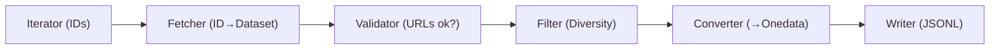

# Processing Pipeline

## Overview

The crawlers framework uses a pipeline architecture for processing data. 
Processors are modular units that transform, validate, filter, or write data. 
They are chained together in a `ProcessorPipeline` that executes them sequentially.

Key features:
- **Typed processing**: Generic types for input/output ensure type safety
- **Statistics tracking**: Built-in stats collection for monitoring
- **Lifecycle management**: `open()`/`close()` hooks for resource handling
- **Enable/disable**: Processors can be conditionally enabled
- **Filtering**: Returning `None` stops processing for that item

## Core Components

### Processor Base Class

```python
class Processor[InT, OutT, StatsT: ProcessorStats](ABC):
    """Abstract base class for typed processors."""
    
    def __init__(self, enabled: bool = True):
        self._stats = self._create_stats()
        self.enabled = enabled
    
    @abstractmethod
    async def process(self, item: InT) -> OutT | None:
        """Process a single item. Return None to filter out."""
    
    async def open(self) -> None:
        """Initialize resources (files, connections)."""
    
    async def close(self) -> None:
        """Cleanup resources."""
    
    def describe(self) -> str:
        """Human-readable description for logging."""
    
    def artifacts(self) -> list[Path]:
        """Output files produced by this processor."""
    
    def _create_stats(self) -> StatsT:
        """Create statistics instance."""
```

**Type Parameters:**

| Parameter | Description |
|-----------|-------------|
| `InT` | Input item type |
| `OutT` | Output item type |
| `StatsT` | Statistics class (extends `ProcessorStats`) |

### ProcessorStats

Base statistics class with common counters:

```python
@dataclass
class ProcessorStats:
    processed: int = 0  # Successfully processed
    filtered: int = 0   # Intentionally filtered out
    failed: int = 0     # Processing errors
    
    def __str__(self) -> str:
        return f"{self.processed} ok, {self.filtered} filtered, {self.failed} failed"
```

Subclass for custom statistics:

```python
@dataclass
class FetcherStats(ProcessorStats):
    fetched: int = 0
    parsed: int = 0
    
    def __str__(self) -> str:
        return f"fetched: {self.fetched}, parsed: {self.parsed}, failed: {self.failed}"
```

### ProcessorPipeline

Chains multiple processors into a sequential pipeline:

```python
pipeline = ProcessorPipeline([
    DatasetFetcher(...),
    URLValidator(...),
    OnedataConverter(...),
    JSONLWriter(...),
])

await pipeline.open()
result = await pipeline.process(item)  # Flows through all processors
await pipeline.close()

# Collect statistics
for name, stats in pipeline.get_processor_stats():
    print(f"{name}: {stats}")
```

**Pipeline behavior:**
- Items flow through processors in order
- If any processor returns `None`, pipeline stops for that item
- Disabled processors are skipped
- Each processor maintains its own statistics

## Built-in Processors

### DatasetFetcher

Fetches data by ID and parses it:

```python
class DatasetFetcher[RawT, DatasetT](Processor[str, DatasetT, FetcherStats]):
    def __init__(
        self,
        fetch_fn: Callable[[str], Awaitable[RawT]],  # ID -> raw data
        parser: Parser[RawT, DatasetT],               # raw -> model
        enabled: bool = True,
    )
```

**Use case:** APIs where listing returns IDs, and details require separate requests.

```python
DatasetFetcher(
    fetch_fn=client.get_dataset_metadata,
    parser=EcudoParser(),
)
```

### ParserProcessor

Parses raw data directly (no fetch step):

```python
class ParserProcessor[RawT, DatasetT](Processor[RawT, DatasetT, ParserStats]):
    def __init__(
        self,
        parser: Parser[RawT, DatasetT],
        enabled: bool = True,
    )
```

**Use case:** APIs that return full records in search results (like STAC).

### URLValidator

Validates accessibility of file URLs:

```python
class URLValidator[DatasetT: Dataset](Processor[DatasetT, DatasetT, URLValidatorStats]):
    def __init__(
        self,
        validate_fn: Callable[[str], Awaitable[bool]],  # URL -> is_valid
        invalid_url_log: Path | None = None,            # Log invalid URLs
        enabled: bool = True,
    )
```

**Behavior:**
- Checks all `dataset.files[].url`
- Filters out datasets with any invalid URL
- Optionally logs invalid URLs to JSONL file

```python
URLValidator(
    validate_fn=client.validate_url,
    invalid_url_log=Path("invalid_urls.jsonl"),
    enabled=config.get_url_validator_enabled(),
)
```

### DiversityFilter

Filters similar datasets by title:

```python
class DiversityFilter[DatasetT: Dataset](Processor[DatasetT, DatasetT, DiversityFilterStats]):
    def __init__(
        self,
        max_similar: int = 10,           # Max datasets per group
        similarity_threshold: float = 0.85,  # 0.0-1.0
        enabled: bool = True,
    )
```

**Behavior:**
- Groups datasets by similar titles (using `difflib.SequenceMatcher`)
- Limits each group to `max_similar` datasets
- Ensures diversity in output

### OnedataConverter

Converts source dataset to Onedata format:

```python
class OnedataConverter[DatasetT: Dataset](Processor[DatasetT, OnedataDataset, ConverterStats]):
    def __init__(
        self,
        metadata_builder: MetadataBuilder[DatasetT],
        enabled: bool = True,
    )
```

**Responsibilities:**
- Generates metadata XML using the provided builder
- Resolves file path collisions (multiple files with same name)
- Creates `OnedataDataset` ready for registration

### JSONLWriter

Writes items to JSONL file:

```python
class JSONLWriter[ItemT: dict | Serializable](Processor[ItemT, ItemT, WriterStats]):
    def __init__(
        self,
        output_path: Path,
        enabled: bool = True,
    )
```

**Behavior:**
- Passes items through unchanged (tap pattern)
- Supports `dict` or objects with `to_json()` method
- Creates parent directories automatically

## Parser Protocol

Parsers convert raw API data to dataset models:

```python
class Parser[I, O](Protocol):
    def parse(self, raw: I) -> O | None:
        """Parse raw data. Return None to skip."""
```

**Example implementation:**

```python
class EcudoParser(Parser[dict, EcudoDataset]):
    def parse(self, raw: dict) -> EcudoDataset | None:
        identifier = raw.get("identifier")
        if not identifier:
            return None
        
        files = self._parse_files(raw.get("distribution", []))
        if not files:
            return None  # Skip datasets without files
        
        return EcudoDataset(
            identifier=identifier,
            title=raw.get("title", "Untitled"),
            files=files,
            ...
        )
```

## Creating Custom Processors

### Step 1: Define Statistics (Optional)

```python
from dataclasses import dataclass
from crawlers.core.abc.processor import ProcessorStats

@dataclass
class MyProcessorStats(ProcessorStats):
    custom_counter: int = 0
    
    def __str__(self) -> str:
        return f"processed: {self.processed}, custom: {self.custom_counter}"
```

### Step 2: Implement Processor

```python
from crawlers.core.abc.processor import Processor

class MyProcessor(Processor[InputType, OutputType, MyProcessorStats]):
    """Description of what this processor does."""
    
    def __init__(self, option: str, enabled: bool = True):
        super().__init__(enabled=enabled)
        self.option = option
        self._resource = None
    
    def _create_stats(self) -> MyProcessorStats:
        return MyProcessorStats()
    
    def describe(self) -> str:
        return f"MyProcessor: {self.option}"
    
    async def open(self) -> None:
        """Initialize resources."""
        self._resource = await create_resource()
    
    async def close(self) -> None:
        """Cleanup resources."""
        if self._resource:
            await self._resource.close()
    
    async def process(self, item: InputType) -> OutputType | None:
        """Process single item."""
        try:
            result = transform(item, self.option)
            
            if should_filter(result):
                self._stats.filtered += 1
                return None
            
            self._stats.processed += 1
            self._stats.custom_counter += 1
            return result
            
        except ProcessingError:
            self._stats.failed += 1
            return None
```

### Step 3: Add to Pipeline

```python
def build_pipeline(self, client: ApiClient) -> ProcessorPipeline:
    return ProcessorPipeline([
        DatasetFetcher(...),
        MyProcessor(option="value", enabled=True),
        JSONLWriter(...),
    ])
```

## Example: Complete Pipeline

```python
from crawlers.core.processors.pipeline import ProcessorPipeline
from crawlers.core.processors.fetchers import DatasetFetcher
from crawlers.core.processors.validators import URLValidator
from crawlers.core.processors.filters import DiversityFilter
from crawlers.core.processors.converters import OnedataConverter
from crawlers.core.processors.writers import JSONLWriter

def build_pipeline(self, client: ApiClient) -> ProcessorPipeline:
    cfg = self.config
    
    return ProcessorPipeline([
        # 1. Fetch and parse: ID -> EcudoDataset
        DatasetFetcher(
            fetch_fn=client.get_dataset_metadata,
            parser=EcudoParser(),
        ),
        
        # 2. Validate URLs (optional)
        URLValidator(
            validate_fn=client.validate_url,
            invalid_url_log=Path("invalid_urls.jsonl"),
            enabled=cfg.get_url_validator_enabled(),
        ),
        
        # 3. Filter similar titles (optional)
        DiversityFilter(
            max_similar=10,
            similarity_threshold=0.85,
            enabled=cfg.get_diversity_filter_enabled(),
        ),
        
        # 4. Write raw data
        JSONLWriter(output_path=Path("raw.jsonl")),
        
        # 5. Convert: EcudoDataset -> OnedataDataset
        OnedataConverter(
            metadata_builder=OpenAIREBuilder(),
        ),
        
        # 6. Write processed data
        JSONLWriter(output_path=Path("processed.jsonl")),
    ])
```

## Data Flow Visualization



## Best Practices

### Statistics

- Always update stats in `process()` method
- Use `filtered` for intentional filtering (validation failed, duplicate, etc.)
- Use `failed` for errors (parsing failed, API error, etc.)
- Use `processed` for successfully processed items

### Resource Management

```python
async def open(self) -> None:
    # Open files, create connections
    self._file = open(self.path, "w")

async def close(self) -> None:
    # Always cleanup, even on errors
    if self._file:
        self._file.close()
        self._file = None
```

### Filtering Pattern

```python
async def process(self, item: DatasetT) -> DatasetT | None:
    if not item.is_valid():
        self._stats.filtered += 1
        return None  # Filter out - pipeline stops here for this item
    
    self._stats.processed += 1
    return item  # Pass to next processor
```

### Tap Pattern (Writers)

Writers that don't transform data should pass items through:

```python
async def process(self, item: ItemT) -> ItemT:
    # Write to file
    self._file.write(json.dumps(item.to_json()) + "\n")
    self._stats.written += 1
    self._stats.processed += 1
    
    return item  # Pass unchanged to next processor
```

### Protocol-based Typing

Use protocols to define required dataset attributes:

```python
class Dataset(Protocol):
    identifier: str
    title: str
    files: Sequence[DatasetFile]

class URLValidator[DatasetT: Dataset](Processor[DatasetT, DatasetT, Stats]):
    # Works with any dataset that has identifier, title, files
    ...
```

This allows processors to work with different dataset types without tight coupling.
