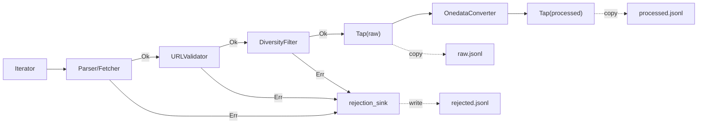

# Processing Pipeline

## Overview

The crawlers framework uses a pipeline architecture for processing data.
Processors are modular units that transform, validate, filter, or observe data.
They are chained together in a `ProcessorPipeline` that executes them sequentially.

Key features:
- **Typed processing**: Generic types for input/output ensure type safety
- **Result-based rejection**: `Err` return stops processing and logs to rejection sink
- **Statistics tracking**: Built-in stats collection for monitoring
- **Lifecycle management**: `open()`/`close()` hooks for resource handling
- **Enable/disable**: Processors can be conditionally enabled

## Core Components

### Processor Base Class

```python
class Processor[InT, OutT, StatsT: ProcessorStats](ABC):
    """Abstract base class for typed processors."""

    def __init__(self, enabled: bool = True):
        self._stats = self._create_stats()
        self.enabled = enabled

    @abstractmethod
    async def process(self, item: InT) -> Result[OutT, object]:
        """
        Process a single item.
        Return Ok(item) to pass to next processor.
        Return Err(reason) to reject — pipeline stops for this item.
        """

    async def open(self) -> None:
        """Initialize resources (files, connections)."""

    async def close(self) -> None:
        """Cleanup resources."""

    def describe(self) -> str:
        """Human-readable description for logging."""

    def artifacts(self) -> list[Path]:
        """Output files produced by this processor."""
```

**Type Parameters:**

| Parameter | Description |
|-----------|-------------|
| `InT` | Input item type |
| `OutT` | Output item type |
| `StatsT` | Statistics class (extends `ProcessorStats`) |

### ProcessorStats

Base statistics class with common counters:

```python
@dataclass
class ProcessorStats:
    processed: int = 0  # Successfully processed
    filtered: int = 0   # Intentionally rejected
    failed: int = 0     # Processing errors

    def __str__(self) -> str:
        return f"{self.processed} ok, {self.filtered} filtered, {self.failed} failed"
```

Subclass for custom statistics:

```python
@dataclass
class FetcherStats(ProcessorStats):
    fetched: int = 0
    parsed: int = 0
```

### ProcessorPipeline

Chains multiple processors into a sequential pipeline. Takes a `rejection_sink`
that receives error details whenever a processor returns `Err`.

```python
pipeline = ProcessorPipeline(
    processors=[
        ParserProcessor(parser=MyParser()),
        URLValidator(validate_fn=client.validate_url),
        Tap(ctx.raw_sink, transform=lambda d: d.to_json()),
        OnedataConverter(metadata_builder=MyBuilder()),
        Tap(ctx.processed_sink, transform=lambda d: d.to_json()),
    ],
    rejection_sink=ctx.rejection_sink,
)

await pipeline.open()
result = await pipeline.process(item)   # Flows through all processors
await pipeline.close()

# Collect statistics
for name, stats in pipeline.get_processor_stats():
    print(f"{name}: {stats}")
```

**Pipeline behavior:**
- Items flow through processors in order
- If any processor returns `Err`, the pipeline stops for that item and pushes
  error details to the `rejection_sink`
- Disabled processors are skipped entirely
- Each processor maintains its own statistics

## Built-in Processors

### ParserProcessor

Parses raw data directly (no fetch step):

```python
class ParserProcessor[RawT, DatasetT](Processor[RawT, DatasetT, ParserStats]):
    def __init__(
        self,
        parser: Parser[RawT, DatasetT],
        enabled: bool = True,
    )
```

**Use case:** APIs that return full records in search results (like STAC).

### DatasetFetcher

Fetches data by ID and parses it:

```python
class DatasetFetcher[RawT, DatasetT](Processor[str, DatasetT, FetcherStats]):
    def __init__(
        self,
        fetch_fn: Callable[[str], Awaitable[RawT]],  # ID -> raw data
        parser: Parser[RawT, DatasetT],
        enabled: bool = True,
    )
```

**Use case:** APIs where listing returns IDs and details require separate requests.

```python
DatasetFetcher(
    fetch_fn=client.get_dataset_metadata,
    parser=EcudoParser(),
)
```

### URLValidator

Validates accessibility of file URLs:

```python
class URLValidator[DatasetT: Dataset](Processor[DatasetT, DatasetT, URLValidatorStats]):
    def __init__(
        self,
        validate_fn: Callable[[str], Awaitable[Result[bool, object]]],
        enabled: bool = True,
    )
```

**Behavior:**
- Checks all `dataset.files[].url`
- Returns `Err` for datasets with any invalid URL (logged to `rejection_sink`)

```python
URLValidator(
    validate_fn=client.validate_url,
    enabled=config.get_url_validator_enabled(),
)
```

### DiversityFilter

Filters similar datasets by title:

```python
class DiversityFilter[DatasetT: Dataset](Processor[DatasetT, DatasetT, DiversityFilterStats]):
    def __init__(
        self,
        max_similar: int = 10,
        similarity_threshold: float = 0.85,
        enabled: bool = True,
    )
```

**Behavior:**
- Groups datasets by similar titles (using `difflib.SequenceMatcher`)
- Limits each group to `max_similar` datasets
- Returns `Err` for excess items (logged to `rejection_sink`)

### OnedataConverter

Converts source dataset to Onedata format:

```python
class OnedataConverter[DatasetT: Dataset](Processor[DatasetT, OnedataDataset, ConverterStats]):
    def __init__(
        self,
        metadata_builder: MetadataBuilder[DatasetT],
        enabled: bool = True,
    )
```

**Responsibilities:**
- Generates metadata XML using the provided builder
- Resolves file path collisions (multiple files with same name)
- Creates `OnedataDataset` ready for registration

### Tap

Pass-through processor that sends a copy of each item to a Sink:

```python
class Tap[T](Processor[T, T, TapStats]):
    def __init__(
        self,
        sink: Sink,
        transform: Callable[[T], Any] | None = None,
        enabled: bool = True,
    )
```

**Behavior:**
- Passes items through unchanged (`Ok(item)`)
- Optionally applies `transform` before pushing to the sink (e.g. `.to_json()`)
- Does **not** manage the sink lifecycle — that is `RunContext`'s responsibility

```python
Tap(ctx.raw_sink, transform=lambda d: d.to_json())
```

Tap replaces the old `JSONLWriter` processor.

## Parser Protocol

Parsers convert raw API data to dataset models:

```python
class Parser[I, O](Protocol):
    def parse(self, raw: I) -> O | None:
        """Parse raw data. Return None to skip."""
```

Return `None` to skip an invalid record without producing an error.

**Example implementation:**

```python
class EcudoParser(Parser[dict, EcudoDataset]):
    def parse(self, raw: dict) -> EcudoDataset | None:
        identifier = raw.get("identifier")
        if not identifier:
            return None

        files = self._parse_files(raw.get("distribution", []))
        if not files:
            return None  # Skip datasets without files

        return EcudoDataset(
            identifier=identifier,
            title=raw.get("title", "Untitled"),
            files=files,
        )
```

## Creating Custom Processors

### Step 1: Define Statistics (Optional)

```python
from dataclasses import dataclass
from crawlers.core.abc.processor import ProcessorStats

@dataclass
class MyProcessorStats(ProcessorStats):
    custom_counter: int = 0

    def __str__(self) -> str:
        return f"processed: {self.processed}, custom: {self.custom_counter}"
```

### Step 2: Implement Processor

```python
from crawlers.core.abc.processor import Processor
from crawlers.core0.result import Ok, Err, Result


class MyProcessor(Processor[InputType, OutputType, MyProcessorStats]):
  """Description of what this processor does."""

  def __init__(self, option: str, enabled: bool = True):
    super().__init__(enabled=enabled)
    self.option = option

  def _create_stats(self) -> MyProcessorStats:
    return MyProcessorStats()

  def describe(self) -> str:
    return f"MyProcessor: {self.option}"

  async def process(self, item: InputType) -> Result[OutputType, object]:
    """Process single item."""
    if should_reject(item):
      self._stats.filtered += 1
      return Err({
        "dataset_id": item.identifier,
        "reason": "my_rejection_reason",
        "detail": {"value": str(item)},
        "processor": "MyProcessor",
      })

    result = transform(item, self.option)
    self._stats.processed += 1
    self._stats.custom_counter += 1
    return Ok(result)
```

### Step 3: Add to Pipeline

```python
def build_pipeline(self, spec: CrawlSpec, ctx: DefaultRunContext) -> ProcessorPipeline:
    return ProcessorPipeline(
        processors=[
            ParserProcessor(parser=spec.parser),
            MyProcessor(option="value"),
            Tap(ctx.raw_sink, transform=lambda d: d.to_json()),
            OnedataConverter(metadata_builder=spec.metadata_builder),
            Tap(ctx.processed_sink, transform=lambda d: d.to_json()),
        ],
        rejection_sink=ctx.rejection_sink,
    )
```

## Example: Complete Custom Pipeline

```python
from crawlers.core.processors.pipeline import ProcessorPipeline
from crawlers.core.processors.fetchers import DatasetFetcher
from crawlers.core.processors.validators import URLValidator
from crawlers.core.processors.filters import DiversityFilter
from crawlers.core.processors.converters import OnedataConverter
from crawlers.core.processors.tap import Tap

def build_pipeline(self, spec: CrawlSpec, ctx: DefaultRunContext) -> ProcessorPipeline:
    client = cast(EcudoClient, spec.client)
    cfg = self._crawl_config

    return ProcessorPipeline(
        processors=[
            # 1. Fetch and parse: ID -> EcudoDataset
            DatasetFetcher(
                fetch_fn=client.get_dataset_metadata,
                parser=spec.parser,
            ),

            # 2. Validate URLs (optional)
            URLValidator(
                validate_fn=client.validate_url,
                enabled=spec.url_validation,
            ),

            # 3. Filter similar titles (optional)
            DiversityFilter(
                max_similar=cfg.processors.diversity_filter.max_similar,
                enabled=cfg.get_diversity_filter_enabled(),
            ),

            # 4. Observe: write raw data
            Tap(ctx.raw_sink, transform=lambda d: d.to_json()),

            # 5. Convert: EcudoDataset -> OnedataDataset
            OnedataConverter(metadata_builder=spec.metadata_builder),

            # 6. Observe: write processed data
            Tap(ctx.processed_sink, transform=lambda d: d.to_json()),
        ],
        rejection_sink=ctx.rejection_sink,
    )
```

## Data Flow



## Best Practices

### Result-based Rejection

Return structured `Err` dicts for rejection logging:

```python
return Err({
    "dataset_id": item.identifier,
    "reason": "invalid_url",
    "detail": {"url": failed_url, "status": 404},
    "processor": "URLValidator",
})
```

Return `None` from `Parser.parse()` to silently skip malformed records that
shouldn't appear in the rejection log.

### Statistics

- `filtered`: intentional rejection (validation failed, duplicate, etc.)
- `failed`: unexpected errors (parsing failed, network error, etc.)
- `processed`: successfully processed and passed to next stage

### Resource Management

```python
async def open(self) -> None:
    self._resource = await create_resource()

async def close(self) -> None:
    if self._resource:
        await self._resource.close()
        self._resource = None
```

### Protocol-based Typing

Use protocols to define required dataset attributes:

```python
class Dataset(Protocol):
    identifier: str
    files: Sequence[DatasetFile]

class URLValidator[DatasetT: Dataset](Processor[DatasetT, DatasetT, Stats]):
    # Works with any dataset type that has identifier and files
    ...
```
