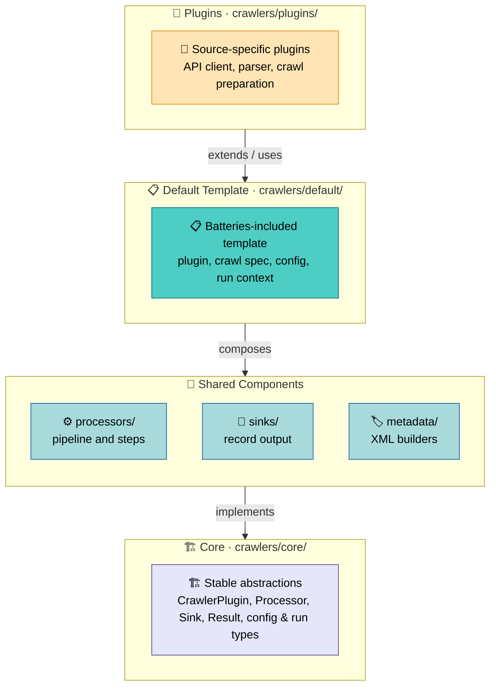
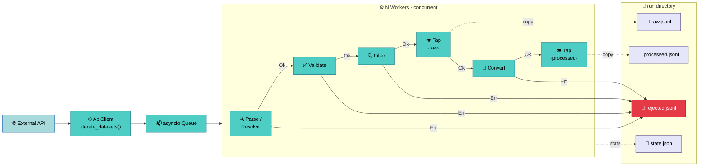

# Crawlers Architecture Overview

The `crawlers` package is a framework for harvesting scientific
dataset metadata from external APIs and producing Onedata-compatible
registration records — structured entries that Onedata uses to make
datasets discoverable and accessible within spaces. Adding support
for a new data source requires
only the source-specific parts — API client, parser, config — while
the [processing pipeline](processing.md),
[parallel execution](processing.md#parallel-execution),
[workspace management](plugin-system.md#workspace-and-run-management),
and [CLI generation](plugin-system.md#cli-argument-generation) are
handled by the framework.

## Why Four Layers

📄 `crawlers/core/plugin.py:70-109` · `crawlers/default/plugin.py:41-93`

The layered architecture separates concerns by rate of change:

- **Core** (`crawlers/core/`) defines the stable vocabulary —
  abstract base classes and framework primitives like `Processor`,
  `Result`, `Sink`, `ConfigBase`, and `CrawlerPlugin`. Nothing here
  is specific to any data source. These contracts rarely change. See
  the [Glossary](glossary.md) for concise definitions.

- **Components** (`crawlers/processors/`, `crawlers/sinks/`,
  `crawlers/metadata/`) provide reusable building blocks that
  implement the core contracts — the
  [processor pipeline](processing.md#processorpipeline) with Ok/Err
  routing, six [built-in processors](processing.md#available-processors),
  two sink implementations, and
  [metadata builders](metadata.md) for DataCite and OpenAIRE. These
  evolve independently of plugins.

- **Default Template** (`crawlers/default/`) composes core and
  components into a batteries-included
  [crawl lifecycle](plugin-system.md#crawl-lifecycle). Plugins
  describe *what* to crawl via
  [DefaultCrawlSpec](plugin-system.md#defaultcrawlspec) — the
  framework handles client lifecycle, pipeline construction, parallel
  execution, state persistence, and display.

- **Plugins** (`crawlers/plugins/`) contain only the source-specific
  logic: an API client, a parser, a config, and a plugin class.

This means adding a new crawler (like Bgee or VIP) doesn't touch the
pipeline, the execution engine, or the config system — you implement
[`prepare_crawl()`](plugin-system.md#defaultcrawlspec) and the
framework does the rest. Plugins that need more control can override
[`build_pipeline()`](plugin-system.md#default-pipeline) or the
[lifecycle hooks](plugin-system.md#crawl-lifecycle).

## Data Flow

A crawl execution follows a fixed pattern regardless of the plugin:

1. **Listing** — The API client's `iterate_datasets()` yields items
   (IDs or full records) from the external API with pagination.
2. **Queuing** — A producer task puts items into a bounded
   `asyncio.Queue`. Backpressure prevents unbounded memory growth.
3. **Processing** — N concurrent workers pull items and feed them
   through the [processor pipeline](processing.md). Each processor
   returns `Ok(value)` to pass the item forward or `Err(reason)` to
   reject it — rejected items land in a dedicated sink.
4. **Observation** — [Tap](processing.md#tap) processors push copies
   of items to sinks at key stages (raw parsed data, final converted
   data) without disrupting the flow.
5. **Conversion** — [OnedataConverter](processing.md#onedataconverter)
   calls the [metadata builder](metadata.md) to produce XML and
   resolves file path collisions.
6. **Output** — [JSONLSink](processing.md#sink-abstraction) writes
   records as append-mode JSONL files. The run directory contains
   `raw.jsonl`, `processed.jsonl`, and `rejected.jsonl`.
7. **State** — [RunContext](plugin-system.md#workspace-and-run-management)
   periodically persists crawl statistics to `state.json`.

## Key Design Decisions

### Explicit error handling with Result

📄 `crawlers/core/result.py:16-52`

The framework uses `Ok[T] | Err[E]` instead of exceptions for
expected failures (HTTP errors, parse failures, validation
rejections). This makes the success/failure boundary visible in type
signatures and lets the pipeline route rejected items to a
dedicated sink for post-mortem analysis — you can inspect *why* each
item was rejected, not just that it failed. Unexpected failures
(bugs, infrastructure issues) still raise exceptions.

### Plugin as composition, not inheritance

📄 `crawlers/default/plugin.py:94-108` · `crawlers/default/crawl_spec.py:16-50`

`DefaultCrawlerPlugin` provides the lifecycle, but plugins describe
*what* to run via
[DefaultCrawlSpec](plugin-system.md#defaultcrawlspec) rather than
*how* to run it. The spec is a simple data object — client, parser,
metadata builder, options. The framework consumes this spec to drive
execution. Plugins that need more control override
`build_pipeline()` or lifecycle hooks — but the default covers most
cases.

### Declarative configuration

📄 `crawlers/core/config.py:21-52` · `crawlers/core/config.py:54-111`

Config fields declare *all* their sources (CLI, YAML, ENV) in one
place via `opt()`. The framework resolves values at runtime with a
fixed [priority](configuration.md#resolution-priority):

> CLI > YAML > ENV > defaults

This eliminates scattered argument parsing and
ensures consistent behavior regardless of how a value is provided.

### Generic typed processors

📄 `crawlers/core/processor.py:36-62`

Without type parameters, every processor would accept and return
`Any` — and the only way to know what flows between pipeline stages
would be to read the implementation. `Processor[InT, OutT, StatsT]`
encodes the data flow in signatures: a `DatasetResolver[str,
EcudoDataset, ResolverStats]` tells you at a glance that it consumes
dataset IDs, produces parsed models, and tracks resolve/parse
counters. While Python's type system does not enforce this at runtime,
it provides IDE support (autocomplete, error detection) and makes the
pipeline's input/output chain explicit in code.

## What's Next

| Goal | Start with |
|------|------------|
| Understand how datasets flow through the system | [Processing](processing.md) |
| Understand plugin structure and crawl lifecycle | [Plugin System](plugin-system.md) |
| Understand how config fields are declared and resolved | [Configuration](configuration.md) |
| Understand how XML metadata is produced | [Metadata](metadata.md) |
| Build a new crawler plugin | [Writing Plugins](../guides/writing-plugins.md) |
| Look up a term | [Glossary](glossary.md) |
