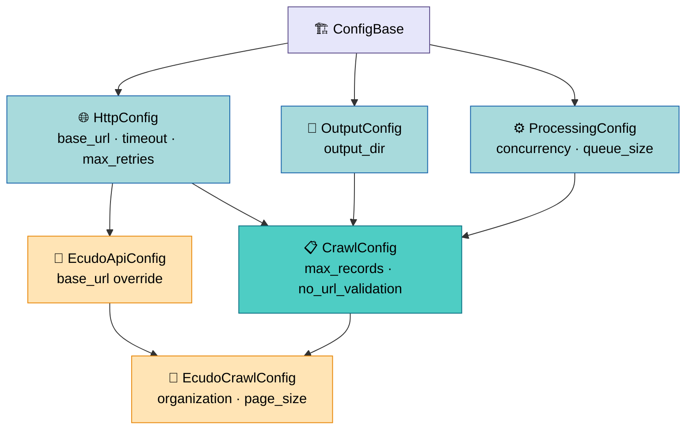
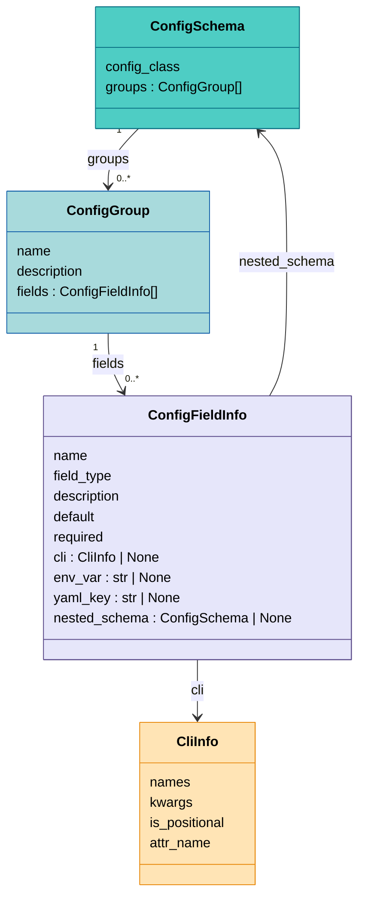

# Configuration System

<sub>📄 `apps/crawlers/src/crawlers/core/plugin.py:326-412`</sub>

Declare a config field once — as an annotated dataclass field with
`opt()` — and the framework gives you CLI argument parsing, YAML
file loading, environment variable support, and help text generation
for free. At runtime, values from all sources merge according to a
fixed [priority order](#resolution-priority): CLI wins over YAML,
YAML wins over ENV, ENV wins over defaults. You never write argument
parsing code or config-loading boilerplate.

```mermaid
graph TB
    field["📝 field declared with opt·&#41;"]

    field --> cli{"🖥️ CLI arg\nprovided?"}
    cli -->|yes| cli_val["✅ use CLI value"]
    cli -->|no| cmd_yaml{"📄 Command YAML\nprovided?"}

    subgraph yaml_hierarchy["📄 YAML file structure"]
        direction TB
        global_sec["global.‹key›"]
        plugin_sec["plugins.‹name›.‹key›"]
        cmd_sec["plugins.‹name›.commands.‹cmd›.‹key›"]
    end

    cmd_yaml -->|yes| cmd_val["✅ use Command YAML value"]
    cmd_yaml -->|no| plugin_yaml{"📄 Plugin YAML\nprovided?"}
    plugin_yaml -->|yes| plugin_val["✅ use Plugin YAML value"]
    plugin_yaml -->|no| global_yaml{"📄 Global YAML\nprovided?"}
    global_yaml -->|yes| global_val["✅ use Global YAML value"]
    global_yaml -->|no| env{"🌐 ENV var\nprovided?"}
    env -->|yes| env_val["✅ use ENV value"]
    env -->|no| default["⚙️ use opt·&#41; default"]

    cmd_sec -.->|feeds| cmd_yaml
    plugin_sec -.->|feeds| plugin_yaml
    global_sec -.->|feeds| global_yaml

    classDef decision fill:#FFD700,stroke:#F08C00,color:#000
    classDef resolved fill:#95D5B2,stroke:#2D6A4F,color:#000
    classDef source fill:#E6E6FA,stroke:#5B4B8A,color:#000
    classDef start fill:#4ECDC4,stroke:#0B7285,color:#000

    class cli,cmd_yaml,plugin_yaml,global_yaml,env decision
    class cli_val,cmd_val,plugin_val,global_val,env_val,default resolved
    class global_sec,plugin_sec,cmd_sec source
    class field start
```



## ConfigBase and opt()

<sub>📄 `apps/crawlers/src/crawlers/core/config.py:21-52`</sub>

Every config class inherits from
[**ConfigBase**](glossary.md#configbase). The base class intercepts
subclass creation via `__init_subclass__`: it applies `@dataclass`
and builds a `ConfigSchema` automatically. You never call
`@dataclass` yourself.

<sub>📄 `apps/crawlers/src/crawlers/core/config.py:54-111`</sub>

Fields use `opt()` instead of `dataclasses.field()` to attach
metadata describing how each value can be provided:

```python
class HttpConfig(ConfigBase):
    """Base configuration for HTTP connections."""

    base_url: str = opt(..., description="API base URL")
    timeout: int = opt(15, description="Request timeout in seconds")
    max_retries: int = opt(3, description="Maximum retry attempts")
```

### opt() Parameters

| Parameter | Type | Default | Effect |
|-----------|------|---------|--------|
| `default` | any | `...` (required) | Default value. `...` means the field is required. |
| `cli` | `str \| tuple \| False \| None` | `None` | CLI flag name(s). `None` auto-generates from field name (`my_field` → `--my-field`). `False` disables CLI. |
| `env` | `str \| False \| None` | `None` | ENV var suffix. `None` auto-generates (`my_field` → `CRAWLER_MY_FIELD`). `False` disables ENV. |
| `yaml_key` | `str \| False \| None` | `None` | YAML key. `None` uses the field name. `False` disables YAML loading. |
| `description` | `str` | `""` | Help text for CLI `--help` and documentation. |

### Field Type Handling

<sub>📄 `apps/crawlers/src/crawlers/core/config.py:261-273` · `apps/crawlers/src/crawlers/core/config.py:275-314`</sub>

The schema builder inspects field type annotations to configure
argparse correctly:

- **`bool`** — generates `action="store_true"` (flag without value).
- **`int`, `float`, `str`** — passes the corresponding `type=` to
  argparse for automatic coercion.
- **`Optional[X]`** / **`X | None`** — unwrapped to `X` for type
  handling; the field is not treated as required.
- **Nested dataclass** — the field gets a recursive `ConfigSchema`.
  Nested configs are YAML-only (no CLI generation). See
  [Nested Configs](#nested-configs).

### Positional Arguments

<sub>📄 `apps/crawlers/src/crawlers/core/config.py:291-305`</sub>

To create a positional CLI argument (like `organization` in Ecudo),
set `cli` to a bare name without dashes:

```python
organization: str = opt(
    ...,
    cli="organization",
    description="Organization ID (e.g. iopan)",
)
```

The framework detects that the name does not start with `-` and
registers it as a positional argument.

## Resolution Priority

<sub>📄 `apps/crawlers/src/crawlers/core/plugin.py:388-412`</sub>

The diagram above shows the full resolution chain. Here's how
each source works in practice.

### How YAML Lookup Works

<sub>📄 `apps/crawlers/src/crawlers/core/plugin.py:326-344`</sub>

Given a config file loaded via `-c config.yaml`, the framework reads
three sections and checks each field's `yaml_key` against them in
order:

```yaml
global:
  timeout: 30
  output_dir: ./output

plugins:
  ecudo:
    base_url: http://custom.ecudo.pl
    timeout: 60

    commands:
      crawl:
        page_size: 50
        max_records: 1000
```

For the `timeout` field when running `crawlers ecudo crawl`:
1. Command YAML (`plugins.ecudo.commands.crawl.timeout`) — not set.
2. Plugin YAML (`plugins.ecudo.timeout`) — **60**. Used.
3. Global YAML (`global.timeout`) — 30, but plugin-level wins.

For the `page_size` field:
1. Command YAML (`plugins.ecudo.commands.crawl.page_size`) — **50**.
   Used.
2. Lower levels not checked.

### Environment Variables

<sub>📄 `apps/crawlers/src/crawlers/core/config.py:239-242`</sub>

Every field gets an env var named `CRAWLER_<SUFFIX>` where `SUFFIX`
defaults to the uppercase field name. You can override the suffix
via `env="CUSTOM_NAME"` or disable it with `env=False`.

Environment variables sit below YAML but above defaults — they are
a fallback for values not provided via CLI or config file.

## Config Inheritance

<sub>📄 `apps/crawlers/src/crawlers/core/crawl_config.py:16-68`</sub>

Config classes compose via multiple inheritance, which maps cleanly
to argparse argument groups in `--help` output:



```python
class CrawlConfig(HttpConfig, OutputConfig, ProcessingConfig, kw_only=True):
    """Base configuration for CrawlerPlugin."""
    max_records: int | None = opt(None, cli=("-n", "--max-records"))
    no_url_validation: bool = opt(False, description="Disable URL validation")
```

The schema builder walks the MRO and creates a `ConfigGroup` per
class. Each group becomes an argparse argument group, so `--help`
output is organized by concern (API settings, output settings,
processing settings).

Plugin configs extend further — adding source-specific fields while
inheriting all the standard ones. Each plugin defines an API config
(extending `HttpConfig` with its own `base_url` default) and a
crawl config (extending both the API config and `CrawlConfig`):

```python
class EcudoApiConfig(HttpConfig):
    base_url: str = opt("http://central.ecudo.pl", description="Ecudo API base URL")

class EcudoCrawlConfig(EcudoApiConfig, CrawlConfig, kw_only=True):
    organization: str = opt(..., cli="organization", description="Organization ID")
    page_size: int = opt(200, description="Items per API page")
```

## Nested Configs

Dataclass fields that are themselves `ConfigBase` subclasses are
treated as nested configs. They are loaded from YAML only — the
framework does not generate CLI arguments for their inner fields.

```python
class FilterConfig(ConfigBase):
    """Configuration for result filtering."""
    max_similar: int = opt(10, yaml_key="max_similar")
    similarity_threshold: float = opt(0.85, yaml_key="similarity_threshold")
```

In YAML, the nested config appears as a sub-object under the
parent's `yaml_key`:

```yaml
plugins:
  myapi:
    filter:
      max_similar: 5
      similarity_threshold: 0.9
```

This pattern works well for plugin-specific tuning knobs that
are too detailed for CLI flags but useful in config files.

## Schema Internals (Framework Maintainers)

<sub>📄 `apps/crawlers/src/crawlers/core/config.py:116-165`</sub>

> The following section is relevant if you're modifying the config
> framework itself. Skip if you're writing plugins.

The schema is built once per class at import time by
`_build_schema()`. It walks the MRO from most specific to most
general class, collecting fields into `ConfigGroup` instances.



<sub>📄 `apps/crawlers/src/crawlers/core/config.py:170-258`</sub>

Each field becomes a `ConfigFieldInfo` with:

- **`CliInfo`** — pre-computed argparse arguments (flag names,
  kwargs, positional flag, attribute name).
- **`env_var`** — full environment variable name
  (e.g. `CRAWLER_BASE_URL`).
- **`yaml_key`** — key used for YAML lookups.
- **`nested_schema`** — recursive `ConfigSchema` for nested
  dataclass fields.

<sub>📄 `apps/crawlers/src/crawlers/core/plugin.py:177-218`</sub>

The `CrawlerPlugin.register_args()` method iterates schema groups
and adds argparse arguments. The `_load_config()` method iterates
fields, calls `_resolve_value()` per field to apply the
[resolution priority](#resolution-priority), then `_coerce()` to
convert string values (from CLI or ENV) to the target type.
