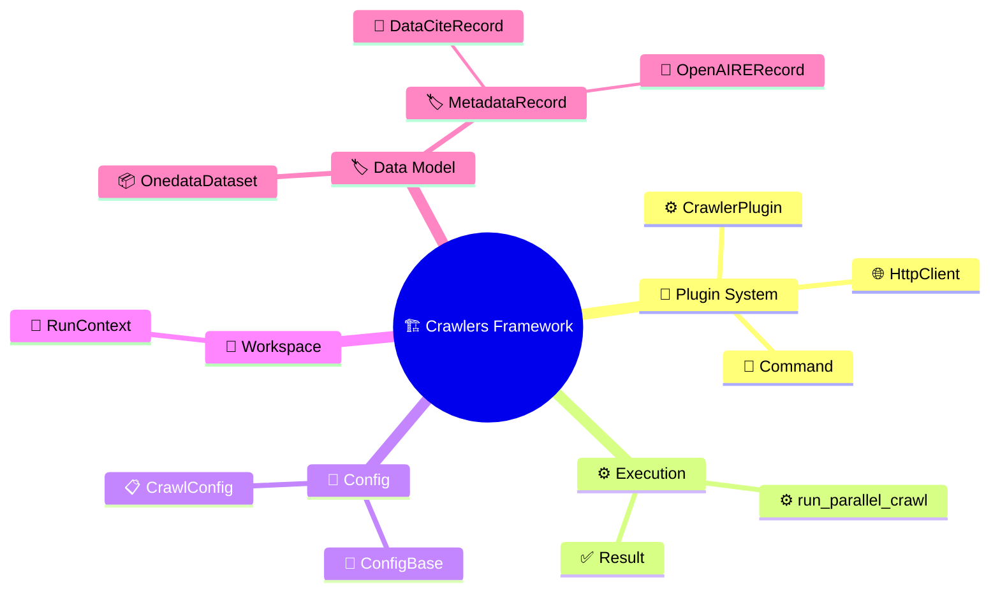

# Glossary

---

## Command

A named CLI entry point registered on a plugin via `@command`,
bound to a `ConfigBase` subclass that defines its arguments.
Learn more: [Plugin System](plugin-system.md#command-registration).

## ConfigBase

Base class for declarative configuration — subclasses are
dataclasses whose fields carry CLI/ENV/YAML metadata via `opt()`.
Learn more: [Configuration](configuration.md#configbase-and-opt).

## CrawlConfig

Framework-level config base for crawl commands — extends
`HttpConfig`, `OutputConfig`, and `ProcessingConfig` to provide
fields like `max_records` and `no_url_validation`. Plugin crawl
configs inherit from this.
Learn more:
[Configuration](configuration.md#config-inheritance).

## CrawlerPlugin

The single abstract base for all plugins — combines command
registration, argparse generation, multi-source config loading,
and the complete crawl lifecycle (`setup` → `iterate_datasets` →
`process`, parallel workers, JSONL sinks).
Learn more: [Plugin System](plugin-system.md#crawlerplugin).

## DataCiteRecord

Structured record that generates XML compliant with DataCite
Metadata Schema 4.5. Satisfies the `MetadataRecord` protocol.
Learn more: [Metadata](metadata.md#dataciterecord).

## HttpClient

Concrete async HTTP client with retries, exponential backoff, and
`Result`-based error handling. Plugins create one during `setup()`
via `HttpClient.from_config(config)`.
Learn more: [Plugin System](plugin-system.md#httpclient).

## MetadataRecord

Protocol with a single method (`to_xml() → str`). Satisfied by
`OpenAIRERecord` and `DataCiteRecord`. Consumed by
`OnedataDataset.build()` to materialize XML metadata.
Learn more: [Metadata](metadata.md#metadatarecord-protocol).

## OnedataDataset

Frozen dataclass representing a dataset ready for Onedata
registration. Built via `OnedataDataset.build()`, which validates
files and materializes XML metadata from a `MetadataRecord`.
Learn more:
[Plugin System](plugin-system.md#onedatadataset-assembly).

## OpenAIRERecord

Structured record that generates XML compliant with OpenAIRE
Guidelines v4.0. Satisfies the `MetadataRecord` protocol.
Learn more: [Metadata](metadata.md#openairrecord).

## Result

Explicit error-handling type: `type Result[T, E] = Ok[T] | Err[E]`.
Makes success/failure paths visible in signatures — `process()`
returns `Result[OnedataDataset, Any]`, `HttpClient` methods return
`Result[T, HttpFailure]` (where `HttpFailure` is
`ResponseFailure | TimeoutFailure`).
Learn more:
[Plugin System](plugin-system.md#iteration-and-processing).

## run_parallel_crawl

The producer–consumer engine that drives a crawl — feeds items
from `iterate_datasets()` into a bounded queue and processes them
with N concurrent workers. Tracks stats and routes results to
JSONL sinks.
Learn more:
[Plugin System](plugin-system.md#parallel-execution).

## RunContext

Manages a crawl run's directory, config snapshot, state
persistence, and JSONL sink lifecycle. Creates `processed.jsonl`
and `rejected.jsonl` via append-mode JSONL sinks.
Learn more:
[Plugin System](plugin-system.md#workspace-and-run-management).

---
