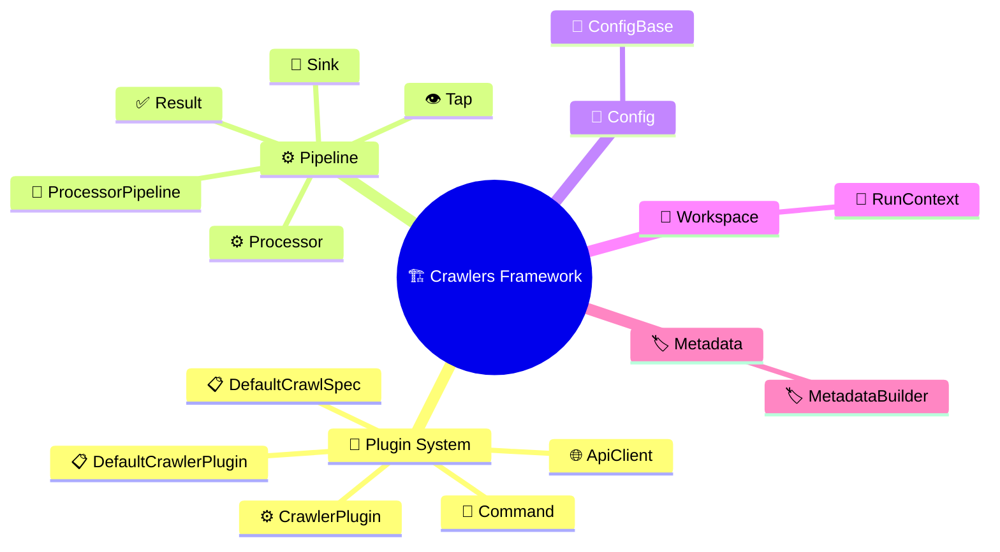

# Glossary

---

## ApiClient

Generic async HTTP base (`ApiClient[OptsT, DatasetT]`) with retries,
exponential backoff, and typed error handling via `Result`.
Learn more: [Plugin System](plugin-system.md#api-client).

## Command

A named CLI entry point registered on a plugin via `@command()`,
bound to a `ConfigBase` subclass that defines its arguments.
Learn more: [Plugin System](plugin-system.md#command-registration).

## ConfigBase

Base class for declarative configuration — subclasses are dataclasses
whose fields carry CLI/ENV/YAML metadata via `opt()`.
Learn more: [Configuration](configuration.md#configbase-and-opt).

## CrawlerPlugin

Abstract base for all plugins — collects `@command()` methods,
builds argparse, loads config, and dispatches to the selected command.
Learn more: [Plugin System](plugin-system.md#crawlerplugin).

## DefaultCrawlerPlugin

Batteries-included base extending `CrawlerPlugin` with a complete
crawl lifecycle. Plugins subclass this and implement `prepare_crawl()`.
Learn more: [Plugin System](plugin-system.md#defaultcrawlerplugin).

## DefaultCrawlSpec

Dataclass returned by `prepare_crawl()` — describes *what* to crawl
(client, parser, metadata builder) so the framework handles *how*.
Learn more: [Plugin System](plugin-system.md#defaultcrawlspec).

## MetadataBuilder

Abstract base (`MetadataBuilder[DatasetT]`) with `build(dataset) →
str` that produces XML. Concrete: `DataCiteBuilder`, `OpenAIREBuilder`.
Learn more: [Metadata](metadata.md).

## Processor

Generic abstract base (`Processor[InT, OutT, StatsT]`) for pipeline
stages — lifecycle (`open`/`close`), `Result`-based processing, stats.
The framework ships six built-in processors (DatasetResolver,
ParserProcessor, URLValidator, DiversityFilter, OnedataConverter, Tap).
Learn more: [Processing](processing.md#processor-abstraction).
Individual processors: [Available Processors](processing.md#available-processors).

## ProcessorPipeline

Chains processors sequentially — `Ok` values flow forward, `Err`
values short-circuit to the rejection sink.
Learn more: [Processing](processing.md#processorpipeline).

## Result

Explicit error-handling type: `type Result[T, E] = Ok[T] | Err[E]`.
Makes success/failure paths visible in signatures throughout the
pipeline and API client.
Learn more: [Processing](processing.md#result-type).

## RunContext

Manages a crawl run's directory, config snapshot, state persistence,
and sink lifecycle. Standard implementation: `DefaultRunContext`.
Learn more: [Plugin System](plugin-system.md#workspace-and-run-management).

## Sink

Output destination (`Sink[T]`) with `open`/`push`/`close` lifecycle
managed by `RunContext`. Implementations: `JSONLSink`, `NullSink`.
Learn more: [Processing](processing.md#sink-abstraction).

## Tap

Pass-through processor that observes data at any pipeline point —
pushes copies to a sink without disrupting the flow.
Learn more: [Processing](processing.md#tap).

---
