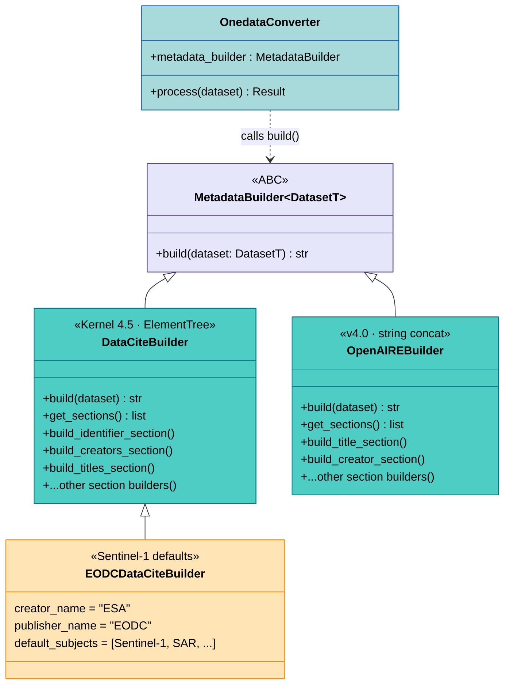
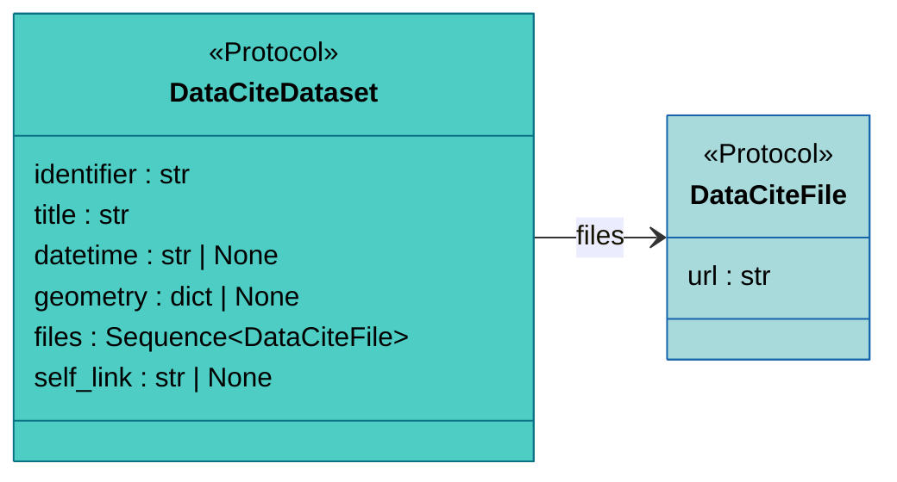
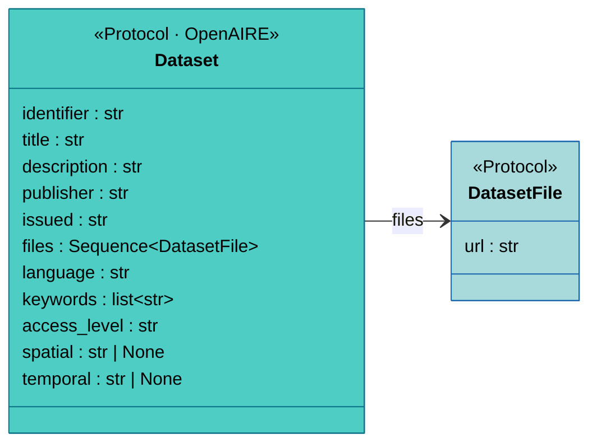

# Metadata Generation

<sub>📄 `crawlers/core/metadata.py:12-27`</sub>

Crawled datasets need standards-compliant XML metadata embedded in
their output records — Onedata uses this for discovery and
interoperability. Metadata builders take a parsed dataset model and
produce an XML string following either DataCite Kernel 4.5 or
OpenAIRE v4.0. The
[OnedataConverter](processing.md#onedataconverter) calls the builder
as the final pipeline step.

The base interface is intentionally minimal — a single generic
abstract class with one method:

```python
class MetadataBuilder[DatasetT](ABC):
    @abstractmethod
    def build(self, dataset: DatasetT) -> str: ...
```

Both concrete builders extend this with a **template method pattern**
that makes customization surgical: you override individual section
builders rather than reimplementing the whole XML generation.




## Template Method Pattern

<sub>📄 `crawlers/metadata/datacite.py:79-137`</sub>

Both `DataCiteBuilder` and `OpenAIREBuilder` follow the same
structure:

1. `build(dataset)` creates a context object from the dataset.
2. `get_sections()` returns an ordered list of section builder
   methods.
3. Each section builder receives the context and produces its output
   (XML elements for DataCite, string lines for OpenAIRE).
4. The results are assembled into the final XML document.

This design gives plugins three levels of customization:

- **Override a section method** — change how a specific section is
  built (e.g. custom creator name, different subject terms).
- **Override `get_sections()`** — reorder, add, or remove entire
  sections.
- **Override class-level defaults** — change values like
  `creator_name` or `publisher_name` without touching any methods.

## DataCiteBuilder

<sub>📄 `crawlers/metadata/datacite.py:62-296`</sub>

Generates XML compliant with
[DataCite Metadata Schema 4.5](https://schema.datacite.org/meta/kernel-4.5/).
Uses `xml.etree.ElementTree` for structured XML construction.

### Dataset Protocol

<sub>📄 `crawlers/metadata/datacite.py:41-52`</sub>



`DataCiteDataset` uses structural typing — any dataclass with the
required attributes satisfies it. The protocol requires spatial data
as GeoJSON geometry (for the `geoLocations` section) and a
`self_link` for the `relatedIdentifiers` section.

### Sections

DataCite defines 6 mandatory and 6 recommended sections. You'll
typically override the defaults for creators, publisher, and
subjects. Each section has a corresponding builder method:

<details>
<summary>Section reference table</summary>

Mandatory (M) and recommended (R) per the DataCite schema:

| Section | Status | Method |
|---------|--------|--------|
| Identifier | M | `build_identifier_section` |
| Creators | M | `build_creators_section` |
| Titles | M | `build_titles_section` |
| Publisher | M | `build_publisher_section` |
| PublicationYear | M | `build_publication_year_section` |
| ResourceType | M | `build_resource_type_section` |
| Subjects | R | `build_subjects_section` |
| Dates | R | `build_dates_section` |
| GeoLocations | R | `build_geo_locations_section` |
| Descriptions | R | `build_descriptions_section` |
| RelatedIdentifiers | R | `build_related_identifiers_section` |
| Rights | R | `build_rights_section` |

</details>

### Class-level Defaults

<sub>📄 `crawlers/metadata/datacite.py:70-77`</sub>

Subclasses customize the builder by overriding these attributes —
no method changes needed for common cases:

| Attribute | Default | Purpose |
|-----------|---------|---------|
| `creator_name` | `"Unknown Creator"` | Name used in Creators |
| `publisher_name` | `"Unknown Publisher"` | Name used in Publisher |
| `resource_type_general` | `"Dataset"` | DataCite resourceTypeGeneral |
| `resource_type_value` | `"dataset"` | DataCite resourceType value |
| `default_subjects` | `[]` | Subject keywords |
| `default_description` | `""` | Fallback description |
| `default_rights` | `""` | Rights statement |

<sub>📄 `crawlers/plugins/eodc/metadata.py:16-51`</sub>

For example, `EODCDataCiteBuilder` overrides these with
Sentinel-1/Copernicus-specific values (creator: ESA, publisher:
EODC, subjects: Sentinel-1, SAR, GRD, Copernicus).

<!-- FLAG: EODCDataCiteBuilder has a TODO comment (line 14)
     acknowledging that these defaults are specific to Sentinel-1
     GRD and may not apply to other EODC collections. No mechanism
     currently exists to select different defaults per collection. -->

## OpenAIREBuilder

<sub>📄 `crawlers/metadata/openaire.py:99-415`</sub>

Generates XML compliant with
[OpenAIRE Guidelines v4.0](https://openaire-guidelines-for-literature-repository-managers.readthedocs.io/en/v4.0.0/).
Unlike DataCiteBuilder, it uses string concatenation rather than
ElementTree — a legacy implementation choice. Plugin authors don't
need to worry about this: escaping is handled internally, and the
section-builder interface is identical to DataCiteBuilder.

<!-- Q: Should we migrate OpenAIREBuilder to ElementTree for
     consistency with DataCiteBuilder? -->

### Dataset Protocol

<sub>📄 `crawlers/metadata/openaire.py:71-87`</sub>



OpenAIRE requires a richer set of attributes than DataCite — see the
protocol diagram above. Like DataCite, the protocol uses structural
typing.

### Sections

OpenAIRE has a richer set of mandatory and conditionally mandatory
(MA) sections than DataCite.

<details>
<summary>Section reference table</summary>

| Section | Status | Method |
|---------|--------|--------|
| Title | M | `build_title_section` |
| Creator | M | `build_creator_section` |
| Language | MA | `build_language_section` |
| Publisher | MA | `build_publisher_section` |
| Publication Date | M | `build_publication_date_section` |
| Resource Type | M | `build_resource_type_section` |
| Description | MA | `build_description_section` |
| Identifier | M | `build_identifier_section` |
| Access Rights | M | `build_access_rights_section` |
| Subjects | MA | `build_subjects_section` |
| Temporal | R | `build_temporal_section` |
| Geo Location | R | `build_geo_location_section` |
| Files | MA | `build_files_section` |

(M = Mandatory, MA = Mandatory if Applicable, R = Recommended)

</details>

### Implementation Notes

<sub>📄 `crawlers/metadata/openaire.py:22-49`</sub>

The OpenAIRE builder handles several format-specific concerns:
access rights are mapped to COAR URIs (currently only `"public"` →
open access), file sections infer MIME types from extensions (`.zip`,
`.csv`, `.nc`, `.tiff`, etc.), and geo location sections convert
GeoJSON polygon coordinates to bounding box bounds.

## Extending Metadata Builders

See [Writing Plugins](../guides/writing-plugins.md#custom-metadata-builder)
for concrete code examples using the Ecudo and EODC plugins.

