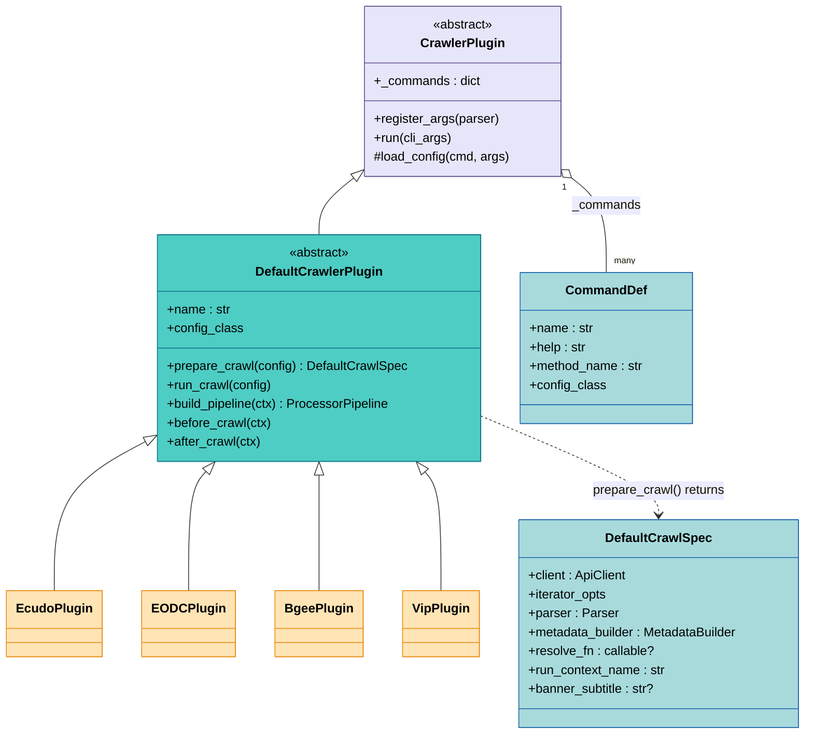
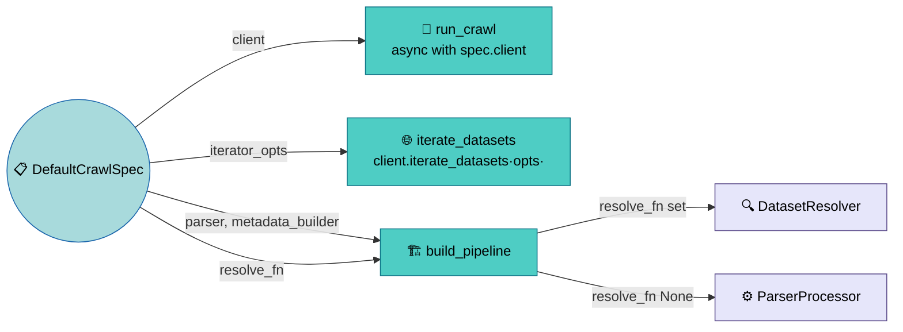
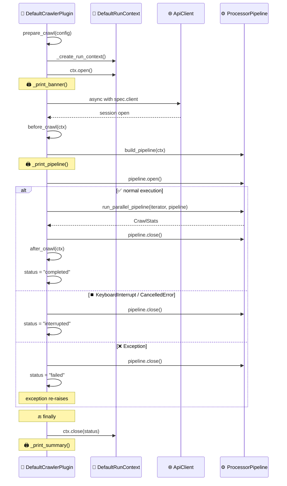

# Plugin System

<sub>📄 `crawlers/core/plugin.py:70-109` · `crawlers/default/plugin.py:41-93`</sub>

The plugin system has two layers. At the base,
[**CrawlerPlugin**](#crawlerplugin) handles the mechanical parts —
collecting `@command`-decorated methods, generating argparse from
config schemas, and dispatching to the right method with a loaded
config object. It knows nothing about crawling.

On top, [**DefaultCrawlerPlugin**](#defaultcrawlerplugin) adds
everything needed for a typical crawl: client session management,
pipeline construction, parallel execution, workspace persistence,
and Rich-based display. You describe *what* to crawl via
[DefaultCrawlSpec](#defaultcrawlspec) and the framework handles
*how* to run it.

Most plugins extend `DefaultCrawlerPlugin` — the base
`CrawlerPlugin` is there for non-standard use cases that don't fit
the crawl lifecycle pattern.




## CrawlerPlugin

<sub>📄 `crawlers/core/plugin.py:70-181`</sub>

[**CrawlerPlugin**](glossary.md#crawlerplugin) is the abstract base
for all plugins. It provides three things: command collection, CLI
argument generation, and config-aware dispatch.

### Command Registration

<sub>📄 `crawlers/core/plugin.py:35-64`</sub>

Commands are declared with the `@command()` decorator on async
methods:

```python
@command("list-orgs", EcudoApiConfig, help="List available organizations")
async def list_organizations(self, config: EcudoApiConfig) -> None:
    ...
```

The decorator attaches a `CommandDef` (name, help text, method name,
config class) to the method. When a subclass is created,
`__init_subclass__` scans all methods for `_command_def` attributes
and collects them into the class-level `_commands` dict.

Commands are inherited — a method decorated in a parent class is
available in all subclasses unless overridden.

### CLI Generation and Dispatch

<sub>📄 `crawlers/core/plugin.py:111-181`</sub>

From the collected commands, `register_args(parser)` builds the full
argparse structure automatically — a global `-c / --config` option,
a subparser per command, and argument groups derived from each
command's `ConfigSchema` hierarchy. At runtime, `run(cli_args)`
resolves the selected command, builds the config object from all
sources (see [Configuration — Resolution Priority](configuration.md#resolution-priority)),
and invokes the decorated method.

For example, the generated `--help` for Ecudo shows how config
inheritance maps to argument groups:

```
$ crawlers ecudo crawl -h
usage: crawlers ecudo crawl [-h] [--no-diversity-filter] [--base-url ...]
                            [--page-size ...] [-n MAX_RECORDS] ...
                            organization

EcudoCrawlConfig:
  Full configuration for Ecudo crawling.

  --no-diversity-filter Disable diversity filter
  organization          Organization ID (e.g. iopan)

EcudoApiConfig:
  Base configuration for Ecudo API connections.

  --base-url BASE_URL   Ecudo API base URL

DefaultCrawlConfig:
  Default configuration for crawlers using DefaultCrawlerPlugin.

  --page-size PAGE_SIZE Items per API page
  --no-url-validation   Disable URL validation
  -n MAX_RECORDS, --max-records MAX_RECORDS
                        Maximum number of items to fetch

ApiConfig:
  Base configuration for API connections.

  --max-retries MAX_RETRIES
                        Maximum retry attempts
  --timeout TIMEOUT     Request timeout in seconds

OutputConfig:
  Configuration for output settings.

  -o OUTPUT_DIR, --output-dir OUTPUT_DIR
                        Output directory for crawled data

ProcessingConfig:
  Configuration for parallel processing.

  --queue-size QUEUE_SIZE
                        Size of the processing queue
  --concurrency CONCURRENCY
                        Number of concurrent workers
```

Each config class in the MRO becomes a separate argument group —
plugin-specific fields at the top, shared framework fields below.

## DefaultCrawlerPlugin

<sub>📄 `crawlers/default/plugin.py:41-93`</sub>

[**DefaultCrawlerPlugin**](glossary.md#defaultcrawlerplugin) extends
`CrawlerPlugin` with a complete crawl lifecycle. The design
separates *what to crawl* (plugin's job) from *how to run it*
(framework's job) — plugins return a
[DefaultCrawlSpec](#defaultcrawlspec) describing the crawl, and the
framework consumes it to drive execution.

### Auto-registered Crawl Command

<sub>📄 `crawlers/default/plugin.py:78-93`</sub>

When a concrete subclass sets `name` as a string class attribute,
`__init_subclass__` automatically registers a `"crawl"` command
pointing to `run_crawl()` with the class's `config_class`. You do
not need to decorate `run_crawl` yourself — just set `name` and
`config_class`.

### DefaultCrawlSpec

<sub>📄 `crawlers/default/crawl_spec.py:16-50`</sub>

[**DefaultCrawlSpec**](glossary.md#defaultcrawlspec) is the
dataclass returned by `prepare_crawl()`. It describes *what* to run
without dictating *how*. The spec's fields (shown in the class
diagram above) are consumed by different parts of the lifecycle:



- **`client`** — `ApiClient` instance (session opened by the
  framework via `async with`).
- **`iterator_opts`** — options passed to
  `client.iterate_datasets()`.
- **`parser`** — `Parser` that transforms raw API items to dataset
  models.
- **`metadata_builder`** — `MetadataBuilder` that produces XML per
  dataset.
- **`resolve_fn`** — optional async callable. When provided, the
  default pipeline uses `DatasetResolver` (resolve + parse) instead
  of `ParserProcessor` (parse only). Use this when the iterator
  yields partial data that needs enrichment via API calls.
- **`run_context_name`** — identifier used in the run directory
  name (default: `"default"`).
- **`banner_subtitle`** — shown in the startup banner (optional).

### Crawl Lifecycle

<sub>📄 `crawlers/default/plugin.py:123-178`</sub>

`run_crawl(config)` orchestrates the full crawl in a fixed sequence:



1. **`prepare_crawl(config)`** — plugin returns a
   `DefaultCrawlSpec`.
2. **`_create_run_context()`** — creates a `DefaultRunContext` with
   a timestamped run directory.
3. **`ctx.open()`** — creates the directory, writes `config.json`,
   opens sinks.
4. **`async with spec.client`** — opens the HTTP session.
5. **`before_crawl(ctx)`** — plugin hook for validation (e.g.
   check that a requested organization exists).
6. **`build_pipeline(ctx)`** — constructs the
   `ProcessorPipeline` using the spec from the run context.
7. **`pipeline.open()`** — initializes all enabled processors.
8. **`run_parallel_pipeline(...)`** — parallel execution with
   progress tracking.
9. **`pipeline.close()`** — always called (in a `finally` block).
10. **`after_crawl(ctx)`** — plugin hook for post-crawl actions.
11. **`ctx.close(status)`** — closes sinks, writes final state.

On `KeyboardInterrupt` or `CancelledError`, status is set to
`"interrupted"`. On other exceptions, status is `"failed"` and the
exception re-raises after cleanup.

### Default Pipeline

<sub>📄 `crawlers/default/plugin.py:179-209`</sub>

If a plugin does not override `build_pipeline()`, the framework
inspects `spec.resolve_fn` to choose the first processor:

- **With `resolve_fn`**: `DatasetResolver → URLValidator → Tap(raw)
  → OnedataConverter → Tap(processed)`
- **Without `resolve_fn`**: `ParserProcessor → URLValidator →
  Tap(raw) → OnedataConverter → Tap(processed)`

The rejection sink is always wired to the pipeline. See
[Processing — Typical Pipeline Compositions](processing.md#typical-pipeline-compositions)
for how the built-in plugins exercise both patterns, and
[Writing Plugins — Custom Pipeline](../guides/writing-plugins.md#custom-pipeline)
for how to override `build_pipeline()` entirely.

## API Client

<sub>📄 `crawlers/core/api.py:56-229`</sub>

[**ApiClient**](glossary.md#apiclient) is the generic async HTTP
client base. Each plugin implements a subclass, and
`DefaultCrawlerPlugin` manages its session lifecycle via
`async with spec.client`.

```python
class ApiClient[OptsT, DatasetT](ABC):
    async def __aenter__(self) -> Self: ...
    async def __aexit__(self, ...): ...
    def iterate_datasets(self, opts: OptsT) -> AsyncIterator[DatasetT]: ...
```

### Generic Parameters

- **`OptsT`** — iterator options type. For example,
  `EcudoIteratorOpts` carries `org_id`, `page_size`, `max_datasets`.
- **`DatasetT`** — type yielded by the iterator. Ecudo yields `str`
  (dataset IDs requiring a second fetch), EODC yields `dict` (full
  STAC items).

### HTTP Handling

<sub>📄 `crawlers/core/api.py:114-169`</sub>

The base class provides `get_json(url)`, `post_json(url, body)`, and
`validate_url(url)` — all returning `Result[..., ApiFailure]`. The
core `_request_json(method, url)` method implements a retry loop
with exponential backoff (`2^attempt` seconds). On non-200 responses
it returns `Err(HttpFailure)`; when all retries are exhausted, it
returns `Err(TimeoutFailure)`.

<sub>📄 `crawlers/core/api.py:19-53`</sub>

<!-- Q: The User-Agent header (api.py lines 83-88) is hardcoded to
     mimic Chrome 115 on Windows — presumably to avoid bot detection.
     Is this intentional? Should it be configurable per-plugin? -->

### Session Management

<sub>📄 `crawlers/core/api.py:91-113`</sub>

The client uses `aiohttp.ClientSession` via async context manager.
The session lives for the entire crawl duration — opened at step 4
of the [crawl lifecycle](#crawl-lifecycle) and closed when the
`async with` block exits. Attempting to use the client outside the
context manager raises `RuntimeError`.

## Workspace and Run Management

<sub>📄 `crawlers/core/workspace.py:18-108`</sub>

Each crawl execution produces a **run directory** with a fixed
structure, managed by [**RunContext**](glossary.md#runcontext):

```
<workspace>/runs/<timestamp>_<plugin>_<context>/
  config.json       # Config snapshot at run start
  state.json        # Status, timestamps, running stats
  raw.jsonl         # Raw parsed datasets (via Tap)
  processed.jsonl   # Final OnedataDataset records (via Tap)
  rejected.jsonl    # Rejected items with reasons
```

<sub>📄 `crawlers/core/workspace.py:37-108`</sub>

The lifecycle is straightforward:

1. **`open(config_snapshot)`** — creates the directory, writes
   `config.json`, initializes `state.json` with status `"running"`,
   calls `open_sinks()`.
2. **`save_stats(stats)`** — periodically updates `state.json`
   (called by the orchestrator every 100 items).
3. **`close(status)`** — calls `close_sinks()`, writes final
   `state.json` with status `"completed"`, `"interrupted"`, or
   `"failed"`.

<sub>📄 `crawlers/default/workspace.py:19-62`</sub>

**`DefaultRunContext`** is the standard implementation. It creates
three sinks — `raw_sink`, `processed_sink`, and `rejection_sink`
(the latter is a `NullSink` when rejection tracking is disabled).
These sinks are wired to [Tap](processing.md#tap) processors and
the pipeline's rejection sink during
[pipeline construction](#default-pipeline).

## Display

<sub>📄 `crawlers/default/plugin.py:225-305`</sub>

`DefaultCrawlerPlugin` uses Rich to present three phases of output
automatically — no plugin code needed:
- **Banner** — plugin class name, subtitle, run directory path.
- **Pipeline tree** — numbered list of processors with
  enabled/disabled indicators.
- **Summary** — per-processor stats table, overall counts, output
  file paths, and next steps (including a resume command if
  interrupted).

## Plugin Registry

<sub>📄 `crawlers/plugins/__init__.py:1-23` · `crawlers/cli.py:52-68`</sub>

Plugins are registered as a hardcoded list in
`crawlers/plugins/__init__.py`. The CLI entry point iterates this
list, creates an argparse subparser per plugin (using `plugin.name`),
and calls `plugin.register_args()`. At runtime, the selected
plugin's `run()` method is invoked via `asyncio.run()`.

There is no dynamic plugin discovery — the registry is intentionally
simple because adding a plugin to the list is trivial. See
[Writing Plugins — Step 5](../guides/writing-plugins.md#step-5-register-the-plugin)
for how to register a new plugin.

