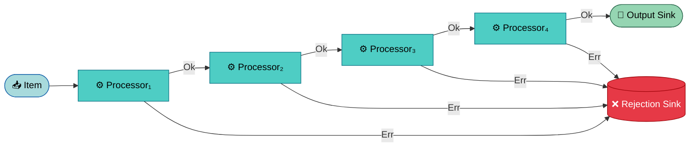
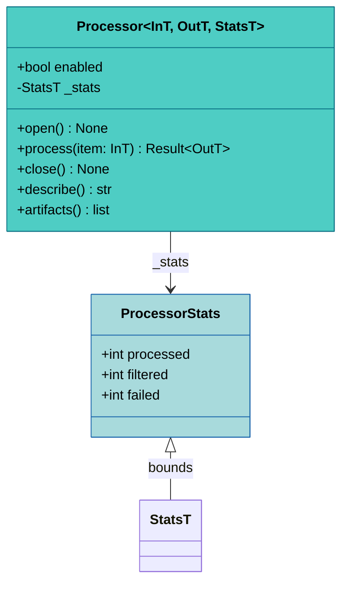
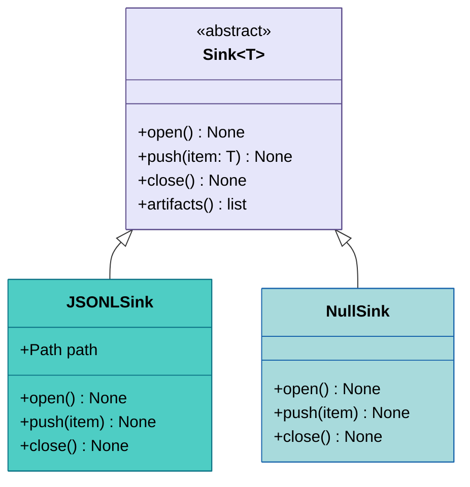
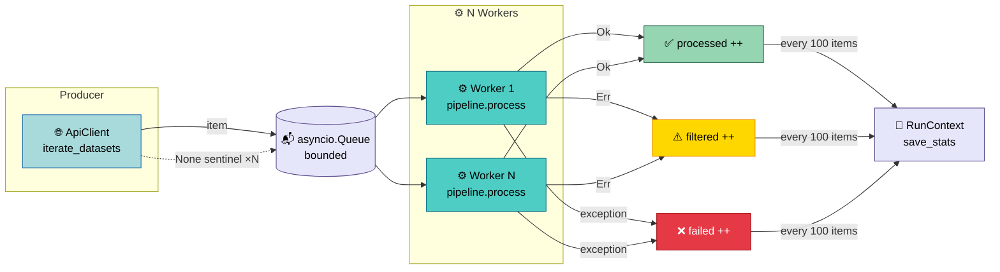

# Processing Pipeline

<sub>📄 `crawlers/processors/pipeline.py:117-147`</sub>

Every dataset passes through a chain of
[**processors**](#processor-abstraction) that fetch, validate, filter,
and convert it into a Onedata-ready record. Each processor returns
`Ok(value)` to pass the item forward or `Err(reason)` to reject it —
rejected items short-circuit to a dedicated
[sink](#sink-abstraction) for post-mortem analysis.

The chain is driven by a [ProcessorPipeline](#processorpipeline) that
handles the Ok/Err routing automatically. Processors have a simple
[lifecycle](#lifecycle) (`open` → `process` → `close`) and track
their own statistics. You can observe data at any point using
[Tap](#tap), which pushes copies to a sink without disrupting the
flow. The whole pipeline runs
[concurrently](#parallel-execution) — a producer feeds items into a
bounded queue, and N workers process them in parallel.



**Reading guide:** Start with [Result Type](#result-type) and
[Processor](#processor-abstraction) for the core abstractions, then
[ProcessorPipeline](#processorpipeline) for how they chain together.
[Typical Pipeline Compositions](#typical-pipeline-compositions) shows
concrete examples before the
[individual processor](#available-processors) deep-dives.

## Result Type

<sub>📄 `crawlers/core/result.py:16-52`</sub>

Why not exceptions? The framework distinguishes between *expected*
failures (HTTP errors, parse failures, validation rejections) and
*unexpected* failures (bugs, infrastructure issues). Expected failures
are values — data that flows through the pipeline like any other,
routed to the rejection sink for analysis. Exceptions are reserved
for unexpected failures and caught at the
[orchestration level](#parallel-execution).

This distinction is encoded in a Rust/Erlang-inspired `Result` type:

```python
type Result[T, E] = Ok[T] | Err[E]
```

`Ok[T]` and `Err[E]` are frozen, slotted dataclasses. Both provide
a `.map(fn)` method — `Ok` applies the function to the wrapped value,
`Err` returns itself unchanged — enabling safe chaining without
unwrapping.

A processor returning `Result[DatasetT, object]` tells you at a
glance that it may reject items. The pipeline reads these signatures
to route each variant: `Ok` flows forward, `Err` short-circuits to
the rejection sink.

## Processor Abstraction

<sub>📄 `crawlers/core/processor.py:36-144`</sub>

[**Processor**](glossary.md#processor) is the central building block
— a generic abstract class with three type parameters that define
what goes in, what comes out, and how statistics are tracked:

```python
class Processor[InT, OutT, StatsT: ProcessorStats](ABC):

    async def process(self, item: InT) -> Result[OutT, object]: ...
    async def open(self) -> None: ...
    async def close(self) -> None: ...
```



### Lifecycle

1. **`open()`** — initialize resources (files, connections). Called
   once before processing starts.
2. **`process(item)`** — transform a single item. Return `Ok(value)`
   to pass it forward, or `Err(reason)` to reject it.
3. **`close()`** — release resources. Called once after processing
   ends (always called, even on failure — via `finally` in the
   plugin lifecycle).

Processors also have an `enabled` flag — disabled processors are
skipped entirely by the pipeline (no `open()`, `process()`, or
`close()` calls). This lets you toggle stages via config (e.g.
`--no-url-validation`) without rebuilding the pipeline.

## ProcessorPipeline

<sub>📄 `crawlers/processors/pipeline.py:20-157`</sub>

[**ProcessorPipeline**](glossary.md#processorpipeline) chains
processors sequentially. It is itself a `Processor` subclass, so it
has the same interface — though nesting is not used in practice.

The routing logic for a single item:

1. Feed the item to the first enabled processor.
2. On `Ok(value)` — pass `value` to the next enabled processor.
3. On `Err(reason)` — serialize `reason` via `errors.to_json()`,
   push to the **rejection sink**, and return the `Err` immediately.
   No further processors see the item.
4. If all processors return `Ok`, the final value is wrapped in `Ok`
   and returned.

<sub>📄 `crawlers/processors/pipeline.py:130-147`</sub>

> [!NOTE]
> The pipeline uses type erasure (`current: Any`) between adjacent
> processors — Python's type system cannot express "the output type
> of processor N matches the input type of processor N+1" in a
> generic chain. Type safety across the pipeline relies on correct
> composition, not runtime enforcement.

The pipeline also provides:

- **`get_processor_info()`** — `(class_name, description, enabled)`
  tuples for the pipeline tree display.
- **`get_processor_stats()`** — collects stats from all enabled
  processors.
- **`get_artifacts()`** — collects output file paths from processors
  and the rejection sink.

## Typical Pipeline Compositions

Two patterns are used by the built-in plugins, illustrating how the
processor chain adapts to different API styles:

**Ecudo** (custom pipeline — API returns IDs, needs separate fetch):
```
DatasetResolver → URLValidator → DiversityFilter → Tap(raw) → OnedataConverter → Tap(processed)
```
Input: `str` (dataset ID). The resolver calls the API per-item and
parses JSON-LD.

**EODC** (default pipeline — API returns complete items):
```
ParserProcessor → URLValidator → Tap(raw) → OnedataConverter → Tap(processed)
```
Input: `dict` (raw STAC item from POST /search).

Both pipelines wire a rejection sink that captures `Err` values as
JSONL. The key difference is the first processor: `DatasetResolver`
for APIs that need a second fetch, `ParserProcessor` for APIs that
deliver complete items in search results. See
[Writing Plugins — Custom Pipeline](../guides/writing-plugins.md#custom-pipeline)
for how to choose between them.

## Available Processors

The framework ships six processor implementations in
`crawlers/processors/`. Plugins can use any combination and add
custom ones.

### DatasetResolver

<sub>📄 `crawlers/processors/resolvers.py:36-128`</sub>

When the external API returns references (IDs, partial records)
rather than complete items, you need a separate fetch per dataset.
DatasetResolver handles this two-step pattern: it takes an input
item, calls an async `resolve_fn` to fetch full data, then parses
it with a `Parser`. Ecudo uses this because its listing API yields
dataset IDs that require individual metadata requests.

If the fetch fails, the resolver emits `Err` with
`reason: "resolve_failed"`. If the parser returns `None`, it emits
`reason: "parse_failed"`. Both include the dataset ID for tracing.

### ParserProcessor

<sub>📄 `crawlers/processors/parsers.py:54-119`</sub>

When the API returns complete items directly (like EODC's STAC search
results), no additional fetching is needed — just parsing. The
ParserProcessor wraps a `Parser` protocol (any object with
`parse(raw) -> dataset | None`) and converts raw API responses into
typed dataset models.

<sub>📄 `crawlers/processors/parsers.py:20-42`</sub>

The `Parser` protocol is intentionally minimal — a single `parse`
method. Return a dataset model on success, `None` to silently skip
items that don't match expectations.

### URLValidator

<sub>📄 `crawlers/processors/validators.py:44-104`</sub>

Before committing a dataset to the output, you may want to verify
that its file URLs are actually reachable. URLValidator checks every
file URL via HEAD request (delegated to `ApiClient.validate_url()`).
If *any* URL fails, the entire dataset is rejected — a strict
approach that ensures output integrity.

<sub>📄 `crawlers/processors/validators.py:19-32`</sub>

The validator uses structural typing: it accepts any dataset with
`identifier` and `files` attributes (where each file has `url`).
This decouples it from any specific dataset model.

### DiversityFilter

<sub>📄 `crawlers/processors/filters.py:38-121`</sub>

Some APIs return many near-duplicate entries — datasets whose titles
differ by a date or a minor suffix. DiversityFilter groups datasets
by title similarity using `difflib.SequenceMatcher` and limits each
group to `max_similar` items (default 10) with a configurable
`similarity_threshold` (default 0.85).

Currently used only by Ecudo, where organization repositories often
contain series of datasets with near-identical names.

### OnedataConverter

<sub>📄 `crawlers/processors/converters.py:47-186`</sub>

The final transformation step — the point where a parsed dataset
becomes an Onedata-ready record. OnedataConverter calls the
[MetadataBuilder](metadata.md) to produce XML, then constructs an
`OnedataDataset` with name, location, PID, metadata, and a file
manifest.

<sub>📄 `crawlers/processors/converters.py:108-172`</sub>

When multiple files share a filename (common with remote sensing
data), the converter resolves collisions by progressively adding URL
path segments until all paths are unique. This always succeeds —
OnedataConverter never rejects items.

### Tap

<sub>📄 `crawlers/processors/tap.py:30-95`</sub>

Tap lets you observe data at any point in the pipeline without
disrupting the flow — useful for capturing intermediate state or
writing audit trails. It pushes a copy of each item to a
[Sink](#sink-abstraction) (optionally transformed via a function
like `dataset.to_json()`) while forwarding the original unchanged.

Taps are typically placed at two observation points: before
conversion (to capture the raw parsed dataset) and after conversion
(to capture the final Onedata record). Tap does *not* manage the
sink's lifecycle — that is [RunContext](plugin-system.md#workspace-and-run-management)'s
responsibility. This separation lets multiple Taps share a single
sink without conflicting open/close calls.

### Statistics

<sub>📄 `crawlers/core/processor.py:19-33` · `crawlers/core/processor.py:64-73`</sub>

Every processor carries a `_stats` instance. The base
`ProcessorStats` tracks `processed`, `filtered`, and `failed`
counters; subclasses extend this (e.g. `ResolverStats` adds
`resolved` and `parsed`). The pipeline collects stats from all
processors via `get_processor_stats()` for the post-crawl summary.

## Sink Abstraction

<sub>📄 `crawlers/core/sink.py:15-48`</sub>

[**Sink**](glossary.md#sink) is the output side of the system — a
destination that accepts data and persists it. Its lifecycle
(`open` / `push` / `close`) is managed externally by `RunContext`,
not by the sink itself or by Tap.



Two implementations are provided:

- **`JSONLSink`** — appends JSON objects as lines to a file. Opens in
  append mode (safe for resume after interruption) and flushes after
  each write (crash safety at the cost of throughput — acceptable
  given typical crawl volumes).
- **`NullSink`** — discards all items. Used when a sink is
  structurally required but the output is disabled (e.g. rejection
  tracking turned off).

## Parallel Execution

<sub>📄 `crawlers/core/orchestration.py:37-136`</sub>

`run_parallel_pipeline()` drives the pipeline with concurrent
workers using a producer–consumer pattern:



1. A **producer** task reads from the source iterator (the API
   client's `iterate_datasets()`) and puts items into a bounded
   `asyncio.Queue`.
2. **N worker** tasks (configurable via `concurrency`, default 128)
   consume from the queue and call `pipeline.process(item)`.
3. Workers classify results: `Ok` increments `processed`, `Err`
   increments `filtered`, exceptions increment `failed`.
4. Every `state_save_interval` items (default 100), the
   `state_callback` persists stats to `state.json` via
   `RunContext.save_stats()`.
5. The producer sends `None` sentinels (one per worker) to signal
   completion.
6. A Rich progress bar shows live throughput.

The bounded queue creates natural backpressure — the producer blocks
when the queue is full (`queue_size`, default 1000), preventing
unbounded memory growth against a fast API.

