# eCUDO Crawler Architecture

This document describes the modular architecture of the eCUDO crawler.

## Overview

The crawler is designed with clear separation of concerns, making it easy to:
- Add new data sources (by creating new parsers)
- Add new metadata formats (by creating new serializers)
- Modify processing logic (by adding/removing processors)
- Scale horizontally (via the parallel fetcher)

## Module Structure

```
ecudo/
├── __init__.py           # Package exports and version
├── __main__.py           # CLI entry point
├── cli.py                # Command-line interface (CLI commands)
├── crawler.py            # EcudoCrawler - high-level orchestration
├── config.py             # Configuration management
├── output.py             # Logging utilities
│
├── ecudo_api/            # Low-level eCUDO API client
│   ├── client.py         # EcudoClient - HTTP requests
│   └── iterator.py       # RecordIDIterator - ID pagination
│
├── models/               # Data structures
│   ├── ecudo.py         # EcudoDataset, FileInfo
│   └── onedata.py        # OnedataDataset, OnedataFile
│
├── parsers/              # Input parsing
│   └── ecudo.py          # JSON-LD → EcudoDataset
│
├── metadata/             # Metadata format generators
│   └── openaire.py       # OpenAIRE XML generator (functional)
│
├── processors/           # Pipeline processors
│   ├── base.py           # Processor[I, O] ABC
│   ├── fetchers.py       # MetadataFetcher
│   ├── validators.py     # URLValidator
│   ├── filters.py        # DiversityFilter
│   ├── converters.py     # OnedataConverter
│   ├── pipeline.py       # ProcessorPipeline
│   └── writers.py        # JSONLWriter
│
└── orchestration/        # Parallel processing
    └── parallel.py       # run_parallel_pipeline() function
```

## Data Flow

The entire crawl is expressed as a single pipeline:

```mermaid
flowchart TD
    subgraph pipeline [Processing Pipeline]
        Iterator["EcudoRecordIDIterator (sequential)"]
        
        subgraph parallel ["run_parallel_pipeline() - N workers"]
            subgraph proc [ProcessorPipeline]
                Fetcher["DatasetFetcher"]
                Validator["URLValidator (optional)"]
                Filter["DiversityFilter (optional)"]
                RawWriter["JSONLWriter (raw)"]
                Converter["OnedataConverter"]
                FinalWriter["JSONLWriter (final)"]
            end
        end
    end
    
    Iterator -->|"yields IDs (str)"| Fetcher
    Fetcher -->|EcudoDataset| Validator
    Validator -->|EcudoDataset| Filter
    Filter -->|EcudoDataset| RawWriter
    RawWriter -->|EcudoDataset| Converter
    Converter -->|OnedataDataset| FinalWriter
```



## Key Components

### EcudoClient (`ecudo_api/client.py`)

Low-level HTTP client for eCUDO API. Handles session management (async context
manager), retries with exponential backoff, JSON fetching, and URL validation.

### EcudoDatasetIDIterator (`ecudo_api/iterator.py`)

Async iterator that yields record IDs from an organization. Lightweight - fetches
only IDs (small payloads), not full metadata. This allows the heavy metadata
fetching to be parallelized by workers.

### EcudoDataset (`models/ecudo.py`)

Structured representation of a dataset. eCUDO-specific for now, but designed
to be easily extended when other data sources are added.

### OnedataDataset (`models/onedata.py`)

Output structure ready for Onedata registration.

### Processor[I, O] (`processors/base.py`)

Generic typed processor base class. Processors can transform data (`I` → `O`),
filter data (return `None` to skip) and have lifecycle methods (`open()`, `close()`).

### ProcessorPipeline (`processors/pipeline.py`)

Chains multiple processors into a sequential pipeline. Items flow through
processors in order; if any processor returns `None`, the pipeline stops for
that item.

### run_parallel_pipeline (`orchestration/parallel.py`)

Producer-consumer loop that separates lightweight ID iteration from heavy
metadata processing. Applies backpressure via a bounded queue.

Key behaviors:
- Configurable `concurrency` and `queue_size` for workers and backpressure.
- `ProcessingStats` tracks queued, processed, and failed items.
- Errors per item are logged as warnings; processing continues for other items.
- Uses `None` sentinels to stop workers cleanly once the producer finishes.

### Built-in Processors

| Processor          | Input | Output | Description |
|--------------------|-------|--------|-------------|
| `DatasetFetcher`   | `str` (ID) | `EcudoDataset` | Fetches JSON-LD and parses |
| `URLValidator`     | `EcudoDataset` | `EcudoDataset` | Validates file URLs |
| `DiversityFilter`  | `EcudoDataset` | `EcudoDataset` | Limits similar titles |
| `OnedataConverter` | `EcudoDataset` | `OnedataDataset` | Builds Onedata output |
| `JSONLWriter`      | `T` | `T` | Writes to JSONL file |

## Configuration

Configuration uses a three-layer hierarchy (higher overrides lower):
1. CLI arguments
2. Config file (`ecudo.yaml`)
3. Environment variables (`ECUDO_*` prefix)

See `config.example.yaml` for all options.

## Design Decisions

### Pipeline Pattern

The crawler uses a pipeline pattern where each processor is a single-responsibility
unit that transforms or filters data. This design:
- Makes it easy to add/remove/reorder processing steps
- Enables unit testing of individual processors
- Provides clear data flow visibility

### Async/Await

The entire codebase is async-first using `asyncio` and `aiohttp`. This enables:
- High concurrency (128+ parallel workers) without threads
- Efficient I/O-bound operations (network requests dominate the workload)
- Clean cancellation and timeout handling

### JSONL as Intermediate Format

Raw and processed data is saved as JSONL (JSON Lines) rather than a single JSON
array. Benefits:
- **Streaming writes**: Each record is appended immediately; no buffering needed
- **Crash resilience**: Partial results are preserved if the crawler is interrupted
- **Memory efficiency**: No need to hold all records in memory
- **Easy inspection**: `head`, `tail`, `wc -l` work directly on the file

### Separation of ID Iteration and Processing

The `EcudoRecordIDIterator` only fetches lightweight dataset IDs, while the heavy
metadata fetching happens in parallel workers. This design:
- Minimizes memory usage (only IDs in the queue, not full records)
- Allows backpressure control via bounded queue
- Keeps the producer fast and non-blocking

## Performance Considerations

- **Concurrency**: Default 128 workers. Adjust based on target API rate limits.
- **Queue size**: 1000 items. Provides backpressure.
- **Page size**: 200 IDs per page. eCUDO API default.
- **Timeout**: 15 seconds per request.
- **Retries**: 3 attempts with exponential backoff.

## Testing

Run a small test crawl:
```bash
python -m ecudo crawl iopan -n 10 --no-url-validation
```

Run with quiet mode:
```bash
python -m ecudo -q crawl iopan -n 100
```

Check output:
```bash
python -m ecudo convert data/iopan_processed.jsonl
cat data/iopan_processed.json | jq '.[0]'
```

Run unit tests:
```bash
python -m pytest tests/ -v
```
