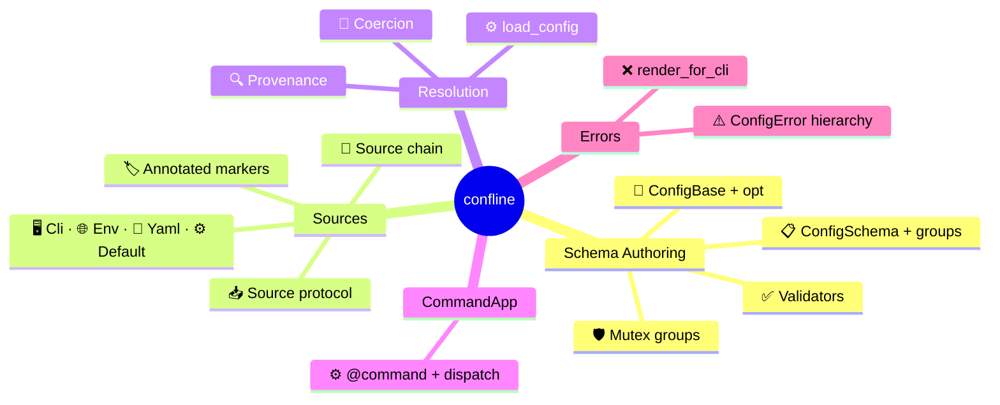

# Glossary

## Schema Authoring

| Term | Definition |
|------|------------|
| **`ConfigBase`** | Base class for declarative config objects. Auto-applies `@dataclass` and builds a frozen schema at class-creation time. [→ Schema Authoring](schema.md#configbase-and-opt) |
| **`opt()`** | Field declaration function wrapping `dataclasses.field()` with confline metadata — default, description, secret flag, validator, choices, and more. [→ Schema Authoring](schema.md#configbase-and-opt) |
| **`ConfigSchema`** | Frozen, introspectable structure built from a `ConfigBase` subclass. Contains one group per class in the inheritance chain and collected validators. [→ MRO-Based Groups](schema.md#mro-based-groups) |
| **`MutuallyExclusiveGroup`** | Marker subclass of `ConfigBase`. Fields declared in the group participate in post-resolution mutex enforcement across all sources. [→ Mutually Exclusive Groups](schema.md#mutually-exclusive-groups) |
| **`@field_validator`** | Decorator for per-field validation running after instance construction. Receives `self` and the resolved value; can transform the value. [→ Validators](schema.md#validators) |
| **`@model_validator`** | Decorator for whole-config validation running after all field validators. Receives `self`; raises `ValueError` for invariant violations. [→ Validators](schema.md#validators) |

## Sources

| Term | Definition |
|------|------------|
| **`Source`** | ABC for value providers — the contract for built-in and custom backends. [→ Source Protocol](sources-and-resolution.md#source-protocol) |
| **source chain** | Ordered list of `Source` objects. Position determines precedence — first source to return a value for a field wins. [→ The Source Chain](sources-and-resolution.md#the-source-chain) |
| **`NO_VALUE`** | Singleton sentinel meaning "I have nothing for this field." Distinct from `None` (a legitimate value) and `MISSING` (no declared default). [→ The NO_VALUE Sentinel](sources-and-resolution.md#the-no_value-sentinel) |
| **`CliSource`** | Wraps an `argparse.Namespace`. `from_argv` convenience constructor auto-derives and parses a CLI. [→ CliSource](sources-and-resolution.md#clisource) |
| **`EnvSource`** | Reads from a string-keyed mapping (typically `os.environ`). Key derivation: `prefix + uppercased path` with `__` nesting. [→ EnvSource](sources-and-resolution.md#envsource) |
| **`YamlSource`** | Resolves from parsed YAML dicts. Supports multi-scope layering and `list[ConfigBase]` shapes. [→ YamlSource](sources-and-resolution.md#yamlsource) |
| **`DefaultSource`** | Returns the field's declared default. `is_fallback=True` so defaults don't count as user-provided in mutex checks. [→ DefaultSource](sources-and-resolution.md#defaultsource) |
| **`CliAlias`** | `Annotated` marker overriding auto-derived CLI flag names for a field. [→ Source-side Annotations](sources-and-resolution.md#source-side-annotations) |
| **`EnvAlias`** | `Annotated` marker overriding the auto-derived environment variable key for a field. [→ Source-side Annotations](sources-and-resolution.md#source-side-annotations) |
| **`YamlPath`** | `Annotated` marker pinning the YAML dict path independently of the field name. [→ Source-side Annotations](sources-and-resolution.md#source-side-annotations) |
| **`is_fallback`** | Source flag distinguishing user-provided values from baseline defaults. Used by [mutex enforcement](sources-and-resolution.md#mutex-enforcement) to determine what counts as "explicitly set." |

## Resolution

| Term | Definition |
|------|------------|
| **`load_config`** | Core resolution function. Walks the schema, queries sources per field, coerces, validates, and stamps provenance. [→ Resolution Algorithm](sources-and-resolution.md#resolution-algorithm) |
| **`load_default`** | Convenience wrapper assembling the canonical CLI-first source chain and calling `load_config`. [→ The Source Chain](sources-and-resolution.md#the-source-chain) |
| **`load_or_exit`** | Catch-render-exit wrapper around `load_config`. On `ConfigError`, renders to stderr and exits with a typed exit code. [→ Integration](error-system.md#integration) |
| **coercion** | Type conversion from raw source values (usually strings) to declared Python types. Dispatches through built-in handlers, `__confline_convert__`, or registered `TypeSpec` entries. [→ Field Types](schema.md#field-types) |
| **`Provenance`** | `(name, label)` record tracking which source provided a field's value. `name` is a stable wire-id; `label` is human-readable. [→ Provenance](sources-and-resolution.md#provenance) |
| **`source_of()`** | Method on `ConfigBase` instances returning the `Provenance` for a field by dotted path. Available only on resolver-built instances. [→ Provenance](sources-and-resolution.md#provenance) |
| **`excluded_from`** | `opt()` parameter listing source classes that should skip this field during resolution. [→ Source Protocol](sources-and-resolution.md#extension-points) |

## CommandApp

| Term | Definition |
|------|------------|
| **`CommandApp`** | Higher-level orchestrator subclass. Automates source assembly, argparse building, subcommand dispatch, and error rendering. [→ CommandApp](command-app.md) |
| **`@command`** | Decorator marking a method as a subcommand handler. Infers name, config class, and description from the method. [→ The @command Decorator](command-app.md#the-command-decorator) |

## Errors

| Term | Definition |
|------|------------|
| **`ConfigError`** | Base error class. Carries a sysexits `_EXIT_CODE` class variable for process exit mapping. [→ Error Hierarchy](error-system.md#error-hierarchy) |
| **`SourceValueError`** | A source found a value but it failed coercion or validation. Exit code 65 (EX_DATAERR). [→ Error Hierarchy](error-system.md#error-hierarchy) |
| **`MissingRequiredError`** | No source provided a value for a required field. Exit code 64 (EX_USAGE). [→ Error Hierarchy](error-system.md#error-hierarchy) |
| **`MutexViolationError`** | Two or more mutex fields were user-provided across sources. Exit code 64 (EX_USAGE). [→ Error Hierarchy](error-system.md#error-hierarchy) |
| **`UnknownCommandError`** | Subcommand name not found in the dispatch table. Includes did-you-mean suggestions. Exit code 64 (EX_USAGE). [→ Error Hierarchy](error-system.md#error-hierarchy) |
| **`render_for_cli`** | Single entry point for error rendering. Takes a `ConfigError`, returns a styled `rich.text.Text` for stderr. [→ Rendering](error-system.md#rendering) |
