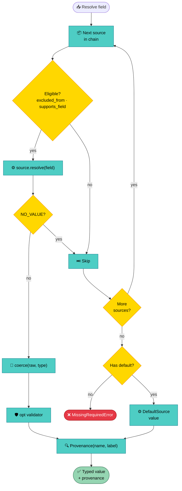

# Sources and Resolution

Configuration enters an application through multiple channels --
CLI flags, environment variables, YAML files, hardcoded defaults.
Confline treats each channel as a **source**: a standalone object that
knows how to look up one field at a time. The application controls
precedence by ordering sources in a list. The resolver walks that list
per field, takes the first value it finds,
[coerces](schema.md#field-types) it to the declared type, and stamps
provenance so the application can later answer "where did this value
come from?"



## The Source Chain
<sub>source: `resolution/api.py:36-65`, `examples/single_config_app.py:63-78`</sub>

The source chain is a Python list. Position determines precedence --
the first source to return a value for a given field wins. The
remaining sources are never consulted for that field.

Two orderings cover most applications:

- **CLI-first** (the `load_default` canonical chain):
  cli -> env -> yaml -> default. Flags typed at the terminal override
  everything else. Standard for interactive developer tools.
- **Env-first** (container-friendly):
  env -> cli -> yaml -> default. The orchestrator sets env vars; CLI
  flags drop to a debugging escape hatch. The
  `single_config_app.py` example demonstrates this variant.

Because the chain is a plain list, the application can reorder it,
drop sources entirely, or mix in custom sources. `load_default`
assembles the CLI-first chain as a convenience; applications that
need different precedence build the list by hand:

```python
sources = [
    EnvSource(os.environ, prefix="MYAPP_"),
    CliSource.from_argv(AppConfig, argv),
    YamlSource.from_files([yaml_path]) if yaml_path.exists() else None,
    DefaultSource(),
]
sources = [s for s in sources if s is not None]
config = load_or_exit(AppConfig, sources=sources, prog="myapp")
```

The `load_or_exit` wrapper resolves the config and, on any
`ConfigError`, renders an
[operator-friendly diagnostic](error-system.md#rendering) to stderr
before exiting with a typed exit code (64 for missing fields, 65 for
bad values). Applications needing custom error handling catch
`ConfigError` directly and call
[`render_for_cli`](error-system.md#rendering) themselves.

## Source Protocol
<sub>source: `sources/base.py`</sub>

Most apps use the built-in sources and skip this section. Read on if
you need a custom backend (Vault, Consul, test fixtures).

Every source inherits from the `Source` ABC. The protocol is
deliberately narrow -- one required method (`resolve`), a sentinel,
and a few optional hooks -- so that adding a new backend requires
minimal ceremony.

### The NO_VALUE Sentinel

`NO_VALUE` is a singleton that means "I have nothing for this field."
It is distinct from `None` (which is a legitimate resolved value for
`Optional` fields) and from `dataclasses.MISSING` (which marks the
absence of a declared default in the schema). A source returns
`NO_VALUE` to defer to the next source in the chain; returning `None`
claims the field with an explicit null.

### Extension Points

- **`validate_schema(schema)`** -- called once per source before
  resolution starts. Sources that project fields into an external
  namespace use this hook to detect naming collisions early.
  `EnvSource` checks for two fields mapping to the same env var;
  `YamlSource` checks for path collisions. The default is a no-op.
- **`supports_field(field)` (classmethod)** -- returns `False` when
  the source cannot represent the field's shape. `CliSource` and
  `EnvSource` refuse `list[ConfigBase]` (list-of-dicts has no flat
  encoding in flags or env vars); YAML handles it natively. This is a
  source-side capability declaration, distinct from the user-side
  `excluded_from` opt-out on individual fields.
- **`resolve(field)`** -- the core method. Returns a raw value or
  `NO_VALUE`. May raise `SourceValueError` for found-but-invalid
  values; resolution must not silently fall through after finding a
  value.
- **`is_fallback` (class variable)** -- `True` marks a source as a
  fallback provider. Values from fallback sources do not count as
  "user-provided" during mutex enforcement. `DefaultSource` sets this
  to `True`; third-party baseline-config sources opt in by overriding
  the flag.
- **`describe_field(field)` / `describe_provenance(field)`** -- return
  source-native key labels (`--port`, `MYAPP_PORT`, `db.port`) and
  per-instance provenance strings (`yaml /etc/app.yaml`). Used by
  error rendering and provenance tracking. Buggy implementations are
  caught defensively -- a broken label never aborts resolution.

### Source-side Annotations

Each built-in source exports annotation markers that override the
auto-derived key for a field. These live in `Annotated` metadata on
the field type:

| Marker | Source | Effect |
|--------|--------|--------|
| `CliAlias("-p", "--port")` | `CliSource` | Override CLI flag names |
| `CliPositional` | `CliSource` | Declare as positional argument |
| `EnvAlias("LEGACY_KEY")` | `EnvSource` | Override env var name |
| `YamlPath("legacy", "host")` | `YamlSource` | Override YAML dict path |

Annotations are optional. Without them, each source derives the key
from the field name and path using source-specific conventions (kebab
flags for CLI, uppercased with `__` nesting for env, natural path
segments for YAML).

## Built-in Sources

### CliSource
<sub>source: `sources/cli_source.py`</sub>

Wraps an `argparse.Namespace`. The convenience constructor
`CliSource.from_argv(config_class, argv)` auto-derives an argparse
parser from the config schema, parses `argv`, and wraps the resulting
namespace. Only flags the user actually typed on the command line
produce values; omitted flags return `NO_VALUE` so the next source in
the chain gets a chance.

<!-- FLAG: CliSource.resolve() treats None as NO_VALUE for the purpose
of "not provided" detection. This is correct for argparse SUPPRESS
semantics but noted because it means a hypothetical custom parser
that sets explicit None would need its own source subclass. -->

### EnvSource
<sub>source: `sources/env_source.py`</sub>

Reads from a string-keyed mapping (typically `os.environ`). Key
derivation follows a `prefix + path` convention: for a field at
`db.host` with `prefix="MYAPP_"` and the default `__` delimiter, the
derived key is `MYAPP_DB__HOST`. `EnvAlias("LEGACY_KEY")` overrides
the derivation entirely.

Empty strings (`PORT=`) are treated as `NO_VALUE` -- colloquially
"not set" in shell contexts. All resolved values are strings; the
coercion layer handles type conversion.

The `validate_schema` hook runs a collision check: if two fields
derive the same env var name, resolution fails early with an
`EnvKeyCollisionError`. 
### YamlSource
<sub>source: `sources/yaml_source.py`</sub>

Resolves fields from a sequence of dict scopes. Each scope is a
parsed YAML mapping; the first scope containing the field's path
wins. This multi-scope design supports layered configuration --
a global section, a plugin section, and a command section can each
be a separate scope with a natural priority order.

`YamlSource.from_files(paths)` loads one scope per file. Later
files in the input list take higher priority (internally reversed to
highest-priority-first). Missing files raise
`ConfigFileNotFoundError` rather than silently falling through, so a
typo in `--config /etc/app/typoo.yaml` cannot quietly degrade to
defaults. A 10 MiB size guard (`MAX_FILE_BYTES`) prevents DoS from
oversized files; subclasses can raise the limit.

YAML is the only built-in source that supports `list[ConfigBase]`
(list-of-dicts shape) -- the others self-skip via
`supports_field`. Nested configs map naturally to YAML sub-objects
without any special encoding.

Per-field provenance tracks back to the actual file that supplied the
value via `scope_origins`, so the operator sees `yaml /etc/app.yaml`
rather than a generic "yaml" label.

### DefaultSource
<sub>source: `sources/default_source.py`</sub>

Returns the field's declared `default` or calls its
`default_factory`. Fields without either get `NO_VALUE`. This source
sets `is_fallback = True`, which tells the mutex enforcer that
default-supplied values are not user-provided -- two mutex fields
both falling through to defaults is not a conflict.

`DefaultSource` is the simplest source (29 lines) and the natural
anchor at the end of any chain.

## Resolution Algorithm
<sub>source: `resolution/resolver.py`, `resolution/context.py`</sub>

`load_config(config_class, sources=...)` orchestrates the full
schema-to-instance pipeline in four phases:

1. **Validate** -- each source checks the schema for naming collisions
   (duplicate env keys, overlapping YAML paths) before any field is
   resolved.
2. **Resolve + coerce** -- the resolver walks every field, queries
   sources in chain order (first non-`NO_VALUE` wins), and
   [coerces](schema.md#field-types) the raw value to the declared type.
3. **Validate** -- per-field `opt(validator=...)` callbacks run on
   coerced values; then
   [`@field_validator` and `@model_validator`](schema.md#validators)
   fire post-construction.
4. **Stamp + enforce** -- the resolver attaches per-field
   [provenance](#provenance) and runs
   [mutex enforcement](#mutex-enforcement) after validators have had
   a chance to reconcile values.

Unexpected exceptions from `source.resolve()` -- third-party timeouts,
bugs in custom sources -- are caught and wrapped into `SourceValueError`
with the field path and source identity, so the operator sees a
contextual message rather than a bare traceback.

### Mutex Enforcement
<sub>source: `resolution/mutex.py`</sub>

[Mutex groups](schema.md#mutually-exclusive-groups) declare that at
most one (or exactly one) field in a group may be user-provided. The
enforcement runs *post-resolution*, after validators, because a
`@model_validator` might reconcile an apparent conflict.

The key distinction is **user-provided vs. fallback**.
The enforcer checks each field's provenance: if the producing source
has `is_fallback = True`, that field does not count toward the mutex
limit. Two mutex fields both falling through to `DefaultSource`
is fine; two set explicitly via YAML or env is a
`MutexViolationError`. This catches the cross-source case that
argparse's built-in mutually-exclusive groups miss -- a YAML file
setting both `json: true` and `yaml: true` registers no CLI flag, so
argparse never sees the conflict.

## Provenance
<sub>source: `config/types.py`, `config/base.py:241-281`</sub>

Every resolved field carries a `Provenance(name, label)` record.
`name` is the source's stable wire-id (`"argparse"`, `"env"`,
`"yaml"`, `"default"`) used for dispatch and registry lookups.
`label` is the human-readable form (`"command line"`,
`"yaml /etc/app.yaml"`, `"environment"`) used in error messages and
operator diagnostics.

The provenance map lives on the root config instance. Nested
`ConfigBase` subtrees do not carry their own provenance -- query the
root with the full dotted path:

```python
config = load_or_exit(AppConfig, sources=sources, prog="myapp")

port_prov = config.source_of("bind.port")
print(f"port came from {port_prov.label}")
# => "port came from yaml /etc/app.yaml"
```

`source_of` accepts both dotted strings (`"db.host"`) and tuples
(`("db", "host")`). Calling it on a nested instance raises `KeyError`
with an actionable hint directing the caller to query the root
instead. Calling it on an instance built without `load_config` (e.g.
a hand-constructed test fixture) raises a similar `KeyError`
explaining that provenance requires the load pipeline.
