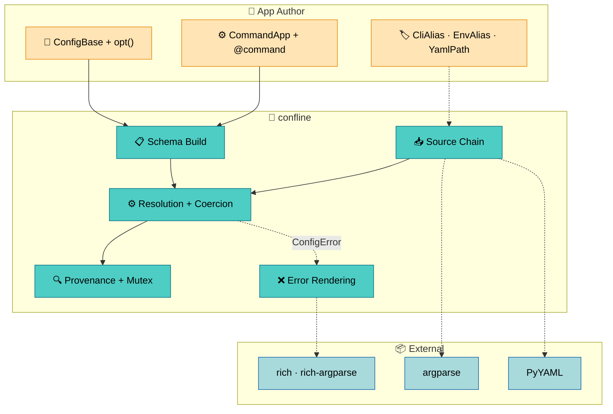
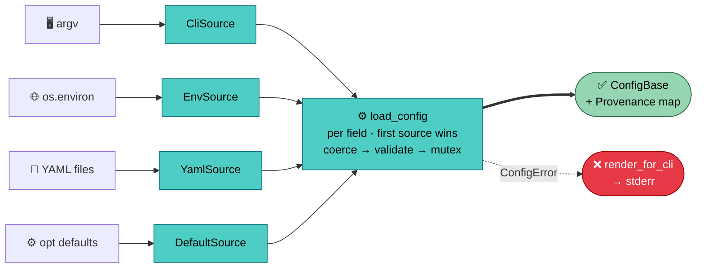

# confline

Confline is a configuration and CLI framework for Python applications.
You declare config fields once — as annotated dataclass fields with
`opt()` — and the framework gives you argument parsing, environment
variable support, YAML file loading, type coercion, and operator-facing
error messages for free. At runtime, an ordered chain of
[**sources**](sources-and-resolution.md) feeds values into a resolver
that produces a typed, provenance-stamped config object.

```python
class AppConfig(ConfigBase):
    """Service configuration."""

    port: int = opt(8080, description="HTTP port to bind.")
    workers: int = opt(4, description="Worker thread count.")
    debug: bool = opt(False, description="Enable debug logging.")

config = load_or_exit(AppConfig, sources=sources, prog="myapp")
print(config.source_of("port").label)  # => "env MYAPP_PORT"
```



## Design Motivation

Confline separates two concerns that traditional config systems couple:

- **Declaration** describes *what* exists:
  [field types, defaults, constraints, validators](schema.md). This
  happens once, at class-creation time, and produces a frozen
  `ConfigSchema`.
- **Resolution** describes *where* values come from: an ordered list of
  [source objects](sources-and-resolution.md) that the app controls.
  Sources are standalone, composable, and replaceable — the schema
  doesn't know which sources will query it.

Source-side naming (CLI flag names, env var keys, YAML paths) lives in
`Annotated` metadata markers (`CliAlias`, `EnvAlias`, `YamlPath`), not
in `opt()`. Each source reads its own marker; `opt()` stays
source-agnostic.

This separation enables two usage paths that share the same schema
machinery:

- **Single-config apps** assemble a source list by hand and call
  `load_or_exit`. They control precedence explicitly — env-first for
  containers, CLI-first for developer tools.
- **Multi-command apps** subclass
  [`CommandApp`](command-app.md), which automates source assembly,
  argparse building, subcommand dispatch, and error rendering.

## How It Works

A confline config goes through two phases: build and resolve.

**Build** happens at class-creation time. When you define a `ConfigBase`
subclass, the framework captures your field declarations into a frozen
schema. Inherited fields are collected into
[groups](schema.md#mro-based-groups) automatically. No runtime cost
after import.

**Resolve** happens when the app calls `load_config` (or its wrappers
`load_or_exit` / `CommandApp.run`). The
[resolver](sources-and-resolution.md#resolution-algorithm) walks the
schema field by field. For each field, it queries the source chain in
order — the first source to return a value wins. The raw value passes
through [type coercion](schema.md#field-types), then per-field and
whole-config [validators](schema.md#validators). The result is a typed
config instance with a [provenance map](sources-and-resolution.md#provenance)
recording which source provided each field.



When something goes wrong — a value can't coerce, a required field is
missing, a mutex group has two members set — the framework raises a
typed [`ConfigError`](error-system.md#error-hierarchy) with a BSD
sysexits exit code and pre-computed rendering data.

## What's Next

Start with [Getting Started](../guides/getting-started.md) for a
single-config app in five minutes, then
[Building a Multi-Command App](../guides/command-app.md) for
subcommand dispatch. The design docs go deeper — each builds on the
previous:

| Goal | Start with |
|------|------------|
| Declare config fields and types | [Schema Authoring](schema.md) |
| Understand source chains and resolution | [Sources and Resolution](sources-and-resolution.md) |
| Build a multi-command CLI app | [CommandApp](command-app.md) |
| Understand error rendering and diagnostics | [Error System](error-system.md) |
| Look up a term | [Glossary](glossary.md) |
