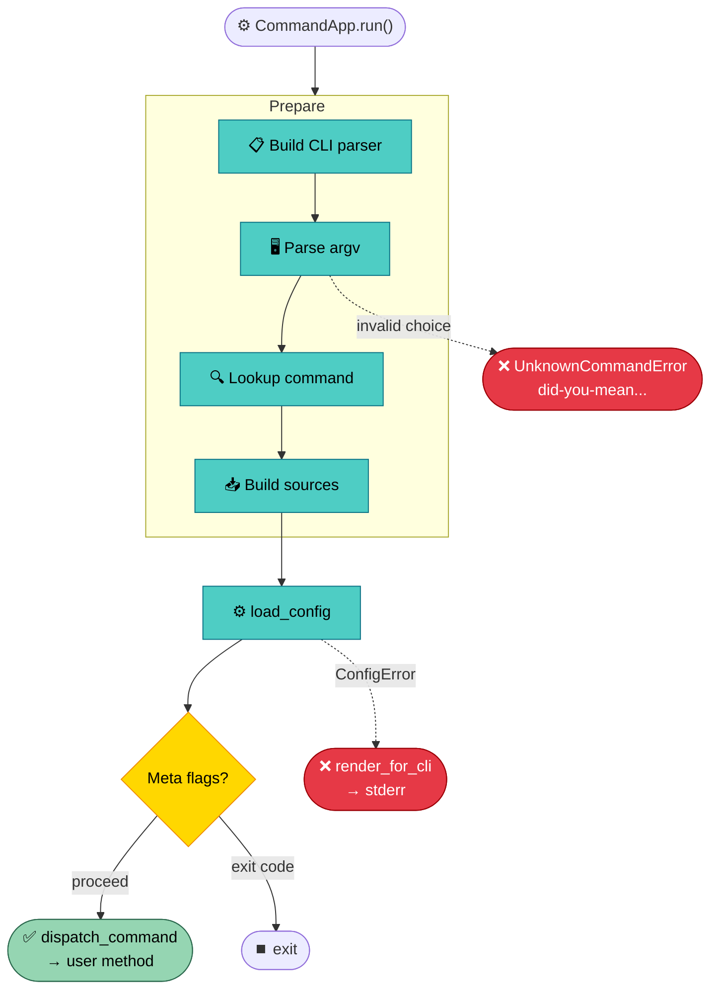

# CommandApp

A confline app needs sources assembled, a parser built, argv parsed,
config resolved, and errors rendered. The single-config path
([`load_or_exit`](sources-and-resolution.md#the-source-chain)) leaves
all of that to the caller — around ten lines of manual wiring per
program. `CommandApp` absorbs the entire pipeline: subclass it,
decorate methods with `@command`, call `run()`.

```python
class MyApp(CommandApp):
    prog = "myapp"
    env_prefix = "MYAPP_"

    @command()
    def serve(self, config: ServeConfig) -> int:
        """Start the HTTP server."""
        ...

    @command(aliases=["m"])
    def migrate(self, config: MigrateConfig) -> int:
        """Run pending database migrations."""
        ...
```

Four class-level attributes drive the lifecycle. `prog` and `description`
control `--help` headers. `env_prefix` feeds `EnvSource` key derivation
(`bind.port` with prefix `"MYAPP_"` becomes `MYAPP_BIND__PORT`).
`config_option` — defaulting to `("-c", "--config")` — enables repeatable
YAML loading; set to `()` to disable it.

## The @command Decorator

<sub>source: `packages/confline/src/confline/commands.py#command`</sub>

`@command` marks a method as a subcommand handler and records a frozen
`Command` DTO: name, config class, aliases, description. The decorator
infers all four from the method itself. Name comes from
`method.__name__` with underscores replaced by hyphens (`list_orgs`
becomes `list-orgs`). Config class comes from scanning type hints for
the first `ConfigBase` subclass. Description comes from the docstring's
first non-blank line.

Both `@command` (bare) and `@command(name=..., config_class=..., ...)`
work. Explicit arguments override inference — useful when
`from __future__ import annotations` prevents hint resolution at
decoration time.

At class-definition time, the framework collects every `@command`
method and builds a dispatch table. Name or alias collisions raise
`CommandRegistrationError` immediately — the app never starts with an
ambiguous dispatch table.



## Dispatch Flow

<sub>source: `packages/confline/src/confline/commands.py#CommandApp.run`</sub>

`run()` drives the pipeline shown in the diagram above. Each phase is
a separate method so subclasses can override one step without
reimplementing the rest. The key override points:

- **`build_sources(parsed, cmd)`** — assembles the
  [source chain](sources-and-resolution.md#the-source-chain). Override
  to add custom sources or change precedence (see
  [Source Assembly](#source-assembly) below).
- **`_handle_meta_flags`** — post-load hook, before dispatch (see
  [Meta-Flag Hooks](#meta-flag-hooks) below).
- **`dispatch_command(cmd, config)`** — calls your `@command` method.
  Override for async dispatch, context managers, or instrumentation.

On `ConfigError`, the pipeline renders an
[operator-friendly diagnostic](error-system.md#rendering) to stderr
and exits with the error class's sysexits-keyed exit code. Unknown
subcommands produce
[`UnknownCommandError`](error-system.md#error-hierarchy) with
did-you-mean suggestions.

## Source Assembly

<sub>source: `packages/confline/src/confline/commands.py#CommandApp.build_sources` · `packages/confline/src/confline/commands.py#CommandApp._label_sources`</sub>

`build_sources` assembles the default four-layer
[source chain](sources-and-resolution.md#the-source-chain):
`CliSource(parsed)` then `EnvSource(os.environ, prefix=...)` then
`YamlSource` (only when `-c` paths were supplied) then `DefaultSource`.
This is the same chain a `single_config_app.py`-style program builds by
hand. The order encodes CLI-wins precedence: flags beat env vars beat
YAML beat declared defaults.

Override `build_sources` to change the chain — add a Vault source,
reverse env/CLI precedence for container setups, or filter by command.
A secondary seam, `discover_config_files`, controls how `-c` paths are
resolved (XDG walk-up, secret-mount scanning, etc.).

A parallel method, `_label_sources()`, builds the same chain shape
without runtime values. Its only job is powering `--help`: each source's
`describe_field` returns the key name it would use for a given field
(`MYAPP_BIND__PORT`, `bind.port`), and the formatter renders those
alongside defaults.

> [!IMPORTANT]
> When overriding `build_sources`, override `_label_sources` too. A
> mismatch means `--help` advertises source keys the resolver never reads.

## Help Rendering

<sub>source: `packages/confline/src/confline/ui/argparse_builder.py#build_command_app_parser` · `packages/confline/src/confline/ui/help_format.py#ConflineHelpFormatter`</sub>

The help system walks the command metadata and produces a standard
argparse parser. Each subparser is populated from its command's schema.
Root meta-flags (`-c/--config`) are emitted on the root parser; an
epilog on each subparser re-surfaces them so the user does not need to
scroll back to `myapp --help`.

`ConflineHelpFormatter` — a `rich-argparse` subclass — appends a
metadata block under each option:

- **Metadata line** — `default: 8080 · env: MYAPP_BIND__PORT · yaml:
  bind.port`. Sources appear in chain order, reading as resolution
  precedence left-to-right.
- **Tag line** — `[secret] · [deprecated] · [mutex: Bind] · [active by
  default]`. Present only when the field carries annotations that affect
  behavior beyond the one-line description.

Color flows through `rich-argparse`; `NO_COLOR` and non-tty stderr
degrade to plain text automatically.

## Meta-Flag Hooks

<sub>source: `packages/confline/src/confline/commands.py#CommandApp._handle_meta_flags`</sub>

`_handle_meta_flags` runs after resolution, before dispatch. The base
is a no-op. Override it for flags like `--show-config` or `--dry-run`
that inspect the loaded config and exit early. Return `None` to proceed,
or an int to short-circuit `run()` with that exit code. Chain `super()`
first when adding custom flags:

```python
def _handle_meta_flags(self, parsed, cmd, config, sources):
    short = super()._handle_meta_flags(parsed, cmd, config, sources)
    if short is not None:
        return short
    if getattr(parsed, "_dry_run", False):
        print(config)
        return 0
    return None
```
