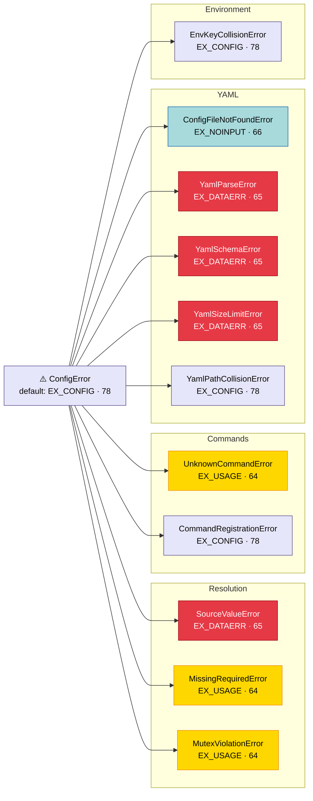

# Error System

Configuration errors happen at the boundary between the operator and the
application. An operator sets `MYAPP_BIND__PORT=abc`, passes `--config
missing.yaml`, or provides two mutually exclusive options from different
sources. What they see on stderr determines whether they fix the problem
in seconds or start debugging the framework. Confline treats error
rendering as a design feature: every `ConfigError` carries a sysexits
exit code, pre-computed rendering data, and enough context for the UI
layer to produce a source-aware, secret-safe diagnostic without
re-deriving anything from the schema.

| Exit code | Meaning | Errors |
|-----------|---------|--------|
| 64 EX_USAGE | Operator input error | `MissingRequiredError`, `MutexViolationError`, `UnknownCommandError` |
| 65 EX_DATAERR | Malformed data | `SourceValueError`, `YamlParseError`, `YamlSchemaError`, `YamlSizeLimitError` |
| 66 EX_NOINPUT | Input file missing | `ConfigFileNotFoundError` |
| 78 EX_CONFIG | Schema/framework misconfig | `CommandRegistrationError`, `EnvKeyCollisionError`, `YamlPathCollisionError` |

## Integration

source: `packages/confline/src/confline/ui/errors.py#render_for_cli`

App authors interact with the error system at three levels, depending on
how much control they need:

**[`CommandApp`](command-app.md) (automatic).** Errors are caught and
rendered with no author code. `CommandApp.run` wraps command dispatch in
a handler that calls `render_for_cli`, prints the styled `Text` to a
`rich.Console` on stderr, and exits with the error's `_EXIT_CODE`. The
console respects `NO_COLOR` and non-tty stderr automatically.

**[`load_or_exit`](sources-and-resolution.md#the-source-chain)
(semi-automatic).** For single-config apps without subcommands,
`load_or_exit` provides the same catch-render-exit behaviour in a
single function call. The author gets a resolved config
object or the process exits with a formatted error.

**Direct handling.** Authors who need custom error logic catch
`ConfigError` themselves and call `render_for_cli` for the formatted
output. The error's structured data -- `field_record` on
`SourceValueError`, `fields` on `MissingRequiredError`, `provided` on
`MutexViolationError` -- is available for programmatic inspection
without parsing the rendered text.

## Error Hierarchy

source: `packages/confline/src/confline/errors/base.py#ConfigError` · `packages/confline/src/confline/errors/resolution.py#SourceValueError` · `packages/confline/src/confline/errors/commands.py#UnknownCommandError` · `packages/confline/src/confline/errors/yaml.py#YamlParseError` · `packages/confline/src/confline/errors/env.py#EnvKeyCollisionError`

`ConfigError` is the single base for every error confline raises. Each
subclass carries an exit code drawn from BSD sysexits conventions (see
the table above), so `CommandApp` maps a caught error to a process exit
code automatically. The codes matter operationally -- Kubernetes restart
policies, systemd unit conditions, and shell scripts all key off the
distinction between "the operator gave bad input" (64) and "a config
file is missing" (66).

## Rendering

source: `packages/confline/src/confline/ui/errors.py#render_for_cli`

`render_for_cli` is the single rendering entry point. It takes a
`ConfigError` and returns a `rich.text.Text` object styled for stderr
output. The templates share a common visual structure: a bold header line
(`prog command: summary`), indented label-value rows (`field:`,
`given:`, `source:`, `expected:`), and a dim `--help` footer. Colour
choices borrow from the help formatter so operators who have read
`--help` recognize the same visual language in error output.

Each error type produces a distinct diagnostic:

- **`SourceValueError`** renders the field path, the given value (or
  `******` for secrets), the originating source, and the expected type.
  When other sources can accept the same field, a "Try one of" block
  lists them with example values in source-native form.
- **`MissingRequiredError`** lists every missing field with its
  expected type and the sources that were tried. Per-field "Try one of"
  suggestions show how to provide each value through any active source.
- **`MutexViolationError`** names each provided field with its current
  value and originating source, rendered in source-native notation
  (`--port 8080`, `MYAPP_PORT=8080`, `port: 8080`). Each line includes
  an unset hint from the source (`"remove --port from the command"`,
  `"unset MYAPP_PORT"`). This catches cross-source conflicts that
  argparse alone cannot see -- a CLI flag and a YAML key both setting
  members of the same exclusive group.
- **`UnknownCommandError`** prints the rejected token, a "Did you
  mean" block with fuzzy matches (via `difflib.get_close_matches`), and
  the full list of available commands.

## Secret Scrubbing

source: `packages/confline/src/confline/resolution/resolver.py#_raise_source_value_error` · `packages/confline/src/confline/config/base.py#ConfigBase.__repr__` · `packages/confline/src/confline/config/types.py#SECRET_PLACEHOLDER`

Fields marked [`secret=True`](schema.md#configbase-and-opt) in the
schema receive three layers of redaction, each guarding a different
leak path:

1. **`__repr__` redaction.** `ConfigBase.__repr__` replaces secret
   values with `SECRET_PLACEHOLDER` (`"******"`). Since `print`,
   `logger.info`, and structured logging all funnel through `__repr__`,
   this is the chokepoint for casual leaks.
2. **Error record redaction.** When a secret field fails coercion, the
   error record receives `None` as the raw value instead of the actual
   secret. The renderer prints `******`.
3. **Cause-chain scrubbing.** The `__cause__` exception is replaced
   with a synthetic exception whose message reads
   `<ValueError: value redacted>`, preventing structured logging
   frameworks from extracting the secret by walking the cause chain.

Together, these layers ensure that a `password: str = opt(secret=True)`
field never surfaces its value in repr output, error messages, or
exception chains -- even when a third-party coercion function embeds the
raw input in its own error message.
